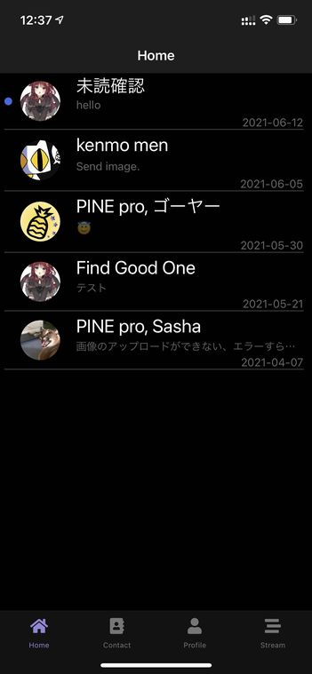
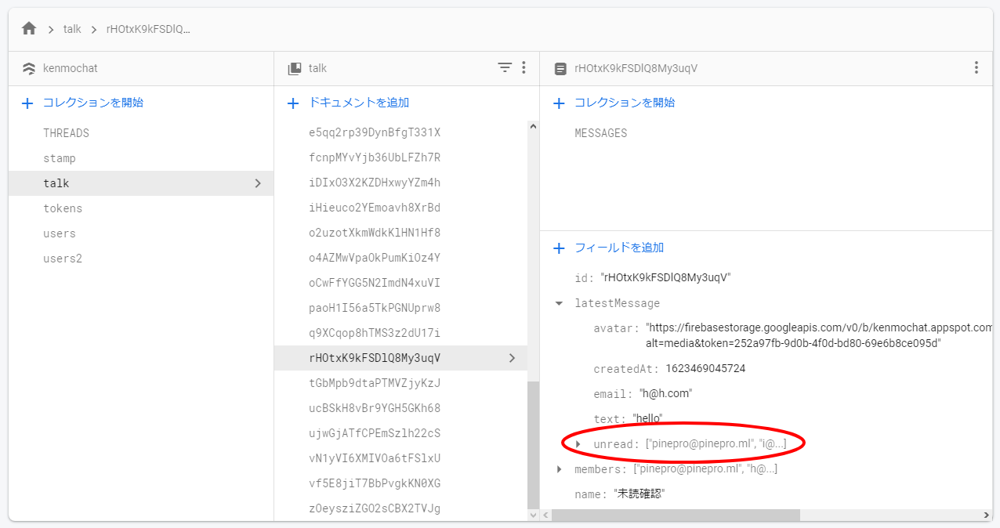
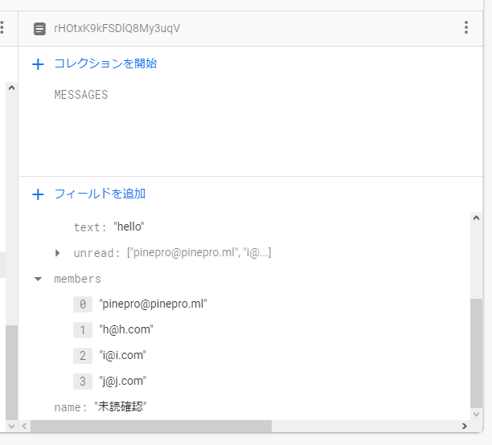
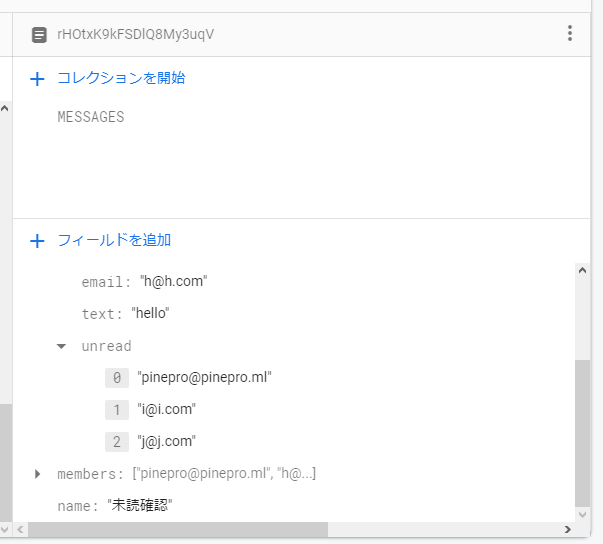

import { Link } from 'gatsby';

## 追加した機能

Homeタブで新着メッセージがある部屋に未読マークがつくようにしました。



## 仕組み

PINE proではトーク一覧画面で部屋ごとの最新メッセージを表示するために`latestMessage`に新着メッセージの情報を格納しています。それと、プッシュ通知の送信用に部屋の情報としてトークルーム参加者のID(メールアドレス)を配列で持っています。この二つを利用します。



新着メッセージを送信したときに未読のメンバーとして`latestMessage`にトークルーム参加者の配列も格納するようにします。読んだらその人のIDを配列から削除するようにします。部屋一覧画面では未読メンバーの配列を参照して、自分のIDが含まれていたら未読マークを表示するようにします。

## 変更したコード

### 未読メンバーを格納

メッセージ送信用の関数に新着メッセージ格納時に未読メンバーの配列も一緒に格納するようにします。

`members`の中には自分も含めてルーム参加者全員が格納されています。



**src\scenes\talk\Talk.js**

ルーム参加者格納用のフックを作ります。

```javascript
const [members, setMembers] = useState([])
```

トークルーム参加者一覧をリッスンして格納します。

```javascript
useEffect(() => {
  const membersListener = firebase.firestore()
    .collection('talk')
    .doc(talkData.id)
    .onSnapshot(function(document) {
      const data = document.data()
      const members = data.members
      setMembers(members)
    })
  return () => membersListener()
}, []);
```

メッセージ送信時に`latestMessage`にトークルーム参加者を一緒に保存するようにします。

```javascript
async function handleSend(messages) {
  const text = messages[0].text;
  const messageRef = firebase.firestore().collection('talk')
  messageRef
    .doc(talkData.id)
    .collection('MESSAGES')
    .add({
      text,
      createdAt: new Date().getTime(),
      user: {
        _id: myProfile.id,
        email: myProfile.email,
        avatar: myProfile.avatar,
        name: myProfile.fullName,
      }
    });
  await messageRef
    .doc(talkData.id)
    .set(
      {
        latestMessage: {
          text,
          avatar: myProfile.avatar,
          createdAt: new Date().getTime(),
          email: myProfile.email,
          unread: members // ここに追加
        }
      },
      { merge: true }
    );
}
```

### 未読メンバーから自分を削除する

トークルームを開いているときに、配列から自分を削除するようにします。



```javascript
useEffect(() => {
  const unreadListener = firebase.firestore()
    .collection('talk')
    .doc(talkData.id)
    .onSnapshot(function(document) {
      const data = document.data()
      firebase
      .firestore()
      .collection('talk').doc(talkData.id).set({
        latestMessage : {
          unread: firebase.firestore.FieldValue.arrayRemove(myProfile.email)
        }
      }, { merge: true })
    })
  return () => unreadListener()
}, []);
```

トークルームを開いている時に、未読メンバーの配列に自分が含まれていると、配列から削除するようにできました。

### トークルーム一覧画面で未読マークをつける

今回は、未読マークを表示するためのコンポーネントを切り分けました。まずはトークルーム画面から未読表示用コンポーネントに必要な情報を渡すようにします。

**src\scenes\home\Home.js**

作成予定の未読表示用コンポーネントをインポートします。

```javascript
import Unread from './unread'
```

未読表示用コンポーネントにはルームの情報`talk`と自分のユーザー情報`userData`を渡します。

```javascript
<ScrollView>
  {
    talks.map((talk, i) => {
      return (
        <View key={i} style={styles.item}>
          <TouchableOpacity onPress={() => props.navigation.navigate('Talk', { talkData: talk, myProfile: userData })}>
            <View style={{flexDirection: 'row'}}>
              <View style={styles.unread}>
                <Unread talk={talk} data={userData}/> {/* ここに追加 */}
              </View>
              <View style={styles.avatar}>
                <Avatar
                  size="medium"
                  rounded
                  title="NI"
                  source={{ uri: talk.latestMessage.avatar }}
                />
              </View>
              <View style={{ flex: 1, width: '100%' }}>
                <Text style={scheme === 'dark' ? styles.darktitle : styles.title} numberOfLines={1}>{talk.name}</Text>
                <Text style={scheme === 'dark' ? styles.darklatestMessage : styles.latestMessage} numberOfLines={1}>{talk.latestMessage.text}</Text>
                <Text style={scheme === 'dark' ? styles.darklatestDate : styles.latestDate}>{displaytime(talk.latestMessage.createdAt)}</Text>
              </View>
            </View>
          </TouchableOpacity>
          <Divider />
        </View>
      )
    })
  }
</ScrollView>
```

### 未読表示用コンポーネントを作成

`Home`から受け取った部屋の情報から部屋IDを取得して未読メンバーをリッスンするようにします。リッスンした未読メンバーの配列は`data`に格納します。配列が存在しない場合の処理もif文で入れておきます。

`useEffect`の第二引数に`talk.latestMessage.createdAt`を設定することで無限ループするのを防ぎます。

その後`info`関数に配列を渡して、自分のメールアドレス`email`が含まれてるか評価してif文でマークの表示/非表示の処理を分けます。

**src\scenes\home\unread.js**

```javascript
import React, { useEffect, useState } from 'react'
import { View } from 'react-native'
import { firebase } from '../../firebase/config'
import FontIcon from 'react-native-vector-icons/FontAwesome5'

export default function Unread(props) {
  console.log('StartScreen')
  const id = props.talk.id
  const createdAt = props.talk.latestMessage.createdAt
  const email = props.data.email
  const [data, setData] = useState([])

  useEffect(() =>{
    const unmount = firebase.firestore().collection('talk').doc(id)
    .onSnapshot(function(doc) {
      const data = doc.data().latestMessage.unread
      if (data) {
        setData(data)
      }
    });
    console.log('useEffect')
    return () => unmount()
  },[createdAt])

  function info(i) {
    if (i.includes(email)) {
      return <FontIcon name="circle" color='#4169e1' size={10} solid />
    } else {
      return <FontIcon name="circle" color='transparent' size={10} solid />
    }
  }

  return (
    <View>
      {info(data)}
    </View>
  )
}
```

## まとめ

未読表示は構想の初期段階からずっと追加したかった機能で、仕組みも思いついていたのですが難しい処理だったので実装まで時間がかかってしまいました。

一見、簡単な機能ではありますが結構複雑な処理になってしまいました。

---