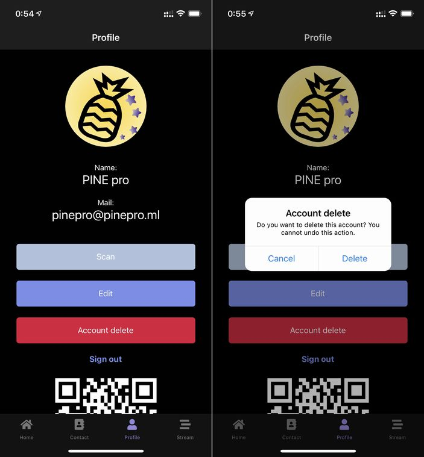

import { Link } from 'gatsby';

## アカウントの削除を実装しました

今週の[WWDC21](https://developer.apple.com/wwdc21/)に合わせてApp Store Review Guidelines改定のお知らせが届いていました。

その中の一つに以下があります。

```
5.1.1(v): Apps supporting account creation must also offer account deletion.
```

**アカウントを作成するアプリではアカウントの削除も用意しなければならない**というものです。

というわけで実装しました。

## 実装した機能

プロフィール画面にアカウント削除のボタンを設置しました。タップしたら確認メッセージを出し、アカウントを削除します。



## 変更したコード

**src\scenes\profile\Profile.js**

ダイアログ表示用のコンポーネントとローディングスピナーをインポートします。

```javascript
import Dialog from "react-native-dialog"
import Spinner from 'react-native-loading-spinner-overlay'
```

ダイアログとローディングスピナーの表示/非表示を制御するフックと関数を定義します。

```javascript
const [visible, setVisible] = useState(false)
const [spinner, setSpinner] = useState(false)

const showDialog = () => {
  setVisible(true)
}

const handleCancel = () => {
  setVisible(false)
}
```

アカウント削除用の関数を定義します。アカウントの削除と同時にユーザー情報も削除します。

```javascript
const accountDelete = async () => {
  setSpinner(true)
  const collectionRef = firebase.firestore()
  await collectionRef.collection('tokens').doc(userData.email).delete()
  await collectionRef.collection('users').doc(userData.id).delete()
  await collectionRef.collection('users2').doc(userData.email).delete()
  const user = firebase.auth().currentUser
  user.delete().then(function() {
    setSpinner(false)
    firebase.auth().signOut()
  }).catch(function(error) {
    setSpinner(false)
    console.log(error)
  });
}
```

表示部にダイアログとローディングスピナーを設置します。

```javascript
<Dialog.Container visible={visible}>
  <Dialog.Title>Account delete</Dialog.Title>
  <Dialog.Description>
    Do you want to delete this account? You cannot undo this action.
  </Dialog.Description>
  <Dialog.Button label="Cancel" onPress={handleCancel} />
  <Dialog.Button label="Delete" onPress={accountDelete}  />
</Dialog.Container>
<Spinner
  visible={spinner}
  textStyle={{ color: "#fff" }}
  overlayColor="rgba(0,0,0,0.5)"
/>
```

## まとめ

アカウントの削除は優先度の低い機能だったのですが、レビューガイドラインが改定されるということで実装しました。

---