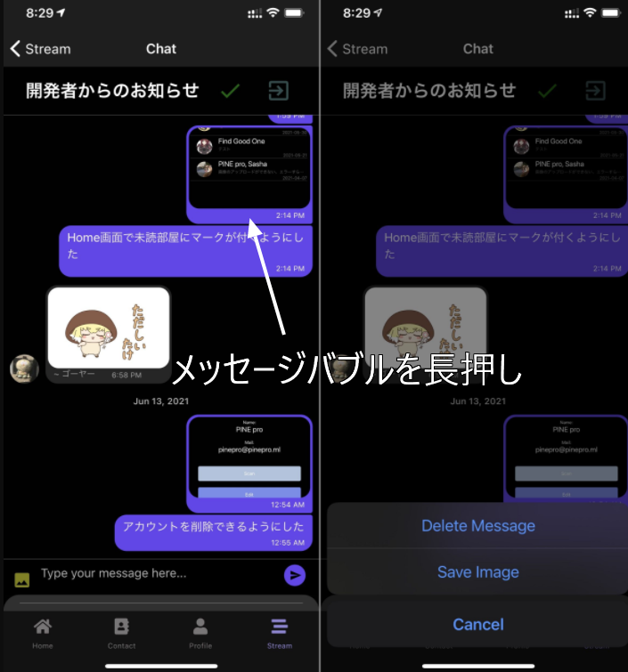
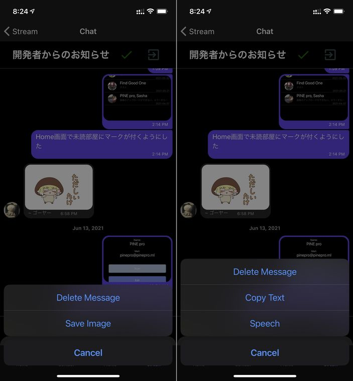

import { Link } from 'gatsby';

## チャットに投稿された画像を保存できるようにしました

画像付きメッセージの吹き出し周辺部分を長押しすることで画像を保存する選択肢が表示されるようにしました。



<Link to="/blog/2021-05-01">以前の投稿</Link>で書いたようにそれぞれのメッセージはこんな感じで情報が入っています。

<br/><br/>

**テキスト投稿の場合**

```javascript
Object {
  "_id": "N5YjCzeVXn7ZpavescaX",
  "createdAt": 1623513303608,
  "name": "",
  "text": "アカウントを削除できるようにした",
  "user": Object {
    "_id": "XDKfXDJXzPYizpVKes4Lnfn9dJC3",
    "avatar": "https://firebasestorage.googleapis.com/v0/b/kenmochat.appspot.com/o/avatar%2FXDKfXDJXzPYizpVKes4Lnfn9dJC31617107738417?alt=media&token=d4fffc95-5330-4767-8b47-cc045f360b79",
    "email": "pinepro@pinepro.ml",
    "name": "PINE pro",
  },
}
```

**画像投稿の場合**

```javascript
Object {
  "_id": "EFax7xHHnkyBV7X7BDlJ",
  "createdAt": 1623513290483,
  "image": "https://i.imgur.com/HBvedqp.png",
  "name": "",
  "text": "",
  "user": Object {
    "_id": "XDKfXDJXzPYizpVKes4Lnfn9dJC3",
    "avatar": "https://firebasestorage.googleapis.com/v0/b/kenmochat.appspot.com/o/avatar%2FXDKfXDJXzPYizpVKes4Lnfn9dJC31617107738417?alt=media&token=d4fffc95-5330-4767-8b47-cc045f360b79",
    "email": "pinepro@pinepro.ml",
    "name": "PINE pro",
  },
}
```

`image`に入っている画像のURLをデバイスのストレージに保存するようにします。

## 変更したコード

フォトライブラリにアクセスするためパーミッションを取得する必要があります。

**app.json**

iOSでは画像アップロードのために以前から使用していた`ios.infoPlist.NSPhotoLibraryUsageDescription`に**画像を保存するために**という文言を付け加えました。

Androidでは`android.permissions`に`WRITE_EXTERNAL_STORAGE`を追加しました。

それから、画像の保存完了時に触覚フィードバックをしたかったので`VIBRATE`も追加しました。

```javascript
"ios": {
  "supportsTablet": true,
  "bundleIdentifier": "net.votepurchase.pine",
  "buildNumber": "1.1.0",
  "infoPlist": {
    "NSCameraUsageDescription": "Used to add a user to your contacts with a QR code.",
    "NSPhotoLibraryUsageDescription": "Use the photo library to change your avatar, send images in chat, and save images."
  },
  "userInterfaceStyle": "automatic"
},
"android": {
  "package": "net.votepurchase.pine",
  "versionCode": 12,
  "googleServicesFile": "./google-services.json",
  "userInterfaceStyle": "automatic",
  "permissions": [
    "VIBRATE",
    "CAMERA",
    "WRITE_EXTERNAL_STORAGE"
  ]
},
```

**src\scenes\chat\Chat.js**

今回使うライブラリをインポートします。

```javascript
import * as FileSystem from 'expo-file-system'
import * as MediaLibrary from 'expo-media-library'
import * as Haptics from 'expo-haptics'
```

まずは、テキスト投稿と画像投稿で長押し時のメニューを切り替えるようにします。



`message.image`が存在するかチェックして表示する選択肢を分けます。

```javascript
function delMessage(context, message) {
  const imageUrl = message.image
  if (!message.image) {
    const options = ['Delete Message', 'Copy Text', 'Speech', 'Cancel'];
    const cancelButtonIndex = options.length - 1;
    context.actionSheet().showActionSheetWithOptions({
      options,
      cancelButtonIndex
    }, (buttonIndex) => {
      switch (buttonIndex) {
        case 0:
          if (message.user.email == myProfile.email) {
            firebase.firestore().collection('THREADS').doc(talkData.id).collection('MESSAGES').doc(message._id).delete()
          } else {
            alert('You can only delete own messages.')
          }
          break
        case 1:
          const text = message.text
          Clipboard.setString(text)
          break
        case 2:
          const script = message.text
          speak(script)
          break
      }
    });
  } else {
    const options = ['Delete Message', 'Save Image', 'Cancel'];
    const cancelButtonIndex = options.length - 1;
    context.actionSheet().showActionSheetWithOptions({
      options,
      cancelButtonIndex
    }, (buttonIndex) => {
      switch (buttonIndex) {
        case 0:
          if (message.user.email == myProfile.email) {
            firebase.firestore().collection('THREADS').doc(talkData.id).collection('MESSAGES').doc(message._id).delete()
          } else {
            alert('You can only delete own messages.')
          }
          break
        case 1:
          downloadImage(imageUrl)
          break
      }
    });
  }
}
```

次に、画像を保存する関数`downloadImage()`を作ります。downloadImageの引数は画像のURLです。

`FileSystem`に画像をダウンロードしてから、そのURIをメディアライブラリーに保存します。

完了時には`Haptics.notificationAsync`を使って触覚フィードバックを発生させます。

```javascript
const downloadImage = ( file ) => {
  FileSystem.downloadAsync(
    file,
    FileSystem.documentDirectory + 'image.png'
  )
  .then( async ( { uri } ) => {
    const { status } = await MediaLibrary.requestPermissionsAsync()
    if( status !== 'granted' ) return
    MediaLibrary.saveToLibraryAsync( uri )
    Haptics.notificationAsync(Haptics.NotificationFeedbackType.Success)
  })
  .catch(error => {
    console.log(error)
    Haptics.notificationAsync(Haptics.NotificationFeedbackType.Error)
  })
}
```

## まとめ

メッセンジャーアプリとしての基本機能はこれでほぼ完成したかなと思っています。

---