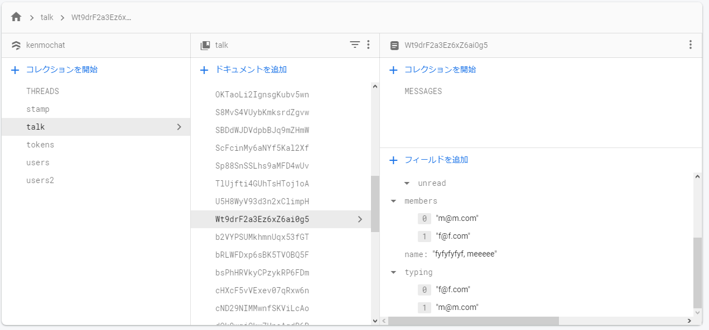

import { Link } from 'gatsby';

## 追加した機能

たまたま聞いていたポッドキャストで「Googleのチャットは**誰々さんが入力中**が表示されなくて使いにくい」と言っていたので、PINE proにタイピングインジケーターを実装しました。

同じ部屋にいるいずれかのユーザーがメッセージを入力しているときに、画面左下にインジケーターが表示されるようにしました。


## 機能の仕組み

各チャット部屋に入力中のユーザーを配列で保存するフィールド(typing)を用意しました。メッセージ入力欄に文字が入ってるときにはここに自分のID(メールアドレス)追加して、空になったら配列から削除するようにします。

この配列をリッスンして、配列が空でないときにインジケーターを表示する処理を追加しました。



## 変更したコード

インジケーターはTalk画面とChat画面両方に実装したいので、**TypingIndicator**コンポーネントとして切り出しました。

**TypingIndicator**コンポーネントでは入力が始まったら自分を配列に追加する処理と、配列をリッスンする処理両方を行いたいので親コンポーネントから必要な情報を渡します。

**src\scenes\talk\Talk.js**

react-native-gifted-chatにPropsを追加します。

- onInputTextChanged 入力テキストが変更されたときのコールバック関数
- renderFooter カスタムフッターコンポーネント

```javascript
<GiftedChat
  messages={messages}
  onSend={newMessage => handleSend(newMessage)}
  user={{ _id: myProfile.id }}
  renderSend={renderSend}
  alwaysShowSend
  renderSystemMessage={renderSystemMessage}
  renderBubble={renderBubble}
  onPressAvatar={showProfile}
  renderUsernameOnMessage={true}
  renderActions={renderActions}
  onLongPress={delMessage}
  renderInputToolbar={renderInputToolbar}
  onInputTextChanged={handleInputTextChanged} // ここに追加
  renderFooter={renderFooter} // ここに追加
  textInputStyle={scheme === 'dark' ? styles.darktextInputStyle: styles.textInputStyle}
  placeholder='Type your message here...'
/>
```

作成予定のコンポーネントをインポートします。

```javascript
import TypingIndicator from '../typing/Typing'
```

メッセージ入力欄に入ってる文字列を格納するフックを作成します。

```javascript
const [input, setInput] = useState('')
```

メッセージ入力欄に入ってる文字列を受け取って、上で作成したフックに格納する関数を作成します。

```javascript
function handleInputTextChanged(text) {
  setInput(text)
}
```

入力欄に文字が入ったままユーザーが部屋を移動してしまうと、リッスン先の配列にそのユーザーが残ったままになってしまいます。これを防ぐために部屋を離れる時に文字列格納フックを空にする処理を追加します。

```javascript
useEffect(() => {
  navigation.addListener('beforeRemove', (e) => {
    setInput('')
  })
}, []);
```

renderFooterに渡す関数を作成します。このフッター部分を**TypingIndicator**として別コンポーネントに切り出します。

TypingIndicatorには

- メッセージ入力欄の文字列
- 自分のユーザー情報
- チャット部屋の情報
- Talk画面かChat画面か

を渡します。

```javascript
function renderFooter() {
  return <TypingIndicator input={input} talkData={talkData} myProfile={myProfile} screen={'talk'} />
}
```

**src\scenes\typing\Typing.js**

TypingIndicatorを新規作成します。

```javascript
import React, { useEffect, useState } from 'react'
import { View } from 'react-native'
import { firebase } from '../../firebase/config'
import { TypingAnimation } from 'react-native-typing-animation'

export default function TypingIndicator(props) {
  const input = props.input // 受け取ったメッセージ入力欄の文字列を格納
  const email = props.myProfile.email // 受け取った自分のユーザー情報からID(メールアドレス)を格納
  const id = props.talkData.id // 受け取った部屋の情報から部屋のIDを格納
  const screen = props.screen // 受け取ったスクリーン名を格納
  const [typing, setTyping] = useState([]) // リッスンした入力中ユーザーの配列を格納するフック

  useEffect(() => { // 入力中ユーザーに自分を追加/削除するフック
    if (input) { // メッセージ入力欄を評価
      firebase.firestore().collection(screen).doc(id).set({
        typing: firebase.firestore.FieldValue.arrayUnion(email) // 何らかの文字が入ってたら配列に自分を追加
      }, { merge: true })
    } else {
      firebase.firestore().collection(screen).doc(id).set({
        typing: firebase.firestore.FieldValue.arrayRemove(email) // 空なら配列から自分を削除する
      }, { merge: true })
    }
  }, [input]); // 第二引数に入力欄の文字列を設定する。変化があるごとにフックを発動させる

  useEffect(() => { // 入力中ユーザーの配列をリッスンするフック
    const typingListner = firebase.firestore()
      .collection(screen)
      .doc(id)
      .onSnapshot(function(document) {
        const data = document.data()
        const typing = data.typing
        setTyping(typing) // 取得した入力中ユーザーの配列をフックに格納する
      })
    return () => typingListner()
  }, []);

  function isTyping(array) { // 入力中ユーザーの配列を引数で受け取る
    console.log(array.length)
    if (array.length) { // 受け取った配列が空かどうか評価
      return ( // 配列が空じゃなければ(誰かが入力中なら)インジケーターを表示する
          <TypingAnimation dotColor={'#b0c4de'} dotSpeed={0.1}/>
      )
    } else { // 配列が空のときは何もしない
      return null
    }
  }

  return (
    <View style={{height:18}}>
      {isTyping(typing)}
    </View>
  )
}
```

## まとめ

メッセンジャーとして必要な機能は全て実装できたと思います。

---