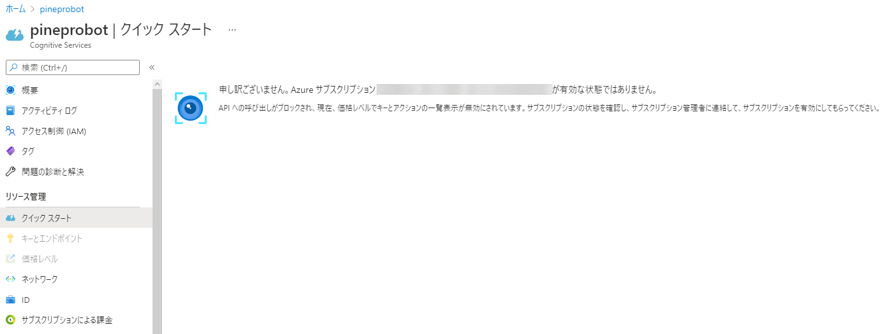
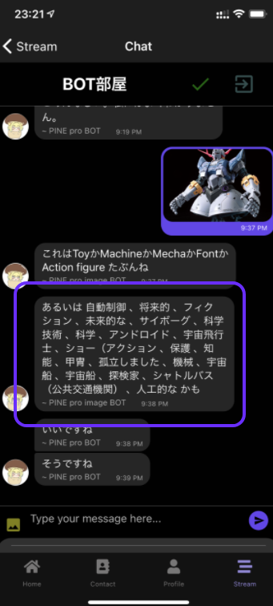
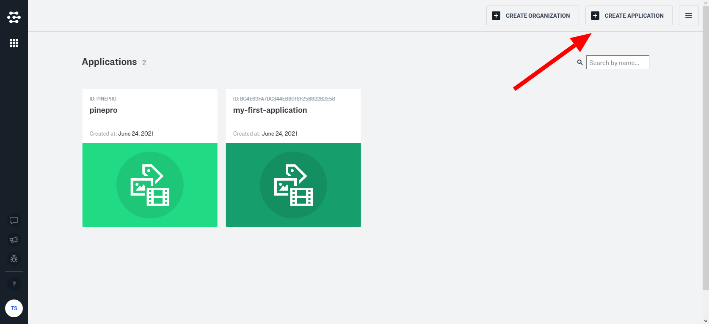
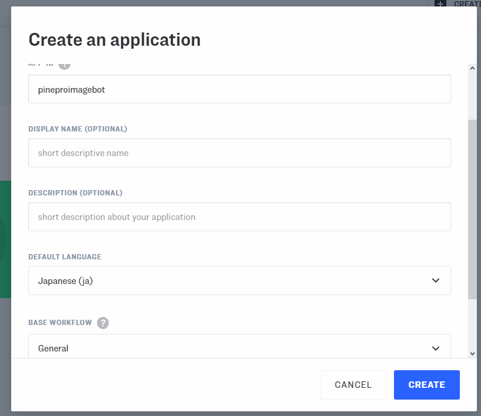
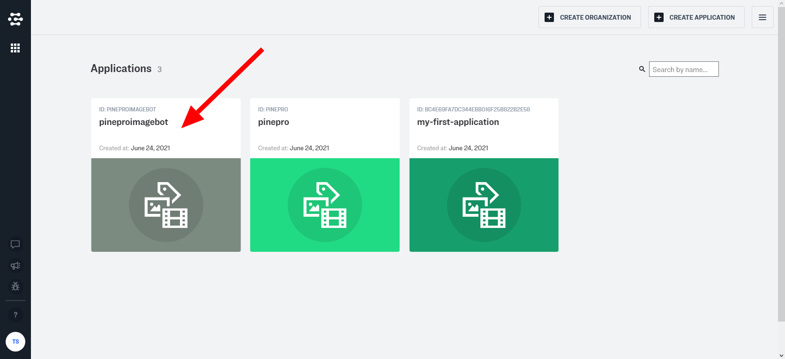
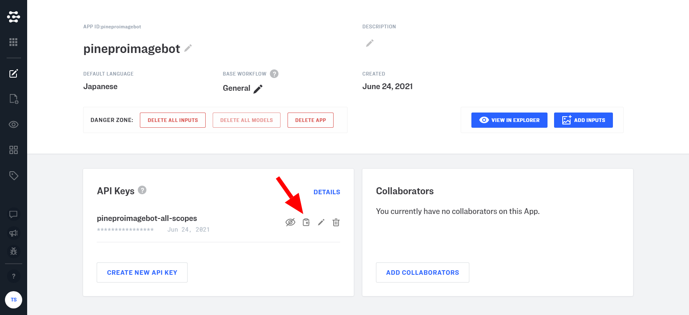

import { Link } from 'gatsby';

<Link to="/blog/2021-05-29">以前</Link>、Azure Computer Vision APIを使ってチャットボットに画像認識を実装しました。

Azureの無料枠を使い切ったのかなんなのかわかりませんがAPIが使えなくなりました。



というわけでAzure Computer Visionの代わりに[clarifai](https://www.clarifai.com)を使って実装しました。



## clarifaiのAPI keyを用意する

1000リクエスト/月までは無料で使えるので[clarifai](https://www.clarifai.com)にサインアップします。

サインアップしたらダッシュボード画面で**CREATE APPLICATION**をクリックします。



**APP-ID**を適当に設定して、**DEFAULT LANGUAGE**をJapaniseに変更してから**CREATE**をクリックします。



ダッシュボードに戻るので、今作ったアプリをクリックします。



API keyがすでに作られているのでコピーしておきます。



clarifaiの準備はこれで完了です。

## 変更したコード

<Link to="/blog/2021-05-28">Cloud Visionを使ったとき</Link>やComputer Visionを使ったときのように、Cloud Functionsを使って実装していきます。

[Clarifai/clarifai-nodejs-grpc](https://github.com/Clarifai/clarifai-nodejs-grpc)のreadmeからほぼコピペです。

まずはnode.js用のクライアントをインストールします。

```shell
npm install clarifai-nodejs-grpc
```

**functions\index.js**

```javascript
const {ClarifaiStub, grpc} = require("clarifai-nodejs-grpc");

const stub = ClarifaiStub.grpc();

const metadata = new grpc.Metadata();
metadata.set("authorization", "Key YOUR_CLARIFAI_API_KEY");
```

`YOUR_CLARIFAI_API_KEY`のところをダッシュボードでコピーしたAPI keyに書き換えます。先頭の`Key `は必要です。

画像のURLを入れてリクエストを送ると[こんな感じ](https://docs.clarifai.com/api-guide/predict/images)でレスポンスが返ってきます。

レスポンスをBOTの発言用に整形してFirestoreに保存する処理を追加していきます。

発言するBOTの情報を定義します。Computer Visionで使っていたものそのままです。

```javascript
const us = {
  _id: 'GrB69PO5oyaTTXbRmLJYqcKGFzf2',
  email: 'pineproimagebot@pinepro.ml',
  avatar: 'https://firebasestorage.googleapis.com/v0/b/kenmochat.appspot.com/o/avatar%2FGrB69PO5oyaTTXbRmLJYqcKGFzf21622094941027?alt=media&token=b82d4765-e603-46eb-ad8e-c213e286e2b0',
  name: 'PINE pro image BOT',
};
```

以下がリクエストを送信して、レスポンスをFirestoreに保存している部分です。

```javascript
stub.PostModelOutputs(
  {
    model_id: "aaa03c23b3724a16a56b629203edc62c",
    inputs: [{data: {image: {url: image}}}]
  },
  metadata,
  (err, response) => {
    if (err) {
      console.log("Error: " + err);
      return;
    }
    if (response.status.code !== 10000) {
      console.log("Received failed status: " + response.status.description + "\n" + response.status.details);
      return;
    }
    console.log("Predicted concepts, with confidence values:")
    const clarifaidata = response.outputs[0].data.concepts
    const labels = clarifaidata.map(label => label.name);
    const dStr = labels.join(' 、');
    const ti = new Date().getTime();
    if(clarifaidata) {
      const text = `あるいは ${dStr} かも`;
      messageRef
      .add({
        text,
        createdAt: ti,
        user: us
      });
    } else {
      const text = 'やっぱりわからん';
      messageRef
      .add({
        text,
        createdAt: ti,
        user: us
      });
    }
  }
);
```

## まとめ

ラベルを羅列するだけなのであまり好みじゃない。

---