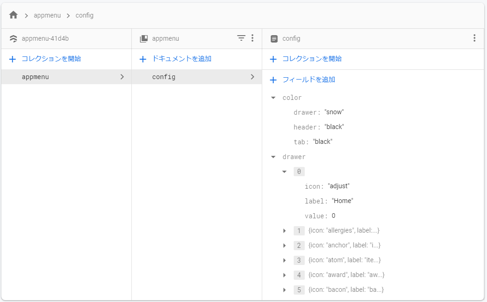
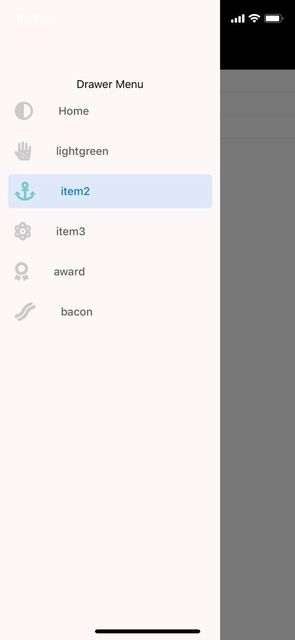
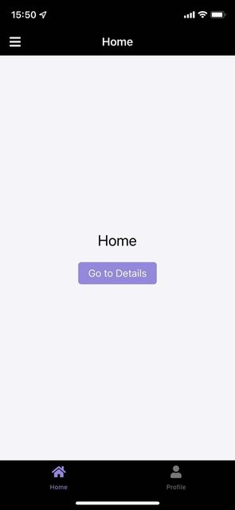

import { Link } from 'gatsby';

Firestoreリアルタイムリスナーを使ってReact Nativeアプリ(Expo)の外観をFirebaseコンソール(ブラウザ)からリアルタイムに書き換えるデモを作りました。

変更するのは以下の要素です。

- ヘッダー/タブバー/ドロワーの背景色
- ドロワー内のアイテム

<br/>

**デモ動画**

`youtube: WTE3YHfLE9g`

**ソースコード**

[react-native-expo-firebase](https://github.com/kiyohken2000/react-native-expo-firebase)

## 作り方

ひな形はいつものボイラープレートを使いました[react-native-boilerplate](https://github.com/WataruMaeda/react-native-boilerplate)。

### ディレクトリ

編集したのは以下のファイルです。

- src\firebase.js
  - Firebase接続用ファイル
- src\routes\navigation\Navigation.js
  - Firestoreからデータを取得してDrawerとStackに渡す処理を追加
- src\routes\navigation\drawer\Drawer.js
  - 受け取ったデータを使ってドロワーメニュー、背景色を表示
- src\routes\navigation\stacks\Stacks.js
  - 受け取ったデータを使って背景色を変更
- src\routes\navigation\tabs\Tabs.js
  - 受け取ったデータを使って背景色を変更
- src\scenes\item1 - item5
  - ドロワー内のメニューをタップしたときの遷移先

```
src
│  firebase.js
├─routes
│  │
│  └─navigation
│      │  Navigation.js
│      ├─drawer
│      │      Drawer.js
│      │
│      │stacks
│      │      Stacks.js
│      └─tabs
│              Tabs.js
├─scenes
│  ├─details
│  │      Details.js
│  │      index.js
│  │
│  ├─home
│  │      Home.js
│  │      index.js
│  │
│  ├─item1
│  │      index.js
│  │      Item1.js

** 途中省略 **

│  ├─item5
│  │      index.js
│  │      Item5.js
│  │
│  └─profile
│          index.js
│          Profile.js

** 以下省略 **
```

### Firestoreの構造



**color(map)**にはドロワー/スタック/タブの背景色を入れます。

**drawer(array)**にはドロワー内のメニューの設定を格納します。ドロワー内のアイテムのアイコン/表示名/表示順制御用の索引番号です。



## 実際のコード

### Firebaseと接続

まずFirebaseを使えるようにします。

```shell
expo install firebase
```

**src\firebase.js**

```javascript
import * as firebase from 'firebase'
import "firebase/auth"
import "firebase/firestore"
import "firebase/storage"

const firebaseConfig = {
  apiKey: "Your API Key",
  authDomain: "Your API Key",
  projectId: "Your API Key",
  storageBucket: "Your API Key",
  messagingSenderId: "Your API Key",
  appId: "Your API Key",
  measurementId: "Your API Key"
};

if (!firebase.apps.length) {
  firebase.initializeApp(firebaseConfig);
}

export { firebase };
```

### Firestoreから値をリッスンする

Firestoreからデータをリッスンする処理を追加します。コンポーネント間の値の受け渡しにはContext APIを使用しました。

**src\routes\navigation\Navigation.js**

```javascript
import React, { useEffect, useState, createContext } from 'react'
import { NavigationContainer } from '@react-navigation/native'
import DrawerNavigator from './drawer'
import { firebase } from '../../firebase'

export const Global = createContext(); // contextを作成

export default function App() {
  const [data, setData] = useState([]) // Firestoreから取得したデータを格納するフックを作成
  const value = { // Providerにはvalueとして渡す
    data, setData,
  }

  useEffect(() => { // Firestoreから値をリッスンする処理
    const appRef = firebase.firestore().collection('appmenu')
    appRef
    .doc('config')
    .onSnapshot(function(document) {
      const appData = document.data()
      setData(appData)
    })
  }, []);

  return (
    <Global.Provider value={value}> {/* contextオブジェクトをラップしたコンポーネントに渡す */}
      <NavigationContainer>
        <DrawerNavigator />
      </NavigationContainer>
    </Global.Provider>
  )
}
```

これでFirestoreから背景色やドロワー内のメニューを取得することができました。

`data`には以下の形で格納されています。

```
Object {
  "color": Object {
    "drawer": "snow",
    "header": "black",
    "tab": "black",
  },
  "drawer": Array [
    Object {
      "icon": "adjust",
      "label": "Home",
      "value": 0,
    },
    Object {
      "icon": "allergies",
      "label": "lightgreen",
      "value": 1,
    },
    Object {
      "icon": "anchor",
      "label": "item2",
      "value": 2,
    },
    Object {
      "icon": "atom",
      "label": "item3",
      "value": 3,
    },
    Object {
      "icon": "award",
      "label": "award",
      "value": 4,
    },
    Object {
      "icon": "bacon",
      "label": "bacon",
      "value": 5,
    },
  ],
}
```

### 背景色の変更

取得したデータを使ってヘッダーとタブの背景色を変更する処理を追加します。

**src\routes\navigation\stacks\Stacks.js**

```javascript
import { Global } from '../Navigation' // contextをインポートする
```

```javascript
export const Item1Navigator = () => {
  const { data } = useContext(Global) // contextオブジェクトを受け取る
  return (
    <Stack.Navigator
      initialRouteName="Item1"
      headerMode="screen"
      screenOptions={
        {
          headerTintColor: 'white',
          headerStyle: { 
            backgroundColor: data.color ? data.color.header:colors.darkPurple // ヘッダーの背景色、受け取ったcontextを参照する
          },
          headerTitleStyle: { fontSize: 18 },
        }
      }
    >
      <Stack.Screen
        name="Item1"
        component={Item1}
        options={({ navigation }) => ({
          title: 'Item1',
          headerLeft: () => <HeaderLeft navigation={navigation} />,
        })}
      />
    </Stack.Navigator>
  )
}
```

**src\routes\navigation\tabs\Tabs.js**

```javascript
import { Global } from '../Navigation' // contextをインポートする
```

```javascript
const TabNavigator = () => {
  const { data } = useContext(Global) // contextオブジェクトを受け取る
  return (
    <Tab.Navigator
      screenOptions={({ route }) => ({
        tabBarIcon: ({ focused }) => {
          switch (route.name) {
            case 'Home':
              return (
                <FontIcon
                  name="home"
                  color={focused ? colors.lightPurple : colors.gray}
                  size={20}
                  solid
                />
              )
            case 'Profile':
              return (
                <FontIcon
                  name="user"
                  color={focused ? colors.lightPurple : colors.gray}
                  size={20}
                  solid
                />
              )
            default:
              return <View />
          }
        },
      })}
      tabBarOptions={{
        activeTintColor: colors.lightPurple,
        inactiveTintColor: colors.gray,
        style: {
          backgroundColor: data.color?data.color.tab:colors.lightPurple, // タブバーの背景色、受け取ったcontextを参照する
        },
      }}
      initialRouteName="Home"
      swipeEnabled={false}
    >
      <Tab.Screen name="Home" component={HomeNavigator} />
      <Tab.Screen name="Profile" component={ProfileNavigator} />
    </Tab.Navigator>
  )
}
```

これでヘッダーとタブバーの背景色をFirestoreからリッスンした値に設定することができました。



### ドロワーの編集

ドロワーの背景色とアイテムを変更する処理を書いていきます。

**src\routes\navigation\drawer\Drawer.js**

```javascript
/* ドロワー内のアイテムと紐づけるコンポーネントをインポート */
import TabNavigator from '../tabs'
import { Item1Navigator, Item2Navigator, Item3Navigator, Item4Navigator, Item5Navigator } from '../stacks'
```

```javascript
import { Global } from '../Navigation' // contextをインポートする
```

```javascript
const DrawerMenuList = [ // インポートしたコンポーネントを配列にまとめる。配列の索引番号を利用して表示順を制御する
  TabNavigator,
  Item1Navigator,
  Item2Navigator,
  Item3Navigator,
  Item4Navigator,
  Item5Navigator,
]
```

```javascript
const DrawerNavigator = () => {
  const { data } = useContext(Global) // contextオブジェクトを受け取る
  return (
    <Drawer.Navigator
      initialRouteName="Home"
      drawerContent={DrawerMenuContainer}
      drawerStyle={{
        backgroundColor: data.color?data.color.drawer:'white', // ドロワーの背景色、受け取ったcontextを参照する
      }}
    >
      {
        data.drawer?
        data.drawer.map((item, i) => { // data.drawerをmap関数でループしてドロワー内のアイテムを出力する
          return (
            <Drawer.Screen
              key={i}
              name={item.label}
              component={DrawerMenuList[item.value]} // コンポーネントの表示順は配列の索引番号とする
              options={{
                title: item.label,
                drawerIcon: ({focused, size}) => (
                  <FontIcon
                    name={item.icon}
                    size={size}
                    color={focused ? '#7cc' : '#ccc'}
                  />
                ),
              }}
            />
          )
        }):
        <Drawer.Screen
          name="Home"
          component={TabNavigator} 
        />
      }
    </Drawer.Navigator>
  )
}
```

## まとめ

実装したコードは以上です。背景色はFirestoreからリッスンした文字列をそのまま使えたので簡単でした。

トリッキーなコードになってしまいましたが、ドロワー内のアイテムの制御に索引番号を利用するアイディアに辿り着けたのは良かったと思います。

---