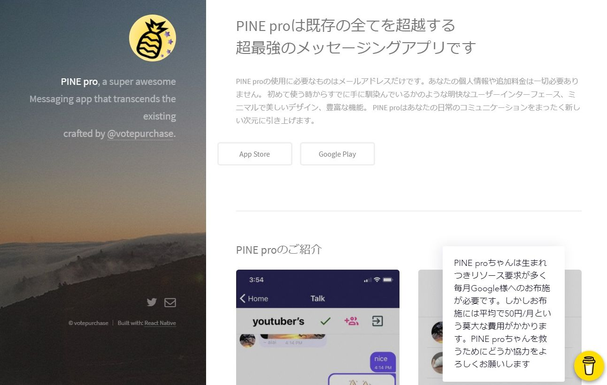
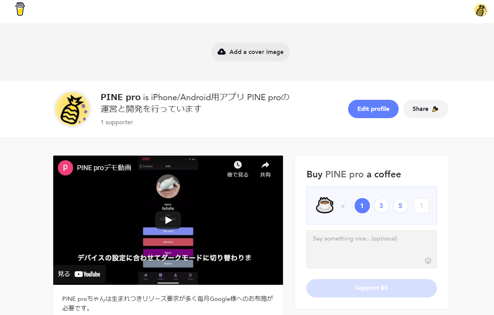
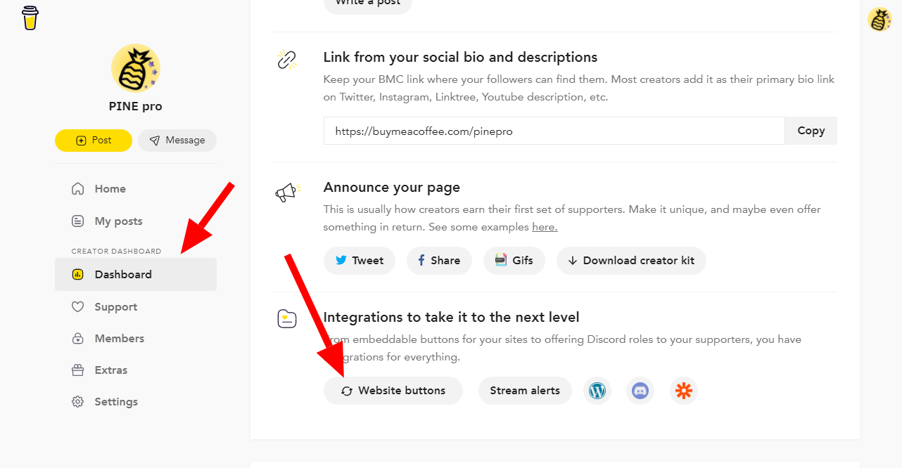
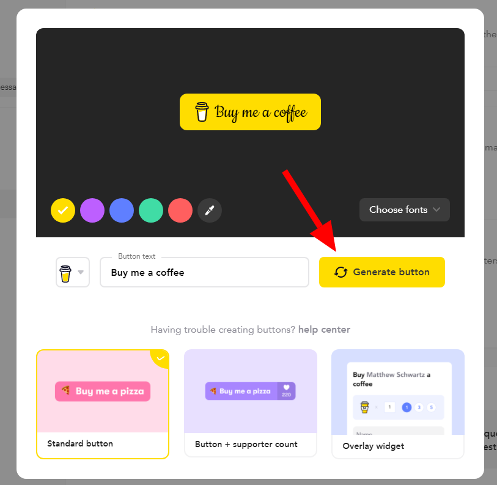
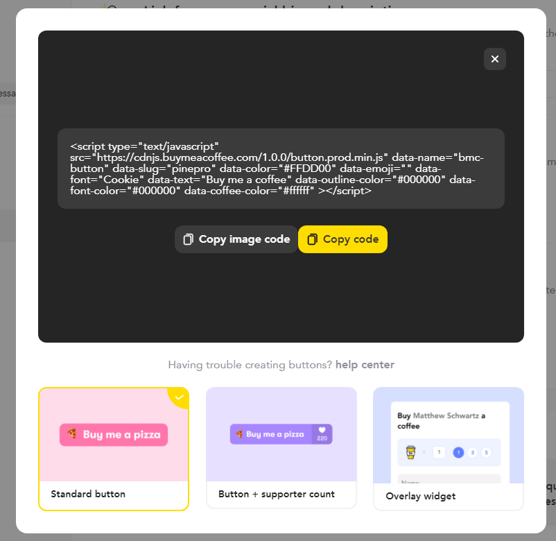
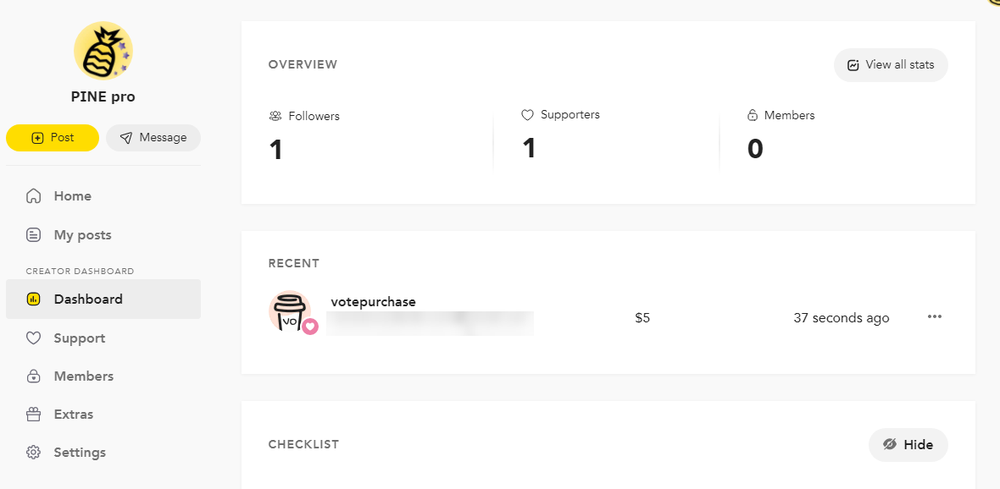
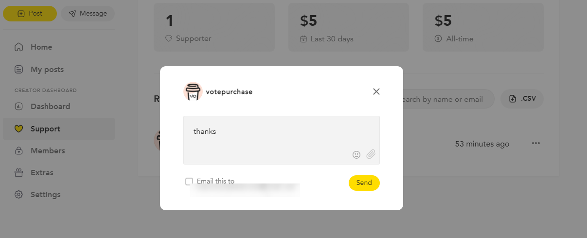

import { Link } from 'gatsby';

## Buy me a coffee

[Buy me a coffee](https://www.buymeacoffee.com)はクリエーターやアーティストがファンからのサポートやメンバーシップを受け付けるためのサービスです。要は投げ銭サービスです。

今回はBuy me a coffeeで投げ銭を受け取るボタンを[PINE pro](https://pinepro.ml/)のランディングページに設置しました。

投げ銭する側はクレジットカードだけでできます。投げ銭を受ける側はStripeかPayPalを利用して口座に入金されます。

## 設置方法

右下にBMCウィジェットを設置します。



### Buy me a coffeeにサインアップ

当然ですが、[Buy me a coffee](https://www.buymeacoffee.com)のアカウントが必要です。

今回は入金手段にStripeを利用しました。サインアップ時にStripeのアカウントがない場合は途中で作成できます。

Stripeのサインアップ時に本人確認が必要です。私は

- SMS認証用の携帯電話番号
- 入金用の銀行口座
- 本人確認用の書類(免許証かパスポート)

<br/>

でアカウントを作成しました。

### 埋め込み用のコードを取得する

サインアップが完了すると、プロフィール画面が開きます。自分のプロフィールを入力します。



プロフィールを作成したら右上のBMCロゴをクリックしてHome画面に移動します。左のメニューから[**Dashboard**]を選択し、下にある[**Website buttons**]をクリックします。



設置するウィジェットの外観をカスタマイズします。完了したら[**Generate button**]をクリックします。



ウェブページに設置する用のコードが表示されます。コピーしておきます。



### BMCボタンをGatsbyサイトに埋め込む

プラグインのインストールは不要です。

**gatsby-ssr.js**

```javascript
import React from 'react'

export const onRenderBody = ({ setPostBodyComponents }) => {
  setPostBodyComponents([
    <script
      key="buyMeACoffee"
      data-name="BMC-Widget"
      data-cfasync="false"
      src="https://cdnjs.buymeacoffee.com/1.0.0/widget.prod.min.js"
      data-id="pinepro"
      data-description="Support me on Buy me a coffee!"
      data-message="PINE proちゃんは生まれつきリソース要求が多く毎月Google様へのお布施が必要です。しかしお布施には平均で50円/月という莫大な費用がかかります。PINE proちゃんを救うためにどうか協力をよろしくお願いします"
      data-color="#FFDD00"
      data-position="Right"
      data-x_margin="18"
      data-y_margin="18"
    ></script>,
  ])
}
```

`setPostBodyComponents`の配列に先ほどコピーしたコードを貼り付けます。エラー回避のために`key`を適当に設定しておきます。あとは普通にビルドしてデプロイします。

### 動作確認

試しに自分で投げ銭をしてみたところBMCのホーム画面には下の画像のように表示されました。



投げ銭してくれた人には下記画像のようにメールでメッセージを送信することもできるようです。



## まとめ

以上です。簡単ですね。

---