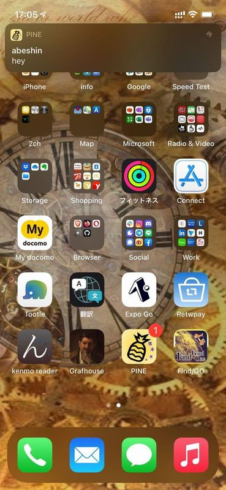

import { Link } from 'gatsby';

## PINE proのアップデート

新着メッセージがあるときにアプリのアイコンにバッジがつくようにしました。



とりあえず

1. Push通知受けたらbadgeカウントを1にする
1. アプリ起動時にbadgeカウントを0にする

という雑な実装です。

## 変更したコード

### バッジを1にする処理

<Link to="/blog/2021-04-28">以前</Link>書いたように、PINE proのプッシュ通知はExpo Push APIとFirebase Cloud Functionsを使って実装しています。

Cloud Functionsにコードにバッジを1にする処理を追加します。

```javascript
exports.sendMessage = functions.region('asia-northeast2').firestore
  .document('talk/{talkId}')
  .onUpdate((change, context) => {
    const newValue = change.after.data();
    const text = newValue.latestMessage.text;
    const talkName = newValue.name;
    const members = newValue.members;
    const email = newValue.latestMessage.email;
    const previousValue = change.before.data();
    const newTime = newValue.latestMessage.createdAt;
    const prevTime = previousValue.latestMessage.createdAt;
    // console.log(name,text,members)

    if (newTime != prevTime) {
      for (const elem of members) {
        const message = [];
        const userRef = db.collection('tokens').doc(elem)
        userRef.get().then((doc) => {
          if (doc.exists) {
            const data = doc.data()
            const token = data.token
            const id = data.email
            if (id != email) {
              message.push({
                to: token,
                sound: 'default',
                title: talkName,
                body: text,
                badge: 1, // ここに追加
              });
            console.log(message)
            expo.sendPushNotificationsAsync(message)
            } else { null }
          } else { null }
        })
      }
    } else { null }
  });
```

### バッジを0にする処理

次にアプリ側の実装です。アプリを開いたときにバッジを0にする処理を追加します。

**src\routes\navigation\Navigation.js**

```javascript
useEffect(() => {
  Notifications.setBadgeCountAsync(0)
  console.log('app start')
});
```

ちょっと古めのブログ記事を参考にしたので、当初`setBadgeNumberAsync`と書いておりアプリを起動してもバッジが消えずに悩みました。

SDK何番か調べてないですが、メソッド名が`setBadgeCountAsync`に変わっていたのですね。[公式ドキュメント](https://docs.expo.dev/versions/latest/sdk/notifications/)を読むのは大事です。

あと今回の変更とは関係ないですが、`useEffect`内に適当な`console.log()`を書いて無限ループしてないかチェックするようにしています。

## まとめ

Expoを使ってアプリを書くのは楽しい。EAS Buildが正式リリースされたらもっと色々やってみたい。

---