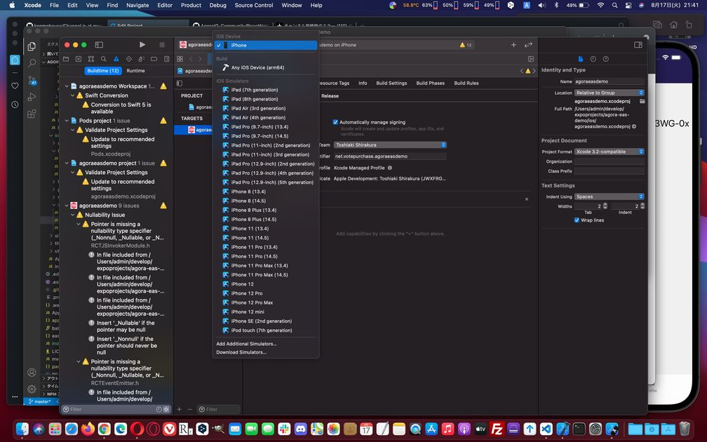

import { Link } from 'gatsby';

## 新作アプリをリリースしました

動画配信SNS、[Ocacatalk](https://ocacatalk.ml)をリリースしました。


詳細はリンク先のランディングページを見ていただきたいのですが、簡単にいうとClubhouseの動画版です。テキストチャットもできます。

Clubhouse使ったことないので伝え聞く情報から完全に想像だけで作りました。

よかったら遊んでみてください。iPhone/Android両対応です。

## Expo Application Services

### Expo CLI

これまで私のアプリは全てExpo Managed Workflowで開発してきました。Expoとは簡単にいうとReact Nativeのアプリ開発を超便利にしてくれる開発ツールです。XcodeやAndroid Studioをまったく触らなくても開発からリリースまで出来てしまいます。

デバッグはもちろんiOS/Androidシミュレーターでもできますが、Expo Goアプリを利用して実機で簡単にできます。私は手持ちのMacBookAirよりも快適に使える自作パソコンで開発するのが好きなので、Windows上のVSCodeでコードを書く→iPhoneで実機デバッグするという形で開発していました。

OTAアップデートやホットリロードも完全に動作するため特に理由がなければExpoを使って開発するのがオススメです。

一方で、Expoには欠点もあります。それはReact Native CLIとは異なり**ネイティブコードを触ることができない**ということです。具体的にはBlutoothやWebRTC、InAppPurchaseなどネイティブコードを使う一部のライブラリには非対応です。ただ、GPSやカメラ、Mapなど大半の機能はExpoが純正ライブラリを提供しているためこれまでリリースしてきたアプリはExpoで開発できました。

### EAS CLI

Expo Application ServicesはExpoの提供する次世代のビルドサービスです。Expoの便利な機能を使いながら上述のこれまで非対応だったネイティブコードを触るライブラリを利用することができます。

2021年後半の本リリースに向けて現在はプレビュー機能となっていますが、**$29/mo**の[Priority Plan](https://expo.dev/pricing)を登録することで利用できるようになります。

### Ocacatalk

というわけで、実際にPriority Planに登録してEAS buidを使ってリリースしたのが冒頭で紹介した新作アプリ**Ocacatalk**です。

Ocacatalkのビデオチャット機能は[Agora](https://www.agora.io/en/)を利用しています。

Agoraは、自社開発のスマートフォン・PCアプリやWebサイトに、カスタマイズしたビデオ・音声通話やライブ配信をかんたんに実装できるSDKです。Clubhouseのバックエンドに使われていることでもおなじみのSaaSです。

React Native用の[ライブラリ(react-native-agora)](https://github.com/AgoraIO-Community/react-native-agora)はこれまでも提供されていましたが、AgoraのビデオチャットはWebRTCであり、Expoでは利用できませんでした。

OcacatalkはEAS buildを使い、これまでできなかったAgoraSDKを利用して開発しました。

## EAS buildの開発方法

EAS buildはまだプレビュー段階のためあまり情報がありません。Expo Managed Workflowでの開発に慣れていれば問題ないと思います。

しかし、いくつか違いがあるので実際にAgoraを使ってビデオチャットを行うデモアプリを作る方法を書きます。

デモアプリのリポジトリです。

- [kiyohken2000/agora-eas-demo](https://github.com/kiyohken2000/agora-eas-demo)

<br/>

### 出来上がるもの

左がiPhone12、右がiPhone6sでとったスクリーンショットです。2つのデバイスでビデオチャットをしている様子です。


### AgoraIDの準備

本題からはずれるので詳細は省きますが、とりあえず[Agora](https://www.agora.io/en/)にサインアップしてプロジェクトを作成します。**10,000 FREE mins per month**の無料枠があり、クレジットカード情報の登録も必須じゃないので安心です。

プロジェクトを作成してAppIDを取得します。デモアプリなのでApp certificateはDisableにしておきます。


### 開発環境

ネイティブコードを利用する場合Expo Goアプリでデバッグできないので、iOSかAndroidのシミュレーターを使います。自作パソコンにAndroid Studioを入れたくないのでMacBookAirを使います。

- Mac Book Air 2020 (Intel, macOS 11.5.2)
- expo-cli v4.9.1
- eas-sli v0.23.0

<br/>

react-native-cliは入っていません。


### Expoプロジェクトの準備

`expo init`で新規で作ってもいいのですが、せっかくなのでアプリっぽくするために前に作った自分用のボイラープレートを使います。

- [kiyohken2000/reactnative-expo-firebase-boilerplate](https://github.com/kiyohken2000/reactnative-expo-firebase-boilerplate)

<br/>


- ボトムタブ、スタックナビゲーション
- Firebase authを使ったメールアドレス/PWでのサインアップ/ログイン
- Firestoreを使ったユーザープロフィールの編集
- Firebase Cloud Storageを使ったアバター画像のアップロード
- expo notifications tokenの取得とFirestoreへの保存
- デバイス設定に合わせたダークモードの動的切り替え

<br/>

を実装した便利なボイラープレートです。

これをクローンしてきて依存関係をインストールします。

```shell
yarn install
```

とりあえず、Managed Workfloのまま動作確認します。

```shell
expo start
```


無事に動きました。画像を載せる用にシミュレーターを使ってますがこの時点では実デバイスのExpo Goアプリでも動作します。

### app.jsonの編集

デモアプリに名前をつけます。

```javascript
"expo": {
  "name": "reactnative-expo-firebase-boilerplate",
  "slug": "reactnative-expo-firebase-boilerplate",
```

```javascript
"ios": {
  "supportsTablet": true,
  "bundleIdentifier": "net.votepurchase.agoraeasdemo",
  "buildNumber": "1.0.0",
  "infoPlist": {
    "NSPhotoLibraryUsageDescription": "Use the photo library to change your avatar.",
    "NSCameraUsageDescription": "Use for video call.",
    "NSMicrophoneUsageDescription": "Use for video call."
  },
  "userInterfaceStyle": "automatic"
},
```

`bundleIdentifier`を設定します。ビデオチャットにカメラとマイクを使うので`NSCameraUsageDescription`と`NSMicrophoneUsageDescription`も追加します。

```javascript
"android": {
  "package": "net.votepurchase.agoraeasdemo",
```

Androidのパッケージ名も設定します。

### EAS buildの準備

EASにログインします。Expoのユーザー名とパスワードです。

```shell
eas login
```

EASの初期化を行います。

```shell
eas build:configure
```

途中で色々聞かれますが**全てyes**を選択しました。

新しく**eas.json**が作成されます。

```javascript
{
  "build": {
    "release": {},
    "development": {
      "developmentClient": true,
      "distribution": "internal"
    }
  }
}
```

デフォルトのままにしておきます。

### 動作確認

EASを使って動かしてみます。まだAgoraはインストールしていません。

iOSのシミュレーターを開いたまま以下のコマンドを打ちます。

```shell
expo run:ios
```

ルートディレクトリに`ios`フォルダが作成され、必要なファイルが作成されます。数分かかります。

しばらく待っているとビルドされたアプリが起動します。


この時点では先ほどExpo Goで動かしたものと変わりありませんが、ホーム画面にはExpo Goアプリではなく今ビルドしたアプリがインストールされています。


今回のデモアプリではログイン後にビデオチャットの画面を置きたいのでアプリにログインしておきます。


### Agora SDKのインストール

Agoraのライブラリをインストールします。

- [AgoraIO-Community/react-native-agora](https://github.com/AgoraIO-Community/react-native-agora)

```shell
yarn add react-native-agora
```

```shell
cd ios
```

```shell
pod install
```

UIはAgoraが用意してくれているものをそのまま利用します(ReactNative-UIKit)

- [AgoraIO-Community/ReactNative-UIKit](https://github.com/AgoraIO-Community/ReactNative-UIKit)


ルートディレクトリに戻ってからインストールします。

```shell
cd ..
```

```shell
yarn add agora-rn-uikit
```

以上でインストールは完了です。

### ページ遷移を作成

ホーム画面→チャット開始前→チャット開始後、という風に遷移したいので、チャット画面用のコンポーネントを作ります。


**src/scenes/stream/Stream.js**

```javascript
import React, { useEffect, useState } from 'react'
import { Text, View, ScrollView, StatusBar, useColorScheme, Button } from 'react-native'
import styles from './styles'
import { firebase } from '../../firebase/config'
import AgoraUIKit from 'agora-rn-uikit'

export default function Stream(props) {
  const userData = props.extraData
  const scheme = useColorScheme()
  const [videoCall, setVideoCall] = useState(false);
  const rtcProps = {
    appId: '<Agora App ID>',
    channel: 'easdemo',
  };
  const callbacks = {
    EndCall: () => setVideoCall(false),
  };

  return (
    <View style={styles.container}>
      <StatusBar barStyle="light-content" />
      <View style={{ flex: 1, width: '100%' }}>
        {
          videoCall ?
            <AgoraUIKit rtcProps={rtcProps} callbacks={callbacks} />
            :
            <Button title={'Start Call'} onPress={()=>setVideoCall(true)} />
        }
      </View>
    </View>
  )
}
```

`<Agora App ID>`には最初のほうで作成したAgoraのAppIDが入ります。

作ったコンポーネントをルーティングに追加します。

**src/routes/navigation/stacks/Stacks.js**

```javascript
import Stream from '../../../scenes/stream'
```

```javascript
<Stack.Navigator headerMode="screen" screenOptions={navigationProps}>
  <Stack.Screen name="Home">
    {props => <Home {...props} extraData={user} />}
  </Stack.Screen>
  <Stack.Screen name="Stream">
    {props => <Stream {...props} extraData={user} />}
  </Stack.Screen>
</Stack.Navigator>
```

Home画面からチャット画面(Stream)に遷移できるようにします。

**src/scenes/home/Home.js**

```javascript
import { useNavigation } from '@react-navigation/native'
```

```javascript
const navigation = useNavigation()
```

```javascript
<Button title={'Go Stream'} onPress={() => {
  navigation.navigate('Stream')
}} />
```

コードの変更はここまでです。

### 動作確認

実際に動かしてみます。

```shell
expo run:ios
```

画面遷移などはできますが、ビデオチャットが開始できません。シミュレーターではカメラとマイクが使えないのでこうなります。


### 動作確認用に実デバイスにインストール

ビデオチャットの動作確認をしたいのでXcodeを使って実デバイス用にビルドします。

ルートディレクトリの中の`ios`フォルダをXcodeで開きます。**Opne a project or file**から`ios`フォルダを選択します。


実機にインストールするためには署名をしないといけません。**Signing & Capabilities**タブを開いて**Team**を選択します。Appleのデベロッパーアカウントが必要です。


iPhoneをUSBケーブルでMacと接続します。インストール先を今接続したiPhoneにします。



左上のビルド開始ボタンをクリックするとビルドとインストールが開始されます。


しばらく待ってるとインストールが完了します。物理iPhoneのスクリーンショットです。


### 実デバイスで動作確認

ビデオチャットの確認をしたいのでiPhone2台にインストールしました。それぞれのiPhoneでインストールしたデモアプリを起動すると無事にビデオチャットが開始されました。


### リリースビルド

リリースするわけではないですが確認のため実際にリリースビルドしてみました。

```shell
eas build --platform ios
```

無事にビルドできました。あとは通常のExpoアプリと同じようにTransporterアプリを使ってAppStoreに提出します。


### 補足

#### バージョン番号

バージョン番号のインクリメントは手動です。

Managed Workflowではストアに新バイナリを提出するときに**app.json**の`expo.ios.buildNumber`と`expo.android.versionCode`をインクリメントしますが、EAS buildでは手動でそれぞれ更新しないといけません。

iOSなら**/ios/agoraeasdemo/Info.plist**の`CFBundleVersion`を手動でインクリメントします。

Androidは**android/app/build.gradle**の`android.defaultConfig.versionCode`です。

#### Androidでのビルド

ここまでXcodeを使ったiOS用のビルドについてだけ書いてきました。Androidについては書いていません。


なぜならAndroid Studioのエミュレーターでどうしても動かせなかったからです。ただし、

```shell
eas build --platform android
```

でのリモートビルドは普通にできてしまったのでAndroidでの動作確認をしないままGoogle Playに提出してそのままリリースしました。

#### OTAアップデート

Testflight中でもリリース後でも`expo publish`でのOTAアップデートはできました。ただし、通常のExpoアプリと同様に**app.json**の変更やネイティブコードを触るライブラリを追加した場合はOTAアップデートできません。ストア経由でのアップデートが必要です。

#### AgoraとAppStoreレビュー

AgoraIOを利用したアプリではAppStoreのレビューに難があります。

- [How do I get past the AppleStore review process?](https://github.com/AgoraIO-Community/react-native-agora/issues/357)

<br/>

レビュアーはVPNを通してレビューしているようですが、AgoraはVPN経由だとビデオチャットが開始できません。そのため「ビデオチャットが開始できない」という理由で何度もリジェクトされてしまいました。

最終的にはレビュアーへのメモに

```
I run the app on my real device using Testflight, the permission request is displayed without any problem and I can allow it to use the camera / microphone.

**Please allow the app to access the camera and microphone. If you do not allow it, you will not be able to video chat.**
**Use a real device. Cameras and microphones are not available in the simulator.**

I have captured it working on my device.
https://youtu.be/Dh5h1-Kk1eU

If you are using a VPN, turn it off.

>The AppStore review team is testing via VPN, so that's probably the problem, but I don't know much about networks, so I don't know what the solution is.
https://github.com/AgoraIO-Community/react-native-agora/issues/357
```

という風に

- VPNを使わないで欲しいこと
- 実デバイスを使って欲しいこと
- 自分のデバイスでは動作すること
- YouTubeにアップロードしたデモビデオのリンク

<br/>

を書いたところレビューを通過しました。

## まとめ

EAS buildを利用することでExpoでこれまで作れなかったアプリが作れるようになりました。

Expo GoアプリでのデバッグができないためMacが必須ではありますが、Managed Workflowでの快適な開発体験をほとんど損なうことなくネイティブコードを触るライブラリを使えます。

プレビュー期間が終わったら無料で解放されるとのことですが、Expoにはお世話になっているのでしばらく課金は続けようと思います。

---