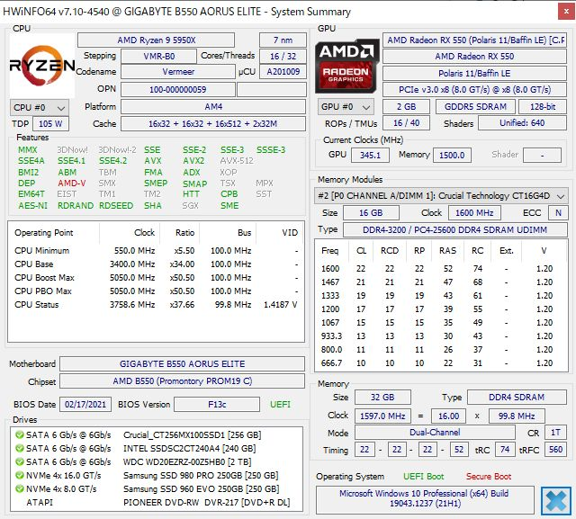
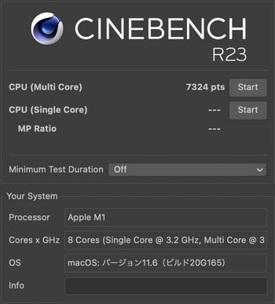
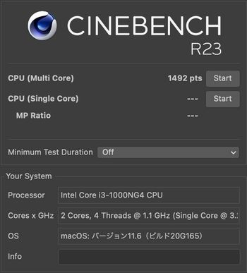
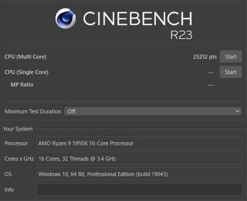
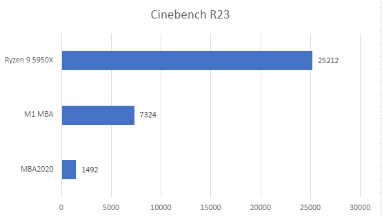
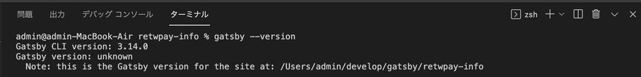
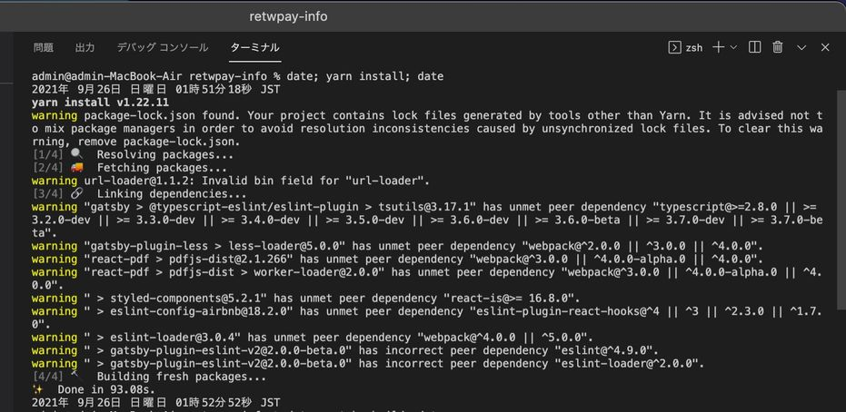
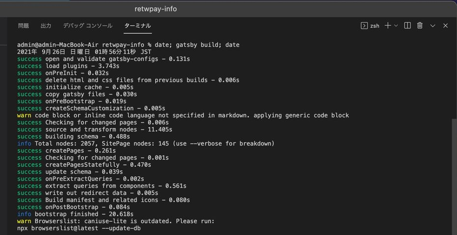
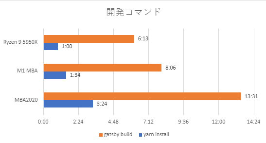

import { Link } from 'gatsby';

新型iPhoneが発売されたこととは全く関係ありませんが、しばらく前にM1 MacBook Airを買ったので性能を調べました。

比較対象はRyzen9な自作パソコンと、これまで使っていたMacBookAir2020(Intel)です。

## Cinebench

まずは定番のCinebenchの結果から。

当然ですがRyzen9が圧倒的に速いです。むしろ、CPUだけでMacBookAirそのものに近い値段なので圧倒的な差じゃないと泣けます。最近涼しくなってきたとはいえ、まだそれなりの室温なので以前に測定したときよりスコアが低く出ています。

## 開発コマンド

次に、開発コマンドに実行時間を調べました。

このブログをGitHubからクローンした後、`yarn install`が完了するまでの時間と、`gatsby build`したときの時間を計測しました。

[Gatsby CLI](https://www.gatsbyjs.com/docs/reference/gatsby-cli/)のバージョンは`3.14.0`で揃えました。

計測方法は、それぞれのコマンドを`date`で挟んでコマンド実行前後の現在時刻を表示して経過時間を調べるやり方です。

`date; yarn install; date`

`date; gatsby build; date`

なお、このブログのレポジトリは[こちら](https://github.com/kiyohken2000/retwpay-info)です。

### 実行時間

その結果がこちらです。

## まとめ

MacBookAir2020とM1 MacBookAirを比べると明らかにM1 MBAが高速でした。

本当はReact Nativeアプリをビルドしたときの時間で比較したいけど良い方法が思いつかない。

---