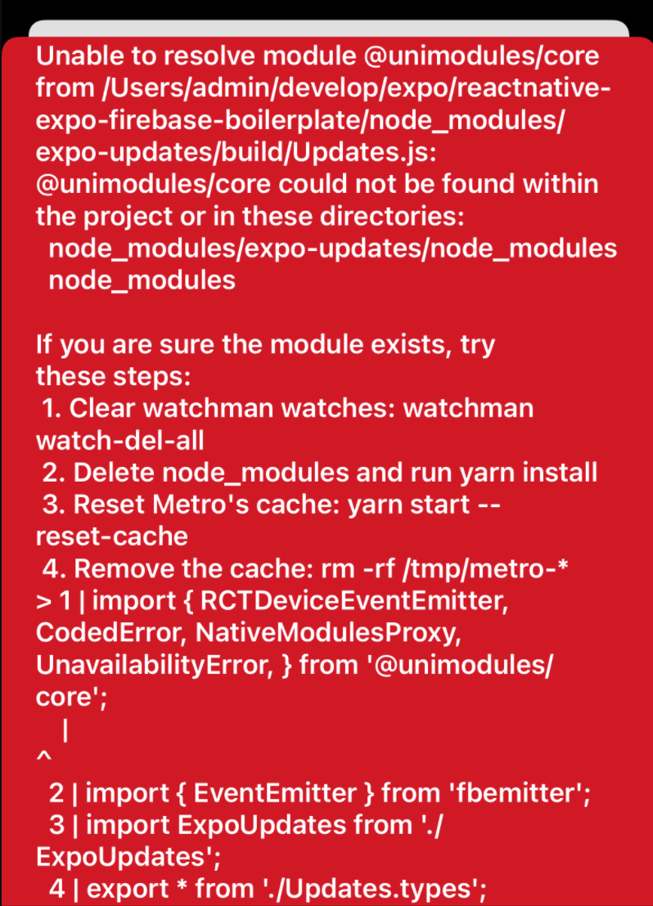
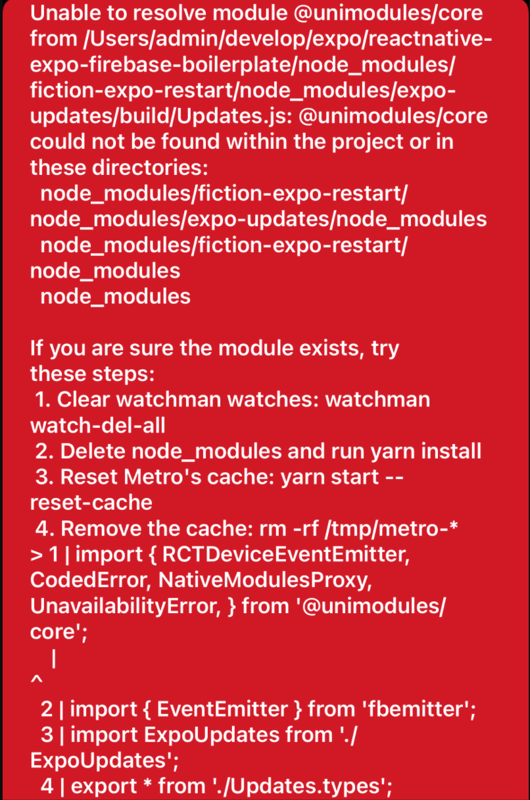

import { Link } from 'gatsby';

## Expo SDK 43が公開されました

先週Expo SDKのversion43が正式にリリースされました。

- [Expo SDK 43](https://blog.expo.dev/expo-sdk-43-aa9b3c7d5541)

<br/>

目玉は

- [Hermes](https://hermesengine.dev)の実験的サポート
- **react-native-unimodules**の**expo**への置き換え

<br/>

の2つです。

これまで何度かSDKのアップデートは行っていますが、スムーズに移行できていました。しかし今回はうまくいきませんでした。

アップデートを試みたのは以下の4つです。いずれもManaged workflowです。

- [ケンモリーダー](https://github.com/kiyohken2000/kenmo-reader)
- [PINE pro](https://github.com/kiyohken2000/kenmochat)
- [reactnative-expo-firebase-boilerplate](https://github.com/kiyohken2000/reactnative-expo-firebase-boilerplate)
- [ReactNative-Expo-Firebase-Boilerplate-v2](https://github.com/kiyohken2000/ReactNative-Expo-Firebase-Boilerplate-v2)

<br/>

このうち**ケンモリーダー**のみ`expo upgrade`コマンドと、いくつかのライブラリ更新でアップデートが完了しました。AppStore/GooglePlayともに配信済みです。

## アップデートができない理由

うまくいかなかった3つですが、いずれも[fiction-expo-restart](https://www.npmjs.com/package/fiction-expo-restart)という、アプリを再起動するライブラリを使っています。このライブラリが原因のようです。

`expo upgrade 43`を実行したあとアプリを起動すると、以下のエラーが出ます。



```
Unable to resolve module @unimodules/core from /Users/admin/develop/expo/reactnative-expo-firebase-boilerplate/node_modules/expo-updates/build/Updates.js: @unimodules/core could not be found within the project or in these directories:
  node_modules/expo-updates/node_modules
  node_modules

If you are sure the module exists, try these steps:
 1. Clear watchman watches: watchman watch-del-all
 2. Delete node_modules and run yarn install
 3. Reset Metro's cache: yarn start --reset-cache
 4. Remove the cache: rm -rf /tmp/metro-*
> 1 | import { RCTDeviceEventEmitter, CodedError, NativeModulesProxy, UnavailabilityError, } from '@unimodules/core';
    |                                                                                              ^
  2 | import { EventEmitter } from 'fbemitter';
  3 | import ExpoUpdates from './ExpoUpdates';
  4 | export * from './Updates.types';
```

`expo-updates`が存在してないので原因っぽいのでインストールします。

```
expo install expo-updates
```

その後アプリを実行すると。以下のエラーになります。



```
Unable to resolve module @unimodules/core from /Users/admin/develop/expo/reactnative-expo-firebase-boilerplate/node_modules/fiction-expo-restart/node_modules/expo-updates/build/Updates.js: @unimodules/core could not be found within the project or in these directories:
  node_modules/fiction-expo-restart/node_modules/expo-updates/node_modules
  node_modules/fiction-expo-restart/node_modules
  node_modules

If you are sure the module exists, try these steps:
 1. Clear watchman watches: watchman watch-del-all
 2. Delete node_modules and run yarn install
 3. Reset Metro's cache: yarn start --reset-cache
 4. Remove the cache: rm -rf /tmp/metro-*
> 1 | import { RCTDeviceEventEmitter, CodedError, NativeModulesProxy, UnavailabilityError, } from '@unimodules/core';
    |                                                                                              ^
  2 | import { EventEmitter } from 'fbemitter';
  3 | import ExpoUpdates from './ExpoUpdates';
  4 | export * from './Updates.types';
```

というわけで、**fiction-expo-restart**が原因になっているらしいことがわかりました。

## 対応策

**ReactNative-Expo-Firebase-Boilerplate-v2**については、**fiction-expo-restart**を使わないという方法で対処しました。このライブラリはログアウト時にアプリを再起動させログイン状態の判定をやりなおすために使っています。

```javascript
<NavigationContainer theme={colorScheme === 'dark' ? DarkTheme : DefaultTheme}>
  { userData ? (
    <UserDataContext.Provider value={{userData, setUserData}}>
      <TabNavigator/>
    </UserDataContext.Provider>
    ) : (
    <LoginNavigator/>
  )}
</NavigationContainer>
```

こんな風に`userData`にFirestoreから取得したユーザー情報が入ってればログイン後の画面遷移へ、入ってなければログイン/サインアップ画面へ、という感じです。なので`userData`を空にしてあげればログイン判定が行われ、ログイン前画面に遷移します。

ボイラープレートv2では`userData`と`setUserData`をContextAPIを使って受け渡しているので、ログアウト関数の書き換えだけで**fiction-expo-restart**の削除ができました。

```javascript
const signOut = () => {
  firebase.auth().signOut()
  // Restart() アプリの再起動は行わない
  setUserData(null) // 代わりにuserDataを空にして判定しなおす
}
```

ただ、ボイラープレートv1とPINE proでは、ContextAPIやReduxを使っておらず、`userData`の受け渡しはpropsのバケツリレー形式なのでこの方法は使えません。他の方法も思いつかないのでライブラリのアップデート待ちになりそうです。

---