import { Link } from 'gatsby';

OpenAIの高性能言語AI**GPT-3**がアカウント作成だけで誰でも利用可能になったので早速試してみました。

- [OpenAI’s API Now Available with No Waitlist](https://openai.com/blog/api-no-waitlist/)

 

## 利用開始方法

まずは[ドキュメンテーションページ](https://beta.openai.com/docs/introduction)にアクセスしてアカウントを作成します。

右上の**Sign up**をクリック

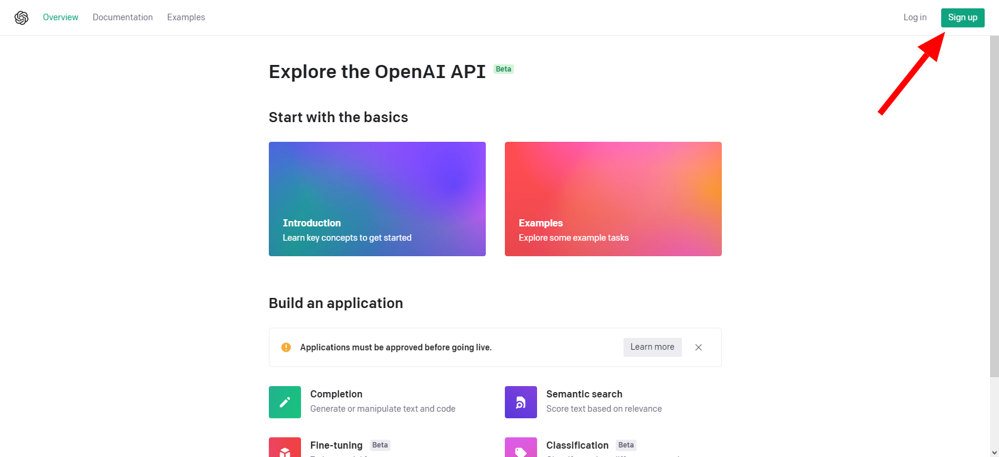

Googleアカウントを使ってサインアップします

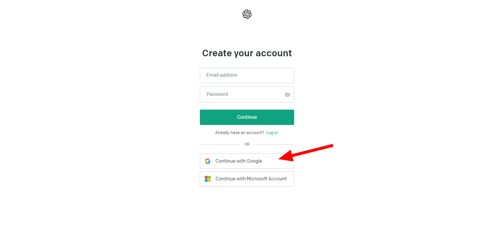

自分の名前を入力して**Continue**をクリックします。ハンドルネームでもOKです

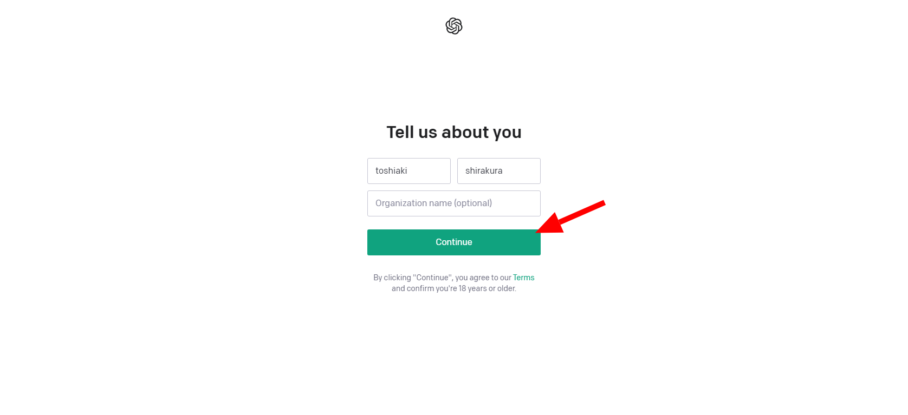

SMS認証が必要なので電話番号を入れます

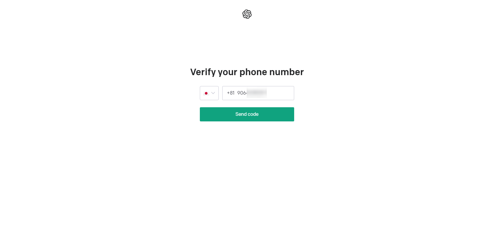

受信した認証番号を入力すると用途の選択に進みます。

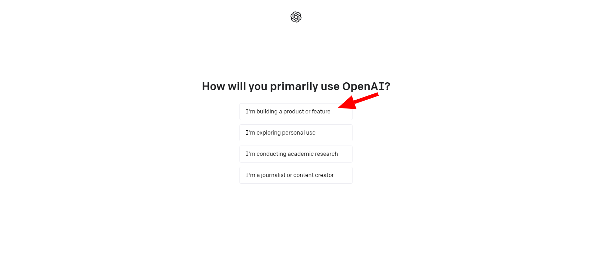

アカウント作成はこれで完了です

## ブラウザ上で試す

**Playground**というブラウザ上で文章を入力してAPIを試すサービスを使います。

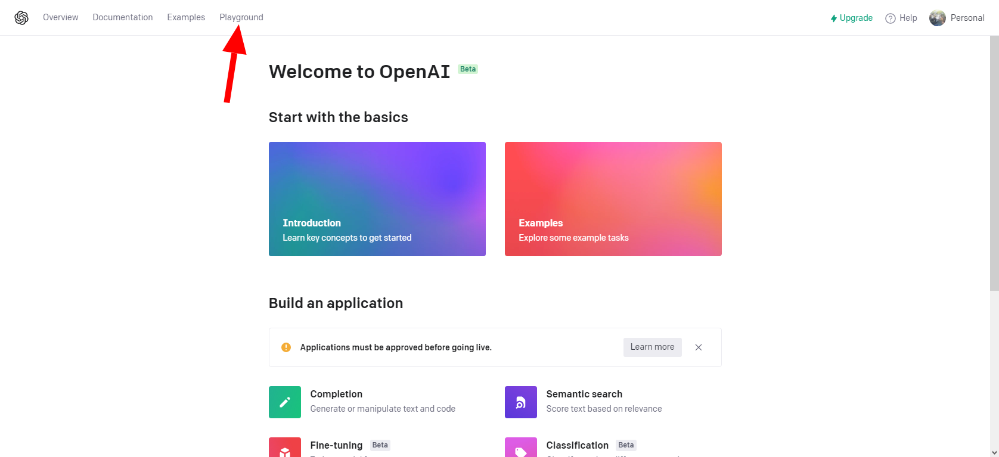

Playground画面です。

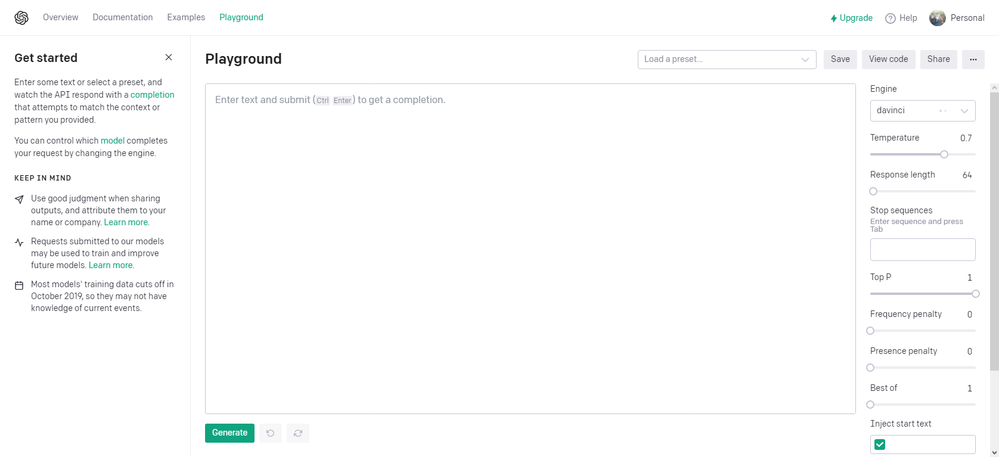

いくつか例文を自分で入力してから、下の**Generate**をクリックするとGPT-3が文章を生成してくれます。この画像では太文字が自分で入力した部分、太字じゃない部分がGPT-3が生成した文章です。

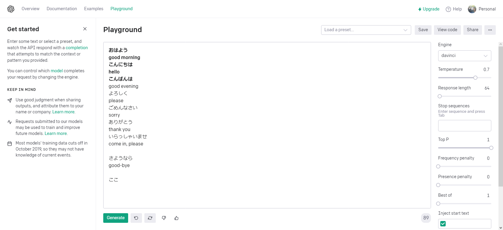

もう少し試してみます。

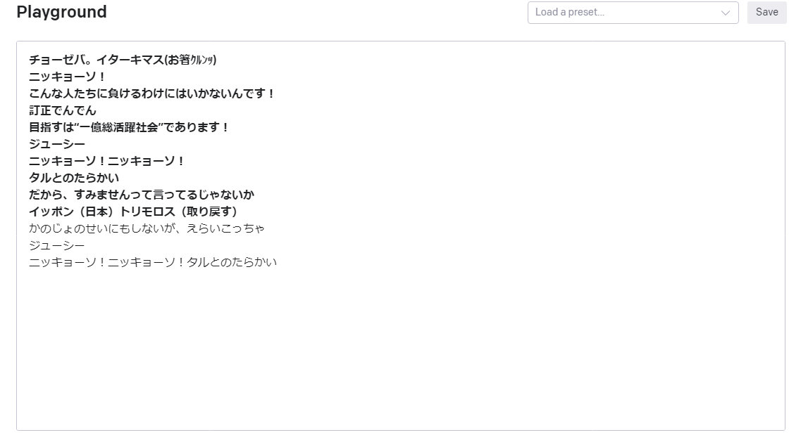

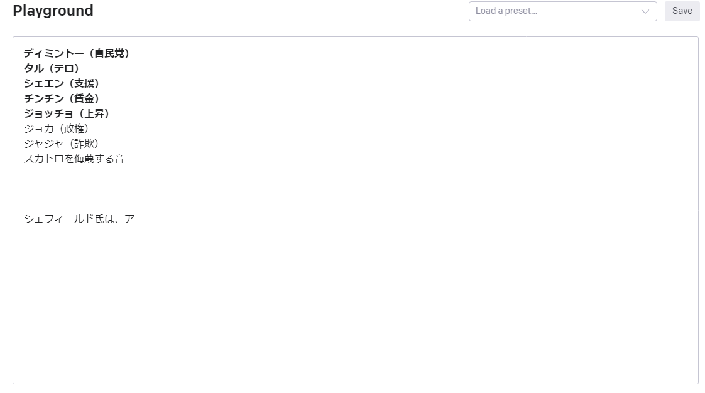

文章を入れると続きを書いてくれます

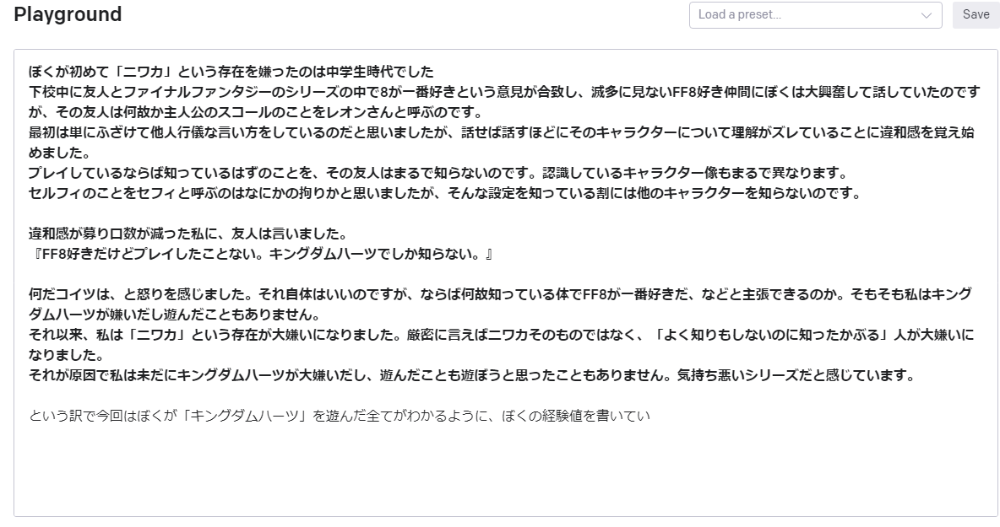

---