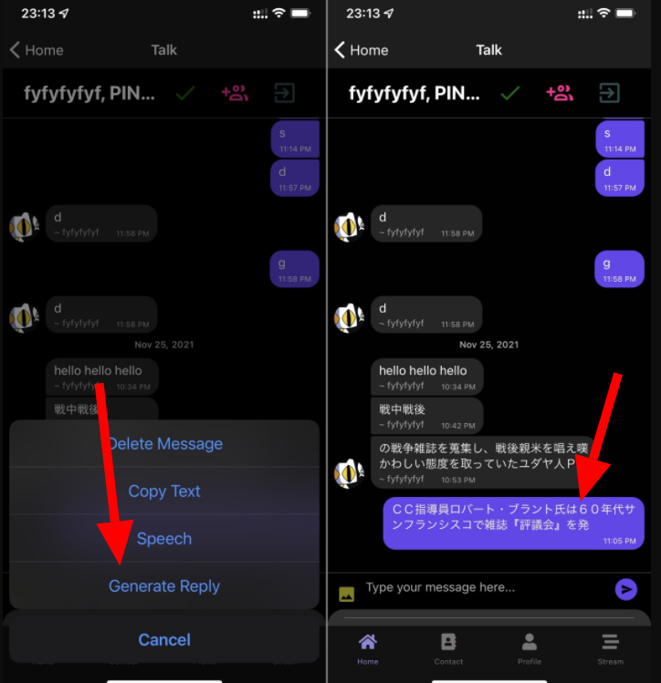
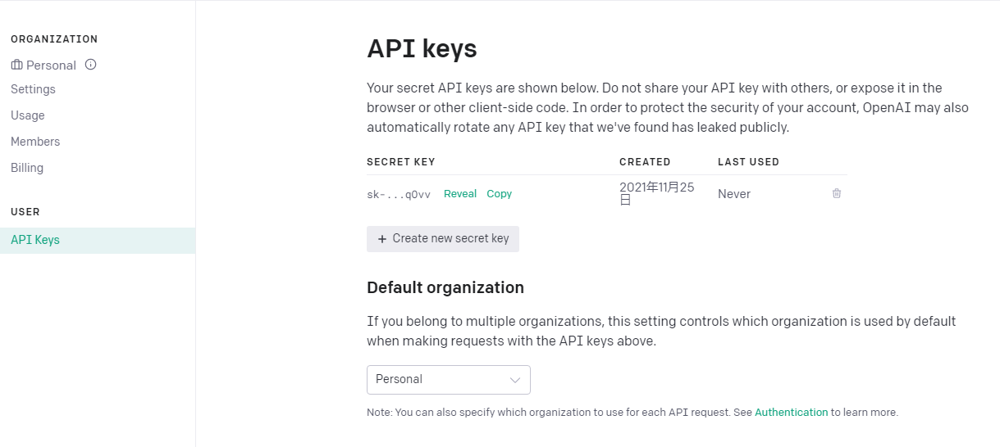

import { Link } from 'gatsby';

<Link to="/blog/2021-11-19">前回</Link>の続きです。

前回、文章生成AIのGPT-3が誰でも利用可能になったことを書きました。

というわけでGPT-3を使って任意のメッセージの返信を自動生成する機能をPINE proに実装しました。

## 機能の説明

チャット画面で、任意のメッセージを長押しして表示されたメニューから**Generate Reply**を選択すると、GPT-3がそのメッセージの続きを生成します。生成された文章は自分のメッセージとして投稿されます。




## 実装したコード

ここからは実装したコードを書きます。とはいえ、GPT-3のAPIにリクエストを送信して、レスポンスをユーザーの発言としてFirestoreに保存するだけの簡単な仕組みです。

### API Keyの用意

誰でも利用可能になったとはいえ、ユーザー登録とAPIキーが必要なので[OpenAI](https://beta.openai.com/account/api-keys)のダッシュボードでキーを確認します。



### ライブラリのインストール

JavaScriptでGPT-3を利用するためのライブラリをインストールします。

- [openai-api](https://www.npmjs.com/package/openai-api)

<br/>

```shell
yarn add openai-api
```

下準備はここまでです。

### コードを書く

**src\scenes\chat\Chat.js**

インストールしたライブラリをインポートします。あと、OpenAIのAPIからのレスポンス待機中に表示させておきたいのでローディングスピナーもインポートします。

```javascript
import OpenAI from 'openai-api'
import { OPENAI_API_KEY } from '../key'
import Spinner from 'react-native-loading-spinner-overlay'
```

ローディングスピナー表示制御用のフックを作成します。

```javascript
const [spinner, setSpinner] = useState(false)
```

APIkeyを使ってOpneAIの初期化を行います。

```javascript
const openai = new OpenAI(OPENAI_API_KEY)
```

表示部にローディングスピナーを設置します。

```javascript
<Spinner
  visible={spinner}
  textStyle={{ color: "#fff" }}
  overlayColor="rgba(0,0,0,0.5)"
/>
```

メッセージを長押ししたときに表示する選択肢に**Generate Reply**を追加します。

```javascript
function delMessage(context, message) {
  const imageUrl = message.image
  if (!message.image) {
    const options = ['Delete Message', 'Copy Text', 'Speech', 'Generate Reply', 'Cancel']; // Generate Reply を選択肢に追加
    const cancelButtonIndex = options.length - 1;
    context.actionSheet().showActionSheetWithOptions({
      options,
      cancelButtonIndex
    }, (buttonIndex) => {
      switch (buttonIndex) {
        case 0:
          if (message.user.email == myProfile.email) {
            firebase.firestore().collection('THREADS').doc(talkData.id).collection('MESSAGES').doc(message._id).delete()
          } else {
            alert('You can only delete own messages.')
          }
          break
        case 1:
          const text = message.text
          Clipboard.setString(text)
          break
        case 2:
          const script = message.text
          speak(script)
          break
        case 3:
          console.log('Generate Reply')
          const text2 = message.text // 長押しした吹き出しのメッセージを格納
          const res = generateReply(text2) // メッセージを文章生成用の関数に渡す
          break
      }
```

ここが今回の本番です。GPT-3のAPIにメッセージを渡してレスポンスを受け取ります。レスポンスの最大文字数以外のパラメーターはひとまずライブラリのドキュメント通りにしておきます。

```javascript
const generateReply = async(item) => {
  setSpinner(true) // リクエストを送信する前にローディングスピナーを表示
  try {
    const gptResponse = await openai.complete({
      engine: 'davinci',
      prompt: item, // 受け取ったメッセージをパラメーターとして格納、APIに渡す
      maxTokens: 60,
      temperature: 0.9,
      topP: 1,
      presencePenalty: 0,
      frequencyPenalty: 0,
      bestOf: 1,
      n: 1,
      stream: false,
      stop: ['\n', "testing"]
    });
    sendGeneratedMessage(gptResponse.data.choices[0].text) // APIからのレスポンスをFirestore格納用の関数に渡す
    setSpinner(false) // レスポンスを格納し終わったらローディングスピナーを非表示に
  } catch (e) {
    alert('Failed to generate.')
    setSpinner(false)
  }
}
```

APIからのレスポンスを自分の発言としてFirestoreに格納する関数です。

```javascript
async function sendGeneratedMessage(message) {
  const text = message;
  const messageRef = firebase.firestore().collection('THREADS')
  messageRef
    .doc(talkData.id)
    .collection('MESSAGES')
    .add({
      text,
      createdAt: new Date().getTime(),
      user: {
        _id: myProfile.id,
        email: myProfile.email,
        avatar: myProfile.avatar,
        name: myProfile.fullName,
      }
    });
  await messageRef
    .doc(talkData.id)
    .set(
      {
        latestMessage: {
          text,
          avatar: myProfile.avatar,
          createdAt: new Date().getTime()
        }
      },
      { merge: true }
    );
}
```

実装したコードは以上です。

## まとめ

GPT-3には今回使用した**Completion**以外にも**Search**、**Answers**、**Classification**などの機能もあります。さらにパラーメーターを変えればもっと自然な返信を生成することもできそうです。

色々試していきたいと思っています。

## おまけ

この記事を書いた後に動作検証していて気づいたのですが、急にAPIが401を返すようになりました。原因がさっぱりわからず色々いじっていたのですが、こんなメールを受信していました。


**API keyが漏洩した可能性があるため停止した**ということです。

そういえば、API keyをgitignoreせずにコミットしていました。それにしてもGithubにプッシュした瞬間にkeyを検知して停止するとは、さすがですな。

---