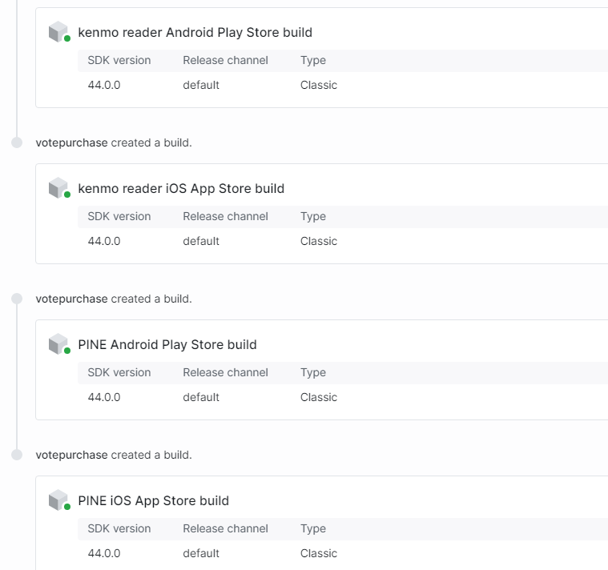
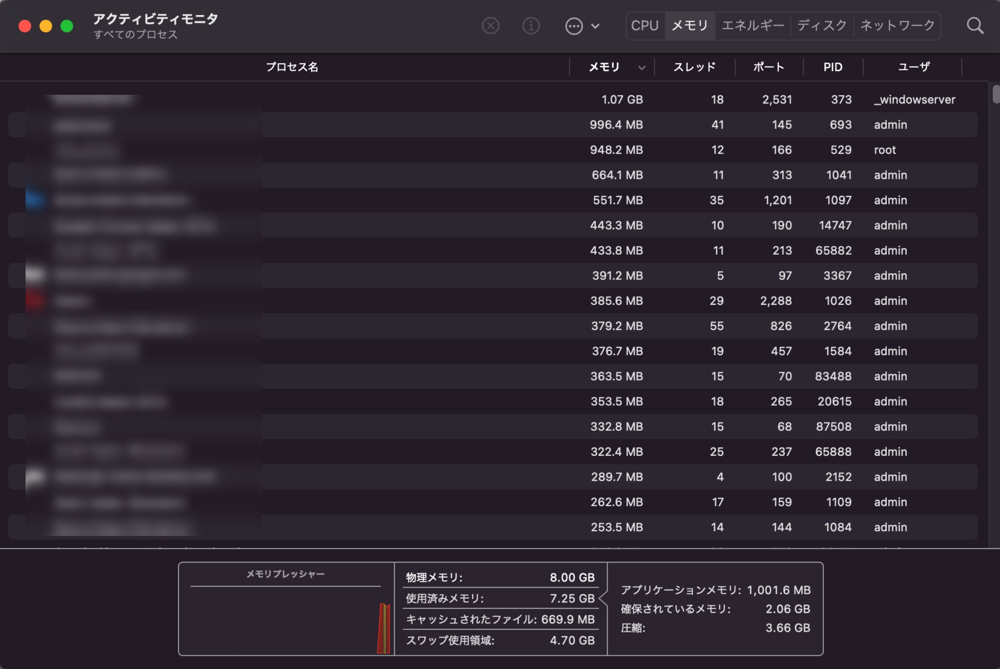

import { Link } from 'gatsby';

## Expo SDK 44が公開されました

ハイライトは、`expo-navigation-bar`, `expo-system-ui`の追加によるルートビューでの背景色操作です。

- [Expo SDK 44](https://blog.expo.dev/expo-sdk-44-4c4b8306584a)

## アップデートした結果

以下2つのリリース済みアプリは無事にアップデートしてAppStore、Google Play共に配信が開始されました。

- [kenmo reader](https://kenmo-reader.ml)
- [PINE pro](https://pinepro.ml)

<br/>

以下2つのボイラープレートも無事に更新できました。

- [ReactNative-Expo-Firebase-Boilerplate-v2](https://github.com/kiyohken2000/ReactNative-Expo-Firebase-Boilerplate-v2)
- [reactnative-expo-firebase-boilerplate](https://github.com/kiyohken2000/reactnative-expo-firebase-boilerplate)



## アップグレード方法

いつも通り**expo-cli**を更新して`expo upgrade 44`コマンドで更新できました。

ただ、PINE proのみ起動時に以下の画像のエラーが発生するようになりました。


このエラーは**babel.config.js**を修正することで解決します。

```javascript
module.exports = function(api) {
  api.cache(true);
  return {
    presets: ['babel-preset-expo'],
    plugins: [
      'react-native-reanimated/plugin', // これを追記
      [
        'module-resolver',
        {
          alias: {
            components: './src/components',
            scenes: './src/scenes', 
            theme: './src/theme',
            utils: './src/utils',
            modules: './src/modules'
          },
        },
      ],
    ],
  };
};
```

なお上記エラー発生後は`expo start --clear`でキャッシュをクリアしてリスタートする必要があります。

## おまけ

EASアプリのデバッグでは実機よりシミュレーターを使ったほうが便利なことが多かったり、自作パソコンに色々な開発ツールを入れるのが嫌(Ryzen買い替えるたびにWindows再インストールするから)ので最近は<Link to="/blog/2021-09-26">M1 MacBookAirで開発</Link>をしています。

ただ、

- 4Kディスプレイを接続
- ウェブブラウザ(Opera、Safari、Chrome、Vivaldiを同時に開いて合計タブ20～30個)
- VSCode
- Xcode
- iOSシミュレーター
- Skype
- Slack
- Discord

<br/>

を同時に起動していると猛烈に重くなります。



もう限界です。なのでM1 Pro MacBookProを買うことにしました。


10万円のCPUを買うのには何の躊躇もしませんが、30万円のラップトップを買う決意をするまでには1ヶ月かかりました。届くのが楽しみです。

---