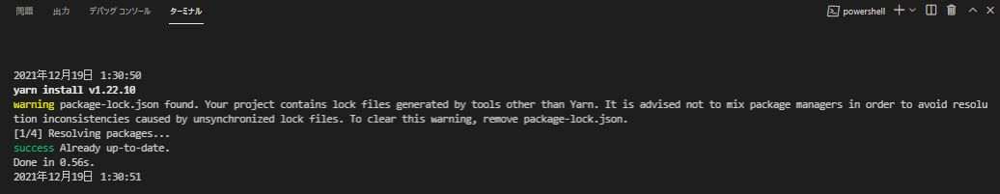
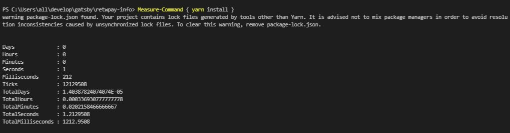
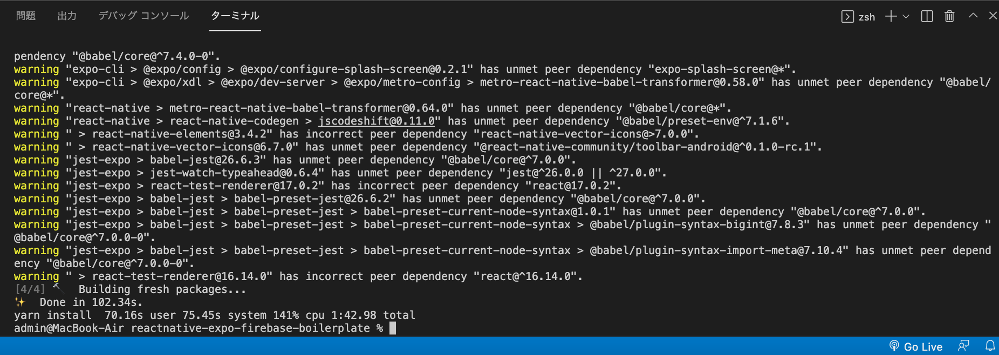
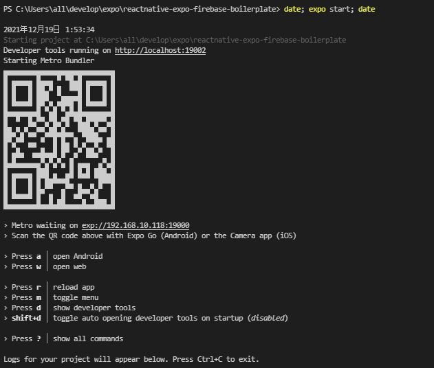
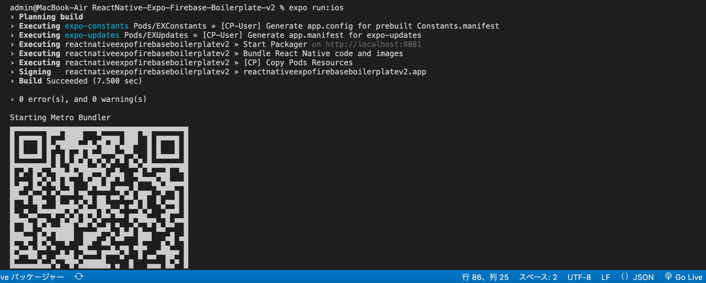

import { Link } from 'gatsby';

## 開発コマンド実行時間によるPCの性能評価

これまで何度かパソコンのパフォーマンスを比較するために、依存関係のインストールやこのブログをビルドするときの所要時間を計測しています。

その方法は、例えば依存関係のインストールなら`date; yarn install; date`のように目的のコマンドを`date`で挟んで実行し、前後の時刻の差から実行時間を計算するという原始的なものでした。



しかし、実行時間を表示するコマンドがあることを知ったのでこの記事にまとめます。

## PowerShell

PowerShellの場合は以下のようにします。

```shell
Measure-Command { 目的のコマンド }
```

依存関係のインストールであれば以下です。

```shell
Measure-Command { yarn install }
```

結果は以下の画像のように表示されます。



## zsh

zshの場合は`time`を使います。

```shell
time 目的のコマンド
```

依存関係のインストールの場合は以下のようにします。

```shell
time yarn install
```

結果は以下の画像のように表示されます。



## React Native

これまでのパフォーマンス計測では**依存関係のインストール**と**このブログをビルドするときの時間**を比較していました。React Nativeアプリのビルド時間も計測したかったのですが、やり方がわからなかったからです。

```shell
date; expo start; date
```

としても、ビルド時間が計測できるわけではないからです。



これについてはまだ計測方法がわかりません。

## Xcode

EASを使うようになってXcode部分のビルド時間は計測できるようになりました。

Xcodeでビルド時間を表示するには、ターミナルで以下のコマンドを実行しておきます。

```shell
defaults write com.apple.dt.Xcode ShowBuildOperationDuration YES
```

あとは通常通りプロジェクトのルートディレクトリでビルドコマンドを実行します。

```shell
expo run:ios
```

以下のように結果が表示されます。



## まとめ

以上、<Link to="/blog/2021-12-18">前回</Link>書いたM1 Pro MacBookProが届いて性能評価をするときのために計測方法をまとめました。

XcodeではなくAndroid Studioを使って測定すれば自作パソコンも含めた評価をできそうですが、React NativeのAndroid環境を整備するのが大変なのと自作パソコンにAndroid Studioを入れたくないのでやめておきます。

---