import { Link } from 'gatsby';

## MacBook Pro 2021 14インチが届きました

<Link to="/blog/2021-12-18">前に注文したことを書いた</Link>MacBookPro14インチが届きました。12/10に注文して1/4に届いたので結構待たされました。

  

### MacBookProのスペック

MacBookProの仕様は以下です。

- 10コアCPU
- 14コアGPU
- 32GBメモリ
- 512GB SSD

 

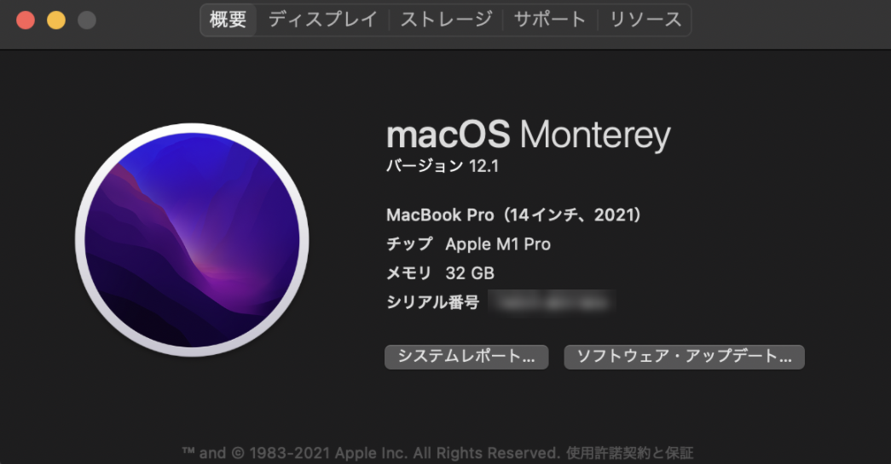

## 環境を移行

開発環境を作り直すのが面倒だったので移行アシスタントを使ってM1 MacBookAirから環境をコピーしました。

約120GBのデータをWi-Fiでコピーしたところ30分かからず完了しました。P2Pでつないでるだけあって結構速かったです。

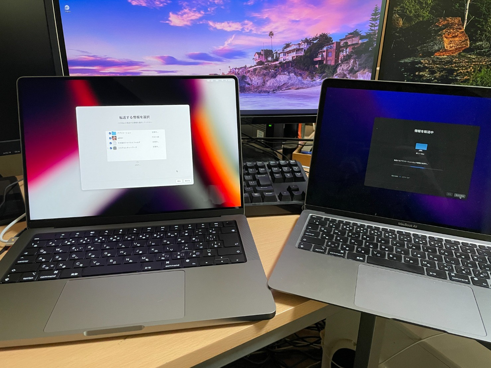

## 性能を検証

### 比較対象

比較対象は以下3つのPCです。

- M1 MacBookAir(8CPU/7GPU/8GBメモリ)
- MacBookAir2020(Core i3 1000NG4/8GBメモリ)
- 自作パソコン(Ryzen9 5950X/RadeonRX550/32GBメモリ)

 

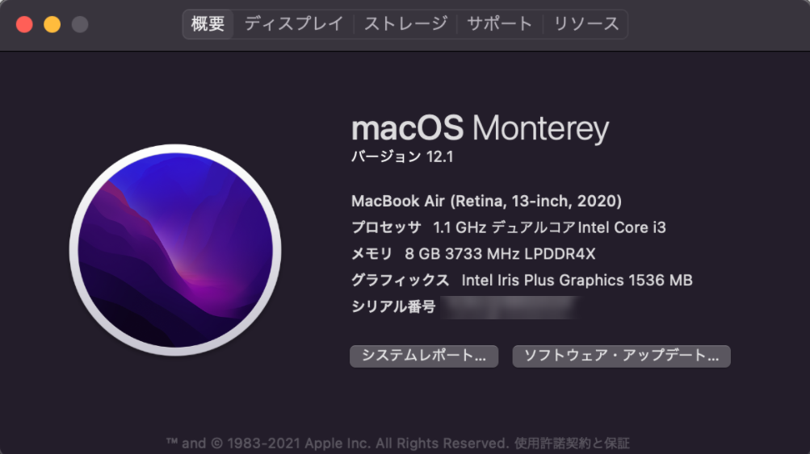

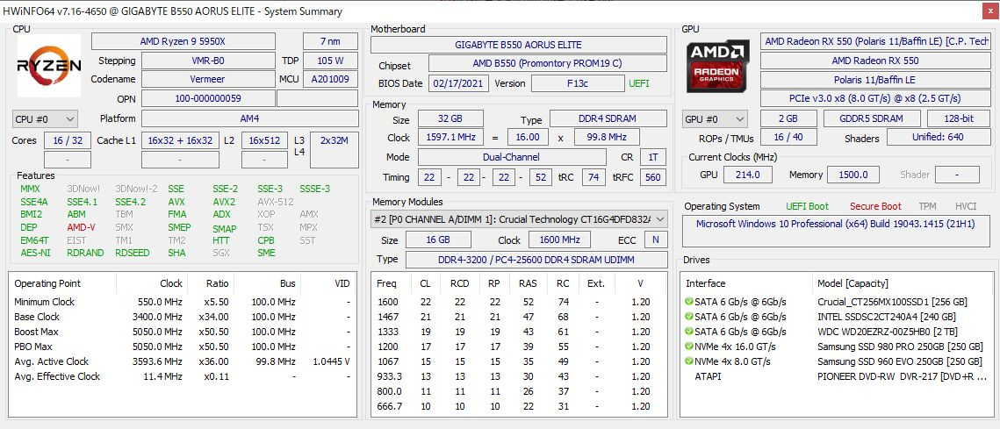

### 検証項目

検証項目は以下の3点です。

- CinebenchR23
- [ReactNative-Expo-Firebase-Boilerplate-v2](https://github.com/kiyohken2000/ReactNative-Expo-Firebase-Boilerplate-v2)の依存関係のインストール/ビルド(Xcode部分)
- [このブログ(React/GatsbyJS)](https://github.com/kiyohken2000/retwpay-info)の依存関係のインストール/ビルド

 

検証は、<Link to="/blog/2021-12-19">前回</Link>書いたやり方でコマンドの実行時間を調べて、完了するまでにかかった時間を比較することで行いました。

なおReact NativeアプリのビルドはXcodeを使用したため自作パソコンでは測定していません。そして、実際にはXcode部分のビルドが完了した後にJSバンドルのビルドがあるため、全体のビルド時間は表中の時間プラスアルファとなります。

### CinebenchR23

前置きはここまでで早速性能測定の結果を書きます。

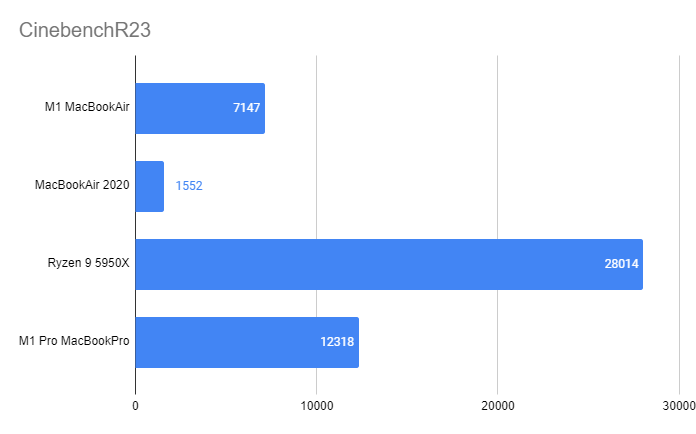

AMDファンボーイ的にはうれしい結果になりました。Apple破れたり。圧倒的にRyzen9の勝利でした。

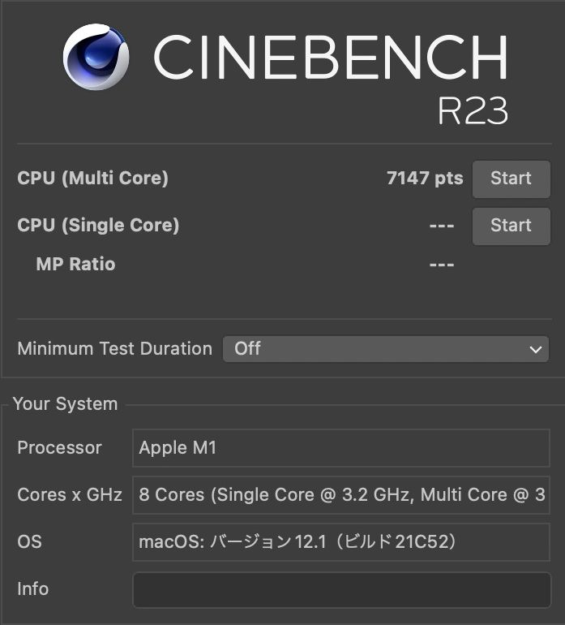

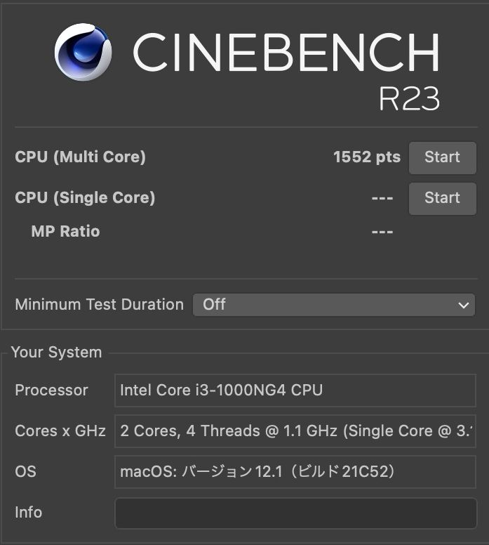

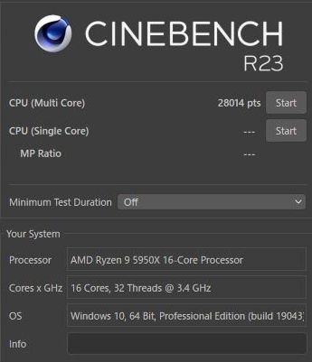

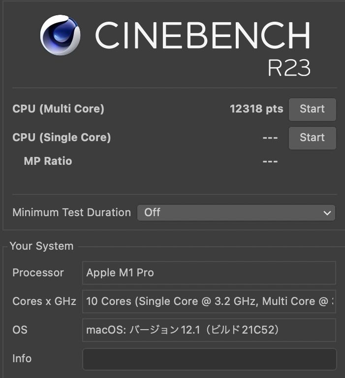

### React Native

React Nativeアプリの依存関係のインストールとビルドにかかった時間(秒)です。

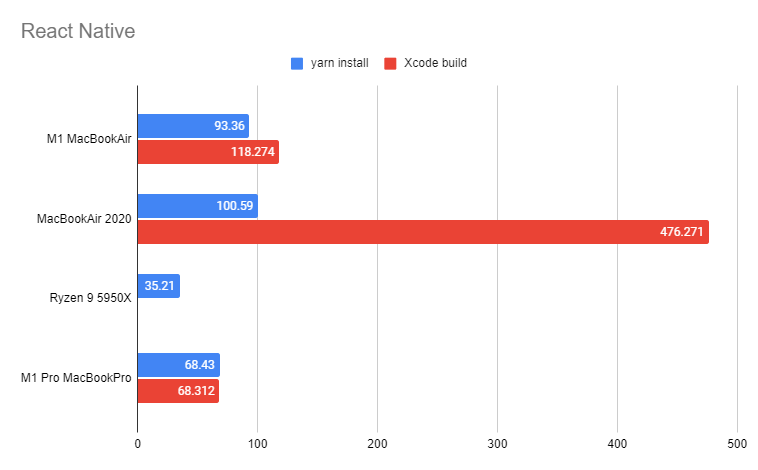

Android用のビルドであればRyzen9の性能も測定できますが、自作パソコンにAndroid Studioを入れるのが嫌なのでやっていません。

### GatsbyJS

このブログ(GatsbyJS)の依存関係のインストールとビルドにかかった時間(秒)です。

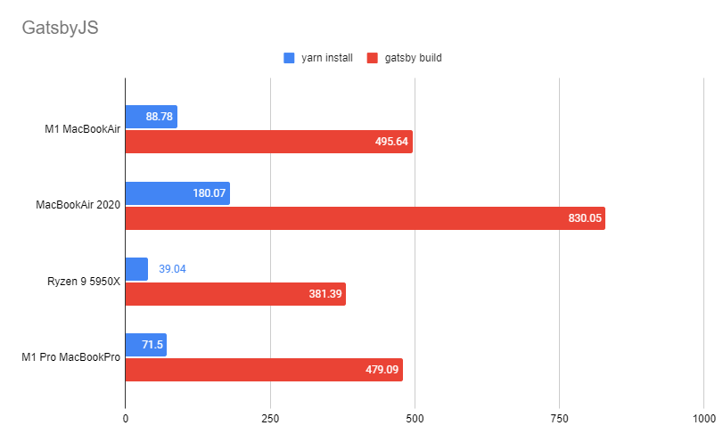

圧倒的とはいかないまでもRyzen9が最速でした。そして意外とM1 MacBookAirとM1 Pro MacBookProの差がないように思います。

## まとめ

デスクトップCPUとモバイルCPUの比較なので当然ですが、Ryzen9が最速となりました。AMDファンボーイ的にはうれしい結果でした。

主に開発に使っているM1 MacBookAirが明らかにメモリ不足だったので、MacBookProを買いましたがCPU性能的にはM1 MacBookAirがかなり善戦する結果となりました。

M1 MacBookAirのコストパフォーマンスの高さは良い意味でぶっ壊れてるといえるのではないでしょうか。

---