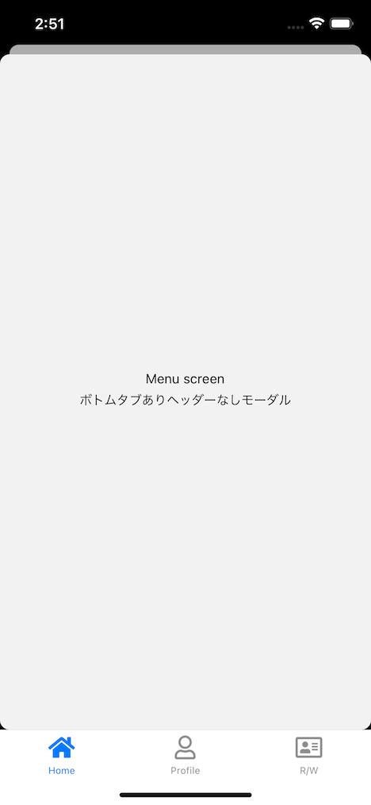

import { Link } from 'gatsby';

## React Navagation

React Nativeの定番ナビゲーションライブラリ[React Navigation](https://reactnavigation.org)(version 6)でiOS風の全画面モーダルを実装する方法です。

特に、ボトムタブナビゲーションと全画面モーダルを組み合わせているときに、モーダル画面でボトムタブを表示したくない場合は複数のネストが必要になるためブログ記事として残します。

レポジトリはこちら → [ReactNativeExpoBoilerplate](https://github.com/kiyohken2000/ReactNativeExpoBoilerplate)

## 作成する各画面

1. ホーム画面です。ここから各画面に遷移します。


2. 全画面モーダル画面です。1の画面から遷移します。ボトムタブは表示しません。「From: Home screen」と表示しています。どの画面から遷移してきたのかを画面遷移時にパラーメーターで渡しています。


3. 全画面モーダル画面その2です。2の画面から遷移します。全画面モーダル内のスタックです。ここでも、どの画面から遷移してきたのかを画面遷移時にパラーメーターで渡しています。


4. 全画面モーダルその3です。1の画面から遷移します。全画面モーダルですがボトムタブを表示しています。



## ナビゲーションの構成

- Navigation(大元の親コンポーネント)
  - RootStack(ここでボトムタブとボトムタブなしのモーダル画面を分岐)
    - HomeRoot(ボトムタブ)
      - HomeStacks
        - Home
        - Details
        - Menu(ボトムタブありのモーダル)
      - ProfileStacks
      - ReadWriteTab
    - ModalStack (ボトムタブなしのモーダルスタック)
      - Modal
      - Print

<br/>

## 各画面のコード

**Navigation**

まずは大元の親コンポーネントを作ります。`RootStack`を`NavigationContainer`でラップするためのコンポーネントです。

```javascript
import React from 'react'
import { NavigationContainer } from '@react-navigation/native'
import RootStack from './RootStack'

export default () => {
  return (
    <NavigationContainer>
      <RootStack />
    </NavigationContainer>
  )
}
```

**RootStack**

次に`RootStack`を作ります。ここでボトムタブナビゲーターと全画面モーダル用のスタックを分岐させます。

```javascript
import React, { useState, useContext } from "react";
import { createStackNavigator } from '@react-navigation/stack'
import TabNavigator from "./tabs/Tabs";
import { ModalStacks } from "./stacks/ModalStacks";

const Stack = createStackNavigator()

export default function RootStack() {

  return (
    <Stack.Navigator
      screenOptions={{
        headerShown: false
      }}
    >
      <Stack.Screen
        name='HomeRoot'
        component={TabNavigator}
      />
      <Stack.Group
        screenOptions={{
          presentation: 'modal',
          headerShown: false,
        }}
      >
        <Stack.Screen
          name='ModalStack'
          component={ModalStacks}
        />
      </Stack.Group>
    </Stack.Navigator>
  )
}
```

**ModalStacks**

次に全画面モーダル用のスタックを作ります。

```javascript
import React, { useState, useContext } from "react";
import { createStackNavigator } from '@react-navigation/stack'

import Modal from '../../../scenes/modal/Modal'
import Print from '../../../scenes/print/Print'

const Stack = createStackNavigator()

export const ModalStacks = () => {

  return (
    <Stack.Navigator
      screenOptions={{
        headerShown: true,
      }}
    >
      <Stack.Screen
        name='Modal'
        component={Modal}
      />
      <Stack.Screen
        name='Print'
        component={Print}
      />
    </Stack.Navigator>
  )
}
```

**Tabs**

ボトムタブコンポーネントを作成します。通常通り`createBottomTabNavigator()`で各スタックをラップしていきます。

```javascript
import React from 'react'
import { createBottomTabNavigator } from '@react-navigation/bottom-tabs'
import FontIcon from 'react-native-vector-icons/FontAwesome5'
import { colors } from 'theme'

// stack navigators
import { HomeStacks } from '../stacks/HomeStacks'
import { ProfileStacks } from '../stacks/ProfileStacks'
import { ReadWriteStacks } from '../stacks/ReadWriteStacks'

const Tab = createBottomTabNavigator()

const TabNavigator = () => {
  return (
    <Tab.Navigator
      options={{
        tabBarActiveTintColor: colors.lightPurple,
        tabBarInactiveTintColor: colors.gray,
      }}
      defaultScreenOptions={{
        headerShown:false,
        headerTransparent:true
      }}
      screenOptions={({ route }) => ({
        headerShown: false,
      })}
      initialRouteName="HomeTab"
      swipeEnabled={false}
    >
      <Tab.Screen
        name="HomeTab"
        component={HomeStacks}
        options={{
          tabBarLabel: 'Home',
          tabBarIcon: ({ color, size }) => (
            <FontIcon
              name="home"
              color={color}
              size={size}
            />
          ),
        }}
      />
      <Tab.Screen
        name="ProfileTab"
        component={ProfileStacks}
        options={{
          tabBarLabel: 'Profile',
          tabBarIcon: ({ color, size }) => (
            <FontIcon
              name="user"
              color={color}
              size={size}
            />
          ),
        }}
      />
      <Tab.Screen
        name="ReadWriteTab"
        component={ReadWriteStacks}
        options={{
          tabBarLabel: 'R/W',
          tabBarIcon: ({ color, size }) => (
            <FontIcon
              name="address-card"
              color={color}
              size={size}
            />
          ),
        }}
      />
    </Tab.Navigator>
  )
}

export default TabNavigator
```

**HomeStacks**

次にボトムタブありのモーダル画面を含むスタックを作ります。

```javascript
import React from 'react'
import { createStackNavigator } from '@react-navigation/stack'
import { navigationProps } from './navigationProps/navigationProps'

import Home from '../../../scenes/home'
import Details from '../../../scenes/details'
import Menu from '../../../scenes/menu/Menu'

const Stack = createStackNavigator()

export const HomeStacks = () => {
  return (
    <Stack.Navigator
      initialRouteName="Home"
      screenOptions={navigationProps}
    >
      <Stack.Screen
        name="Home"
        component={Home}
        options={({ navigation }) => ({
          title: 'Home',
          headerShown: false
        })}
      />
      <Stack.Screen
        name="Details"
        component={Details}
        options={({ navigation }) => ({
          title: 'Details',
        })}
      />
      <Stack.Group
        screenOptions={{
          presentation: 'modal',
          headerShown: false
        }}
      >
        <Stack.Screen
          name="Menu"
          component={Menu}
          options={({ navigation }) => ({
            title: 'Menu',
          })}
        />
      </Stack.Group>
    </Stack.Navigator>
  )
}
```

## 画面間での値の受け渡し方法

通常、スクリーン間での値の受け渡しは`useNavigation`と`useRoute`を使って以下のように受け渡しをすることが多いと思います。

```javascript
import { useNavigation } from '@react-navigation/native'
```

```javascript
const navigation = useNavigation()
```

```javascript
onPress={() => {
  navigation.navigate('Details', { from: 'Home' })
}}
```

しかし、ホーム画面(HomeRoot内)から全画面モーダル画面(ModalStack)のように、別スタックに遷移する場合は以下のようにします。遷移先のスタックとスクリーン名をそれぞれ指定してあげるのと、パラメーターの書き方が通常と少し異なります。

```javascript
onPress={() => {
  navigation.navigate('ModalStack', {
    screen: 'Modal',
    params: {from: 'Home'}
  })
}}
```

受け取り側は通常通りです。

```javascript
import { useRoute } from '@react-navigation/native'
```

```javascript
const route = useRoute()
const { from } = route.params
```

## Androidの追加設定

ここまでのコードだとAndroidにおいて全画面モーダルの表現がiOS風になっていません。


追加の設定を行ってAndroidでもiOSと同じようにモーダルを表現するようにします。


**RootStack**

```javascript
import { TransitionPresets } from "@react-navigation/stack";
```

```javascript
<Stack.Group
  screenOptions={{
    presentation: 'modal',
    headerShown: false,
    /*　ここから */
    gestureEnabled: true,
    cardOverlayEnabled: true,
    ...TransitionPresets.ModalPresentationIOS,
    /* ここまで追加 */
  }}
>
```

## まとめ

これでReact NativeでもiOS風の全画面モーダルを実装できました。

---