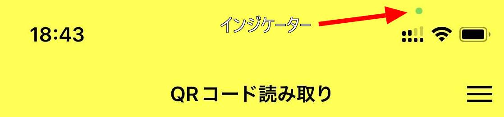

import { Link } from 'gatsby';

## iOSではカメラ使用中にインジケーターが点灯する

いくつか前のiOSバージョンから、アプリでカメラ使用中にステータスバーに緑のインジケーターが表示されるようになりました。



## BarCodeScanner

Expoには[BarCodeScanner](https://docs.expo.dev/versions/latest/sdk/bar-code-scanner/)というQRコードの読み取りなどに使用するコンポーネントがあります。

QRコードを読み取ってその情報を元に画面遷移を行う、というのはよくある使い方だと思います。

## 問題点

ドキュメント通りに実装すると、QRコードの読み取り機能を簡単に実装することができます。しかし、そのまま同じスタック内の別画面に遷移するとカメラがオフにならず、ステータスバーのインジケーターが点灯したままになります。

## 解決方法

画面遷移時に`<BarCodeScanner />`を非表示にしてあげることで上記の問題は解決します。

```javascript
import React, { useState } from 'react';
import { View } from 'react-native';
import { BarCodeScanner } from 'expo-barcode-scanner';
import { useFocusEffect, useNavigation } from '@react-navigation/native'

export default function App() {
  const [scanned, setScanned] = useState(false);
  const navigation = useNavigation()

  useFocusEffect(() => {
    setScanned(false)
  }))

  const handleBarCodeScanned = ({ type, data }) => {
    setScanned(true);
    navigation.navigate('NextScreen')
  };

  return (
    <View>
      {!scanned?
        <BarCodeScanner
          onBarCodeScanned={scanned ? undefined : handleBarCodeScanned}
        />
        :null
      }
    </View>
  );
}
```

ポイントは`!scanned`で、スキャン状態が`false`のときにだけ`<BarCodeScanner/>`を表示することです。そして画面遷移前に`scanned`を`true`にしてあげることで、`<BarCodeScanner/>`を非表示にします。

こうすることで画面遷移したときにステータスバーのインジケーターがオフになります。

遷移先の画面からバックボタンなどでQRコード読み取り画面に戻ってきたときに`useFocusEffect`を使用して`scanned`を`false`にすることで、再び`<BarCodeScanner/>`を表示することができます。

この処理を入れない場合、QRコード読み取り画面に戻ってきたときに`scanned`が`true`のままなので`<BarCodeScanner/>`が表示されないままになってしまいます。

---