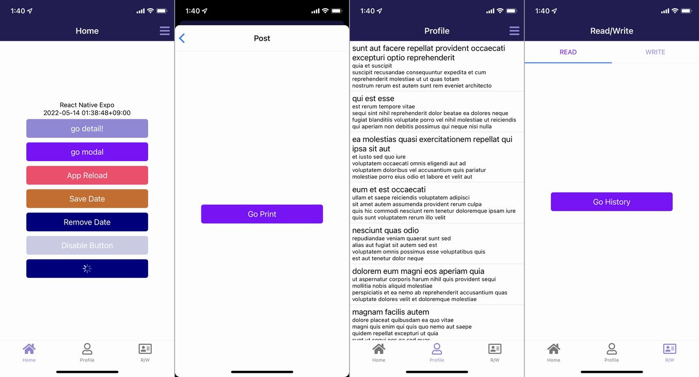

import { Link } from 'gatsby';

# React Native Expo Boilerplate Typescript

- [expo-typescript-boilerplate](https://github.com/kiyohken2000/expo-typescript-boilerplate)
- [Expo link](https://expo.dev/@votepurchase/expo-typescript-boilerplate)

## Screens



## Libraries

- expo
- axios
- redux
- react-navigation
- expo-notifications
- lottie-react-native
- moment
- react-native-elements
- react-native-vector-icons
- react-native-storage

## Features

- BottomTab, TopTab, Modal and Stack navigation
- Dynamic header title
- Get Expo push token
- Loading indicator with Lottie animation
- Save/Load/Remove on local storage

## How to use this project

### 1. Install

```
git clone https://github.com/kiyohken2000/expo-typescript-boilerplate.git
cd expo-typescript-boilerplate
yarn install
```

### 2. Update app.json

```
"name": "your-app-name",
"slug": "your-app-name",
```

### 3. Run Your App

```
expo start
```

## How to use utils

- ### Reload app

```javascript
import { Restart } from '../../utils/restart';

const ourFunc = () => {
  Restart()
}
```

- ### Storage

```javascript
import { storage } from '../../utils/storage';

// Save
const saveStorage = async() => {
  const now = moment().format("YYYY-MM-DD HH:mm:ssZ")
  await storage.save({
    key: 'date',
    data: {
      'date': now
    }
  })
}

// Load
const loadStorage = async() => {
  try {
    const { date } = await storage.load({key: 'date'})
  } catch (e) {
    console.log('error', e)
  }
}

// Remove
const removeStorage = async() => {
  await storage.remove({ key: 'date' })
}
```

## Licence

This project is available under the MIT license. See the [LICENSE](https://github.com/kiyohken2000/expo-typescript-boilerplate/blob/main/LICENSE) file for more info.


---