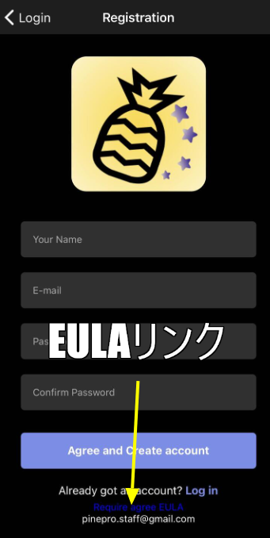
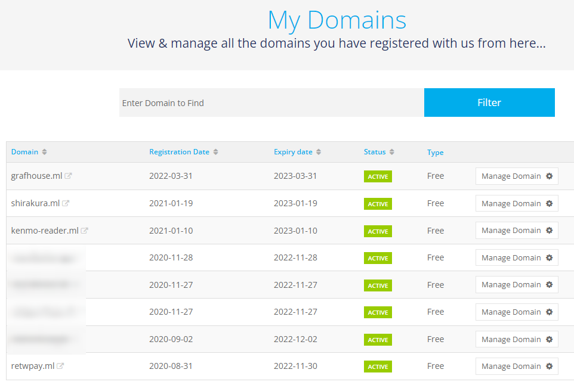
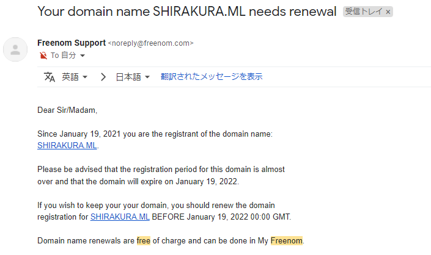
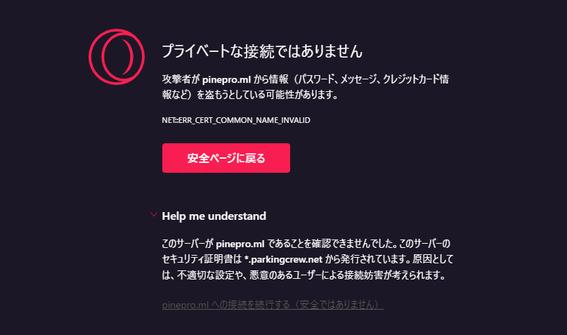
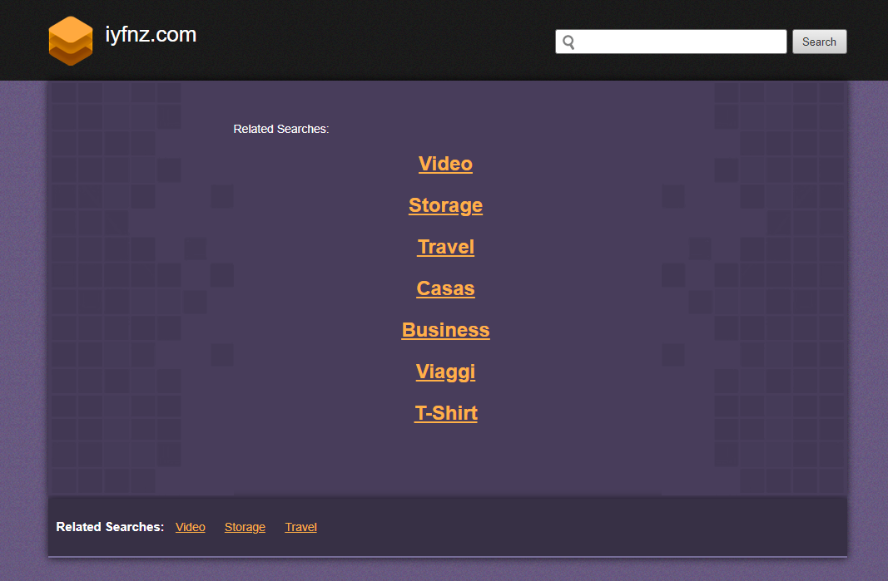

import { Link } from 'gatsby';

## Expo 45

いつの話をしているのかと思われそうですが、5/6に[Expo SDK 45](https://blog.expo.dev/expo-sdk-45-f4e332954a68)が公開されました。

公開当初サーバーでのビルドに対応しているのはEASアプリのみだったため、クラシックビルドのkenmo readerとPINE proは更新できてませんでした。

かなり遅れて5/24にクラシックビルドもサーバーでのビルドができるようになったので無事にアップデートを完了してストアで配布開始しました。

- [kenmo reader](https://kenmo-reader.ml)
- [PINE pro](https://kenmochat.web.app)

<br/>

アップデート自体は特に問題もなく

```shell
expo upgrade 45
```

コマンドだけで完了しました。

## Freenomへの不信感

上に貼ったPINE proのランディングページへのリンクですがFirebaseホスティングのURL https://kenmochat.web.app そのままになっていることに気付かれましたでしょうか。

以前は独自に**pinepro.ml**というドメインを取得しており、アプリ内に埋め込んでいるEULAのリンク先やAppStore/GooglePlayに掲載しているプライバシーポリシーのリンクなどもそのドメインでした。



現在は全てFirebaseホスティングのURLに書き換えてあります。

### ドメインを失った

なんでこんなことになっているかというと、**pinepro.ml**ドメインを失ったからです。Freenomでは無料ドメインは最長でも一年ごとに更新しないといけないのですが、多分更新をしていませんでした。あとfindgoodone.mlドメインもなくなりました。

無料のドメインを色々取得していたので管理ができてなかったのが理由の一つです。



失効の2週間前にはメールでお知らせが来ます。



ですが、**pinepro.ml**と**findgoodone.ml**に関してはお知らせが来てませんでした。改めてメールボックスを検索してみたのですが来てませんでした。

それだけなら自分の凡ミスということで納得できるのですが、不審な点があります。

今pinepro.mlにアクセスするとブラウザから警告が出ます。



警告をスルーしてアクセスしてみるとスパムっぽいサイトが開きます。



表示されるページは何パターンかあるようです。

### Freenomは詐欺レジストラなのか

Freenomは以前から評判が悪く、過去にギガジンが翻訳記事を書いたりもしています。

[「無料でのドメイン提供」をうたうレジストラが詐欺だったと判明、その手口とは？](https://gigazine.net/news/20210726-free-domain-website-scam/)

pinepro.mlはアプリのユーザー数も少なく、ランディングページのアクセスもほぼなかったので、ドメイン自体の価値はかなり低かったはずです。

なので、乗っ取られたとは考えにくいですが。これからFreenomでドメインを取得するのはやめるかもしれません。

---