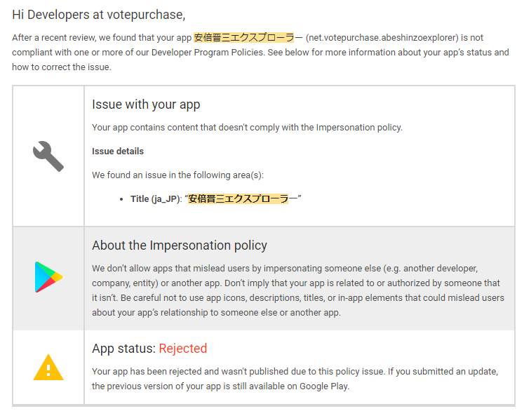
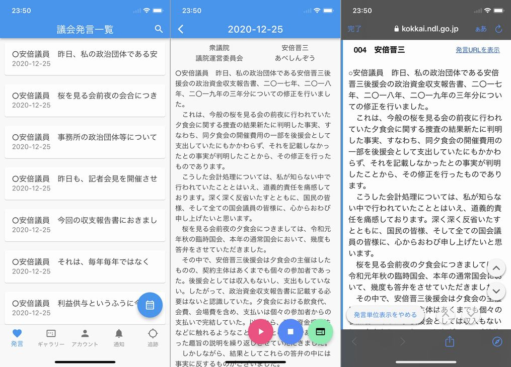
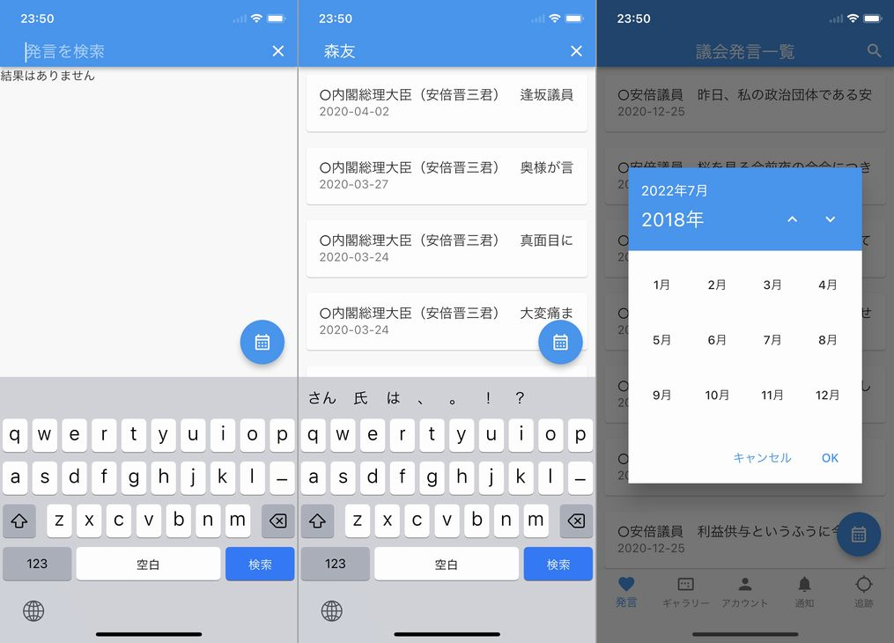
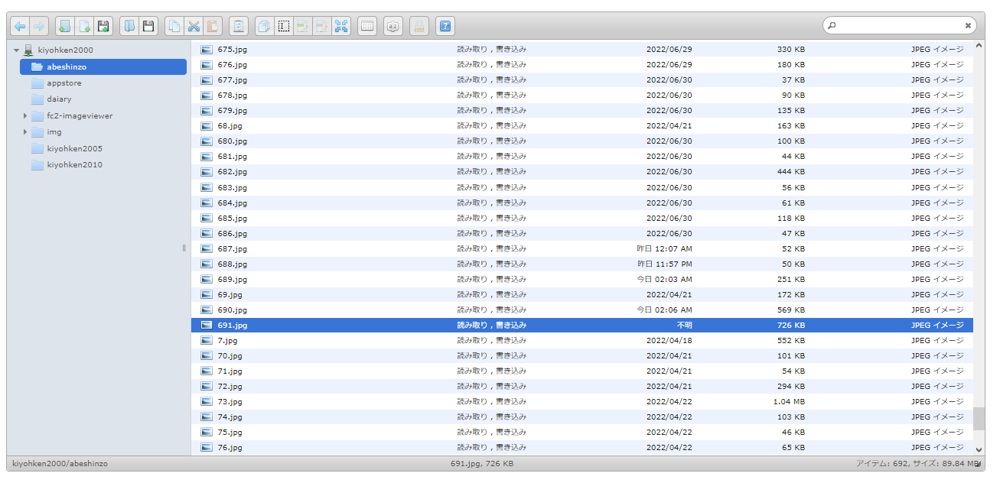
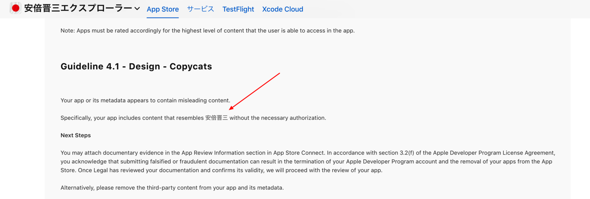
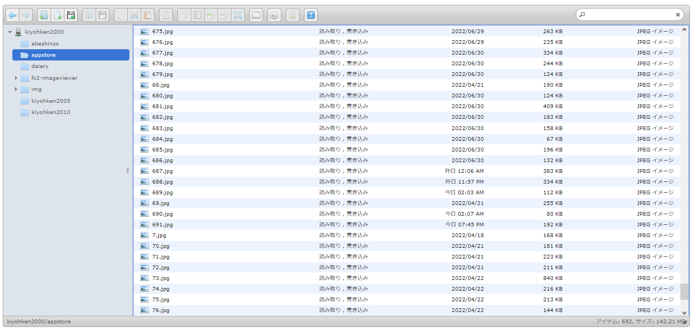
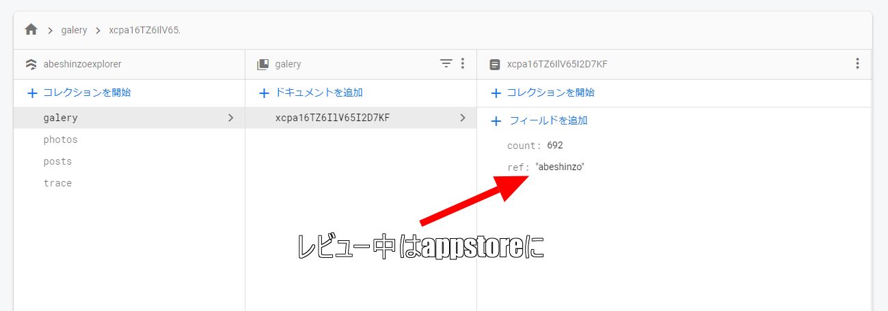
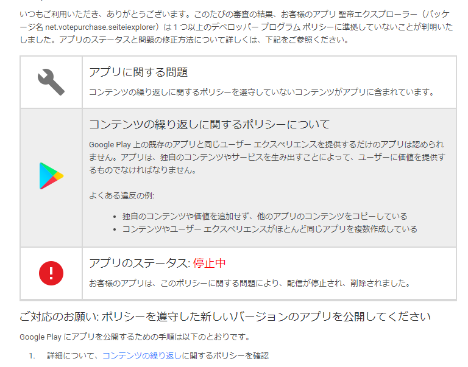
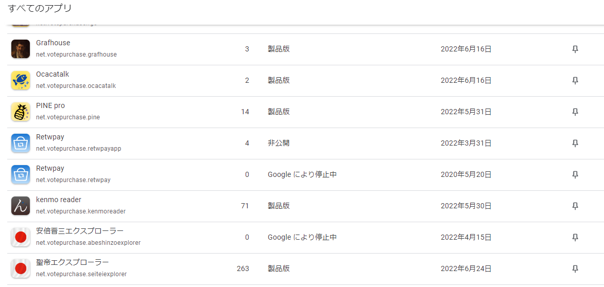
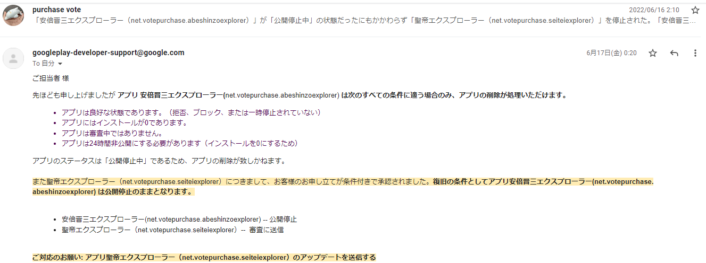

import { Link } from 'gatsby';

## 安倍晋三エクスプローラー

4月のことですが、新作アプリを作って公開しました。iPhone版は**安倍晋三エクスプローラー**、Android版は**聖帝エクスプローラー**です。

安倍晋三の国会での発言や安倍晋三の画像を閲覧するための非公式ファンアプリです。

- [AppStore](https://apps.apple.com/jp/app/安倍晋三エクスプローラー/id1619512045)
- [GooglePlay](https://play.google.com/store/apps/details?id=net.votepurchase.seiteiexplorer)

 

本当は両方「安倍晋三エクスプローラー」にしたかったのですが、GooglePlayは謎の規約により「安倍晋三」というワードを使えず苦肉の策で「聖帝エクスプローラー」にしました。

この「聖帝エクスプローラー」も公開後しばらくしてからGooglePlayのポカで一度BANされて、異議申し立てをして復活した経緯があります。

iPhone版とAndroid版でそれぞれアプリ名は違いますがアプリの内容は完全に同一です。

## アプリの説明

### 議会発言閲覧

安倍晋三の国会での発言を検索、閲覧する画面です。ソースは[国会会議録検索システム](https://kokkai.ndl.go.jp)です。[KenmoFM](https://kenmo.fm)で配布している**安倍首相発言集 JSON**をアプリ内に収録しており、そのJSONをアプリ内に表示しています。

本文を対象にしての検索や月別での表示にも対応しています。

### 画像閲覧

安倍晋三の画像を閲覧する画面です。画像は作者が用意したもので、随時追加しています。安倍晋三の画像をスマートフォンに保存することもできます。

ユーザーは各画像にタグを追加したり削除することができます。タグを元に画像を絞り込んだり、タグ自体をキーワード検索することもできます。タグは全ユーザーで共有されており、全てのユーザーに同じタグが表示されます。

### アカウント閲覧

安倍晋三の国会以外での主な名言を閲覧、コピーする画面です。

安倍晋三に質問を送信すると見せかけて煽られる機能もあります。

### 通知

タイマー機能の画面です。1、3、5、10分のタイマーを設定できます。指定した時間が経過すると通知がきます。

Android版では未確認ですが、iPhone版の通知音は安倍晋三の肉声です。通知音を再生するには消音モードを解除しておく必要があります。

### 追跡

安倍晋三を追跡(物理)する画面です。ヤフーニュースから安倍晋三関連の記事をいくつか拾ってきて、記事内の地名から緯度経度を取得、グーグルマップにマーカーとしてプロットしています。

マーカーをタップするとヤフーニュースの該当記事を開きます。

## 使用技術

### Flutter

アプリそのものはFlutterを使用しています。使い慣れているReact Nativeではなく、安倍晋三エクスプローラーではFlutterを使用しました。

### Firebase

アプリのバックエンドにはFirebaseを使用しています。

画像の表示やタグ付け機能にFirestoreを使用しています。

追跡画面でニュース記事から地名と緯度経度を取得、Firestoreに保存するスクリプトをCloud Functionsで定期実行しています。

### Python

上述のスクリプトはPythonで記述しました。

[ヤフーニュース](https://news.yahoo.co.jp/search?p=%23安倍晋三&ei=UTF-8)の安倍晋三タグがついているニュース記事の最新10件を2時間ごとに巡回しています。

記事内の本文から[spaCy](https://spacy.io)を利用して地名を抽出、更にその地名の緯度経度を[geocoder](https://pypi.org/project/geocoder/)を利用して取得、取得した情報をFirestoreに保存しています。

アプリではFirestoreから保存したデータを呼び出して、緯度経度を元にグーグルマップ上にマーカーとして表示しています。

### FC2ホームページ

ギャラリー画面に表示している画像はFC2ホームページに置いています。

ファイルの置き場所もFirebase Cloud Storageにしようかとも考えたのですが、Storageは課金が発生しやすいことと単純なURLだけでアクセスできないためFC2にもっているホームページのスペースを間借りする形にしました。

### リポジトリ

ソースコードはMITライセンスでGitHubに公開しています。

- [flutter-practice](https://github.com/kiyohken2000/flutter-practice)
- [python-practice](https://github.com/kiyohken2000/python-practice)

 

## AppStore対策

このアプリはAppStoreの**審査待ち**と**審査中**は安倍晋三の画像ではなく、ライセンスフリーの風景画像に切り替わります。

これは安倍晋三の画像をレビュワーに見せるとリジェクトされるためです。

レビュー対策として、Firestoreから安倍晋三の画像かフリー画像のどちらを表示するか切り替えられるようにしています。

仕組みは、FC2ホームページに安倍晋三の画像とフリー画像をそれぞれ同じ名前かつ違うディレクトリに用意しておくことです。

- [https://kiyohken2000.web.fc2.com/abeshinzo/691.jpg](https://kiyohken2000.web.fc2.com/abeshinzo/691.jpg) 安倍晋三の画像
- [https://kiyohken2000.web.fc2.com/appstore/691.jpg](https://kiyohken2000.web.fc2.com/appstore/691.jpg) フリー画像

 

アプリから画像を読みに行くときに、まずはFirestoreを参照して、参照先が安倍晋三の画像のディレクトリか、フリー画像のディレクトリか動的に切り替えています。

Firestoreの管理画面で参照先のディレクトリを動的に切り替えられるので、審査中になったら**appstore**に、審査が終了したら**abeshinzo**に書き換えます。

上の画像の**count**はアプリ内に表示する画像の数です。画像のファイル名と連動しています。画像を追加したときは**count**を書き換えます。

## GooglePlayでのBANと復活

最初に少し書きましたが、Android版の「聖帝エクスプローラー」は公開から約1か月後に一度GooglePlayをBANされました。

理由は**コンテンツの繰り返しに関するポリシー**に違反したためです。

私のPlayコンソールには「安倍晋三エクスプローラー」と「聖帝エクスプローラー」が当初より存在していました。

「聖帝エクスプローラー」が「安倍晋三エクスプローラー」のコピーアプリである、というのがBANの理由でした。

当初、GooglePlayにも「安倍晋三エクスプローラー」という名前で申請したのですが、先述の通りタイトルを理由に却下されたため「聖帝エクスプローラー」にタイトルを変更して提出して承認されたという経緯があります。

本来は「安倍晋三エクスプローラー」を削除した上で、「聖帝エクスプローラー」を提出したかったのですが、GooglePlayにアプリの削除を申請するための条件に「アプリが良好な状態（Google によって削除、停止されていない）」であるというものがあります。

初回申請時に「安倍晋三エクスプローラー」は却下されており、**Google によって削除、停止されていない**という条件を達成していなかったため削除を申請できませんでした。そのため「安倍晋三エクスプローラー」は**Googleにより停止中**のまま放置されていました。

「聖帝エクスプローラー」の公開から約1か月後に初めから停止中で一度も公開されていない「安倍晋三エクスプローラー」が存在することを理由にBANされてしまったのです。

このことを異議申し立てフォームから送信して、「安倍晋三エクスプローラー」と「聖帝エクスプローラー」が存在しているのはGooglePlayの仕様のせいであるということをサポートに説明したところ無事に復活することができました。

## まとめ

アプリの名前からもわかると思いますが、Flutterの練習をするための完全なネタアプリだったのですが、実際に作ってみると実装したいアイディアが次々と出てきて学びが多かったです。

Flutterを書いたのはもちろん初めてでしたし、Pythonを書いたのも初めてでした。まだリクエストをもらっている機能があるのでこれからもアップデートを続けていきたいと思っています。

ぜひインストールしてみてください。

AppStoreのリリースノートはかなり自由度が高いというのも学びの一つでした。

---