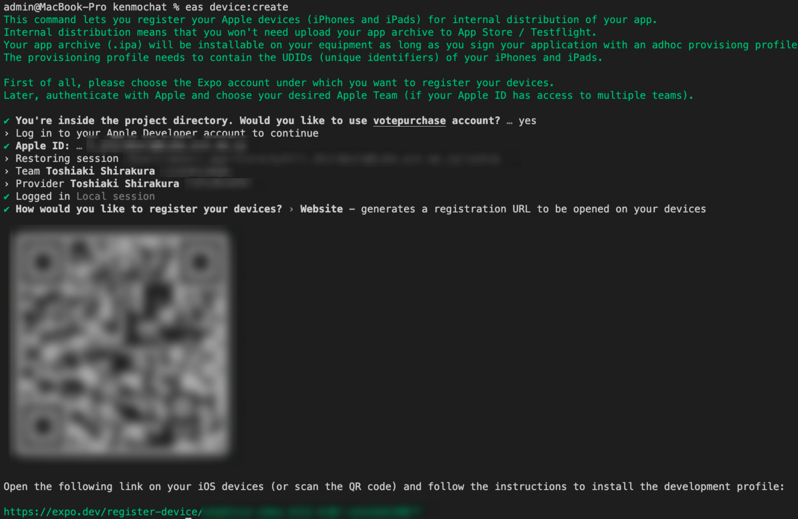
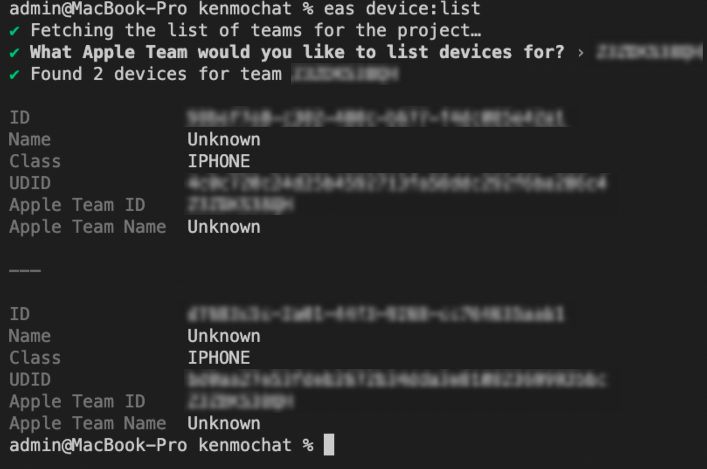
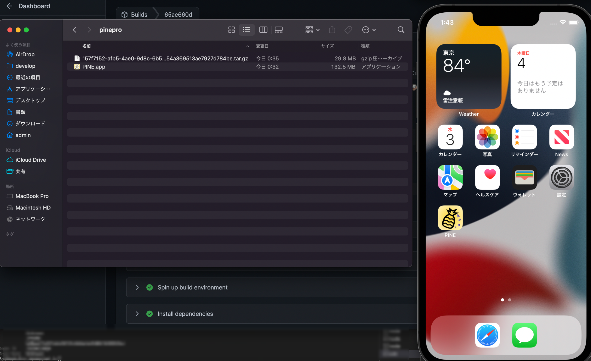
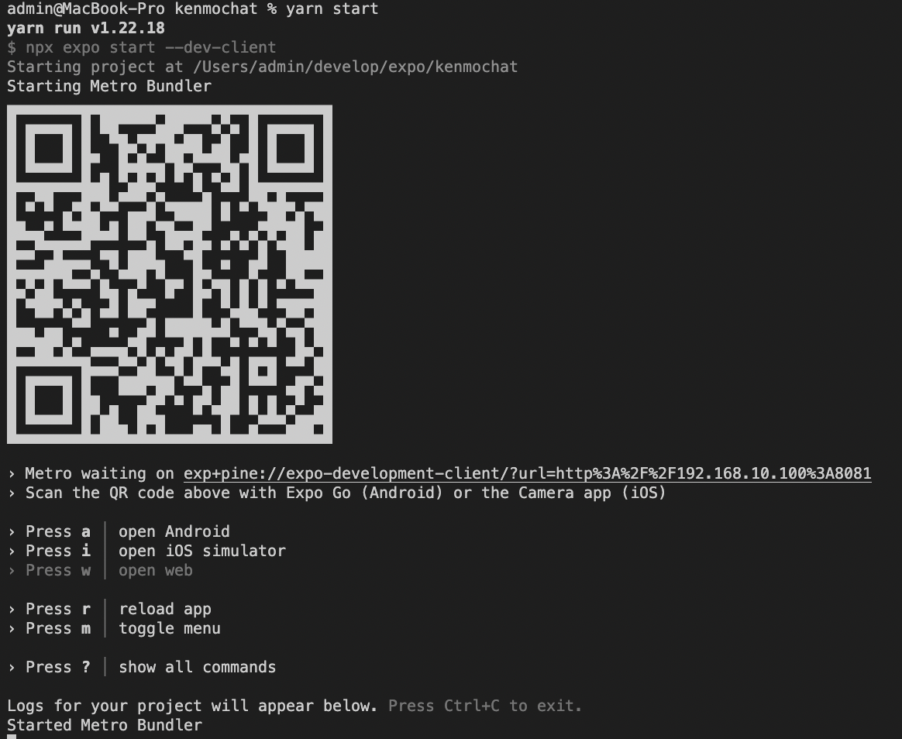
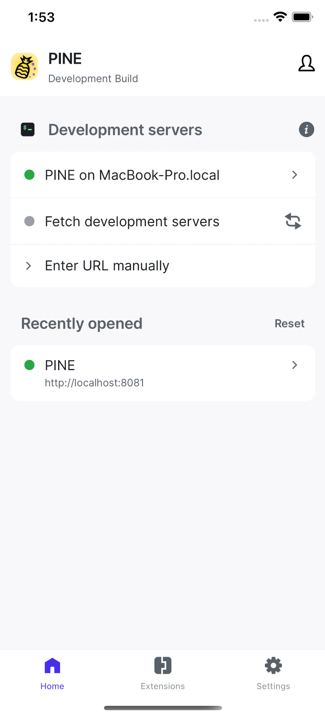
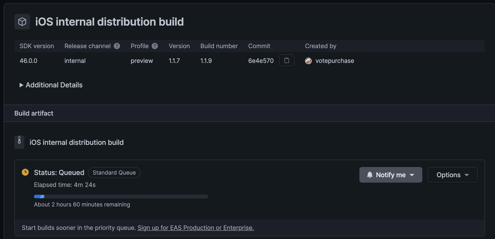

import { Link } from 'gatsby';

## 既存のExpoマネージドアプリをEASビルドに移行する

<Link to="/blog/2022-08-03">前回の予告</Link>通り既存のExpoアプリをEASビルドに移行する方法を書きます。

<br/><br/>

移行したのは[PINE pro](https://kenmochat.web.app)です。このアプリはExpo managed workflowのクラシックビルド(Expo45)を使用しています。アプリの証明書などはすべてExpoで生成と管理しています。

[Expoのドキュメント](https://docs.expo.dev/development/getting-started/)通りに作業を進めていきます。

## ManagedのままExpo 46にアップグレード

まずはExpo46にアップグレードしました。アップグレードについては<Link to="/blog/2022-08-03">前回</Link>の記事を参照してください。

前回同様に`patch-package`も入れてひとまずExpo Goで実行できるところまで持っていきました。

QRコードを生成するライブラリが使えなくなっていたので別のライブラリに入れ替えたりもしました。

## expo-dev-clientのインストール

開発用のライブラリをインストールします。

```
expo install expo-dev-client
```

## eas-cliをインストールする

eas-cliは以前から入っていましたが新しいバージョンが出てたので再度インストールしました。

```
npm install -g eas-cli
```

## EAS buildの準備

eas build用のファイルを作成します。

```
eas build:configure
```

実行すると`eas.json`が作成されます。

作成された`eas.json`を編集します。

```
{
  "cli": {
    "version": ">= 0.56.0"
  },
  "build": {
    "development": {
      "developmentClient": true,
      "distribution": "internal",
      "releaseChannel": "development",
      "ios": {
        "simulator": false
      }
    },
    "preview": {
      "distribution": "internal",
      "releaseChannel": "internal"
    },
    "production": {
      "releaseChannel": "production"
    }
  },
  "submit": {
    "production": {}
  }
}
```

プロファイルは以下の3種類です。

- development(開発用)
- preview(内部配布用)
- production(正式版)

<br/>

`simulator`の`true/false`を切り替える以外は一度作成したらほとんど変更することはないと思います。

## デバイスの登録

EASビルドではiPhone実機で確認する場合、開発用/内部配布用に関わらずExpoのサーバー上でビルドしたipaファイルをインストールします。そのため、使用するiPhoneをExpoサーバーに登録しておく必要あります。

登録作業はExpoで作成したプロファイルをiPhoneにインストールします。

```
eas device:create
```

実行するとApple IDの入力など求められますので指示に従って進めます。最後にプロファイルのダウンロードリンクが発行されます。リンク先のQRコードをiPhoneで読み取ってプロファイルをインストールします。



登録済みのデバイスを一覧することもできます。

```
eas device:list
```



なお、Androidの場合はAPKをサイドロードするのでデバイスの登録は不要です。

## ビルドを行う

### シミュレーター用ビルド

iOSシミュレーターにインストールするビルドを作成する場合は上で作成した`eas.json`の`simulator`を**true**にしておきます。

```
eas build --profile development --platform ios
```

ビルドが完了するとExpoのダッシュボードから.gzファイルをダウンロードできます。

ダウンロードした.gzファイルを展開すると.appファイルが生成されるのでiOSシミュレーターにドラッグアンドドロップするとインストール完了です。



### 実機用ビルド

`eas.json`の`simulator`を**false**にしてコマンドを実行します。

**開発用**

```
eas build --profile development --platform ios
```

**内部配布用**

```
eas build --profile preview --platform ios
```

インストール可能なデバイスはビルドした時点でプロファイルをインストール済みのものだけです。そのため、インストールするiPhoneを追加する場合は追加したいiPhoneにプロファイルをインストールした後に再ビルドする必要があります。

## アプリを実行する

開発用ビルドを起動する前にスクリプトを編集しておきます。

**package.json**

```
"scripts": {
  "start": "npx expo start --dev-client",
  "eject": "expo eject",
  "postinstall": "patch-package",
},
```

`start`に`--dev-client`を追加します。

開発用サーバーを起動します。

```
yarn start
```



インストールした開発用ビルドを起動すると下の画像のような画面になります。



シミュレーターでは`Fetch development servers`をタップするとローカルホストが検出されるので起動します。

実機の場合はターミナルに表示されたQRコードを読み取るとアプリが起動します。


## プッシュ通知トークンの取得

EASビルドでは**expo-notifications**でプッシュ通知トークンの取得時に`experienceId`を指定してあげる必要があります。

```javascript
const token = await Notifications.getExpoPushTokenAsync({
  experienceId: '@votepurchase/pine'
});
```

## まとめ

以上がEASビルドへの移行方法となります。

深夜はExpoのサーバーが混み合ってビルドに数時間待たされるのが普通なので日中にやりましょう。



---