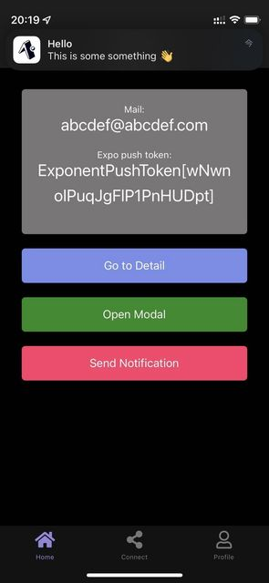

import { Link } from 'gatsby';

## Expo's Push API

<Link to="/blog/2021-04-08">以前</Link>にFirebase Cloud Functionsを利用してExpoアプリにプッシュ通知を送信する方法を書きました。

今回はクライアント(アプリ)から直接Expo's Push APIを利用して通知を送信する方法を書きます。

## プッシュ通知の送信方法

[ドキュメント](https://docs.expo.dev/push-notifications/sending-notifications/#http2-api)の通りです。

Expoが用意しているプッシュ通知用のエンドポイント(`https://exp.host/--/api/v2/push/send`)にPOSTリクエストを送信します。

サーバー側で実装したときはSDKをインストールしましたが、クライアントから送信する場合は不要です。



curlの場合は以下のようにします。

```
curl -H "Content-Type: application/json" -X POST "https://exp.host/--/api/v2/push/send" -d '{
  "to": "ExponentPushToken[xxxxxxxxxxxxxxxxxxxxxx]",
  "title":"hello",
  "body": "world"
}'
```

これをJavascript用に書き換えます。

## 実際のコード

今回はaxiosを使ってPOSTリクエストを送信します。もちろんFetch APIを利用しても問題ありません。

アプリ内の色々な場所から呼べるように関数化しておきます。

**src\utils\SendNotification.js**

```javascript
import axios from "axios";

const sendNotification = async({title, body, token, data}) => {
  const response = await axios.post(
    'https://exp.host/--/api/v2/push/send',
    {
      'to': token,
      'title': title,
      'body': body,
      'data': { data }
    },
    {headers: {'Content-Type': 'application/json'}}
  )
  const { status } = response
  return status
}

export { sendNotification }
```

通知を送信したいときに上の関数を呼び出します。

```javascript
const onNotificationPress = async() => {
  const res = await sendNotification({
    title: 'Hello',
    body: 'This is some something 👋',
    data: 'something data',
    token: token //e.g. ExponentPushToken[WGSdXiJ5rLHAK53DRPq2x-]
  })
  console.log(res)
}
```

`TouchableOpacity`や`Button`コンポーネントなどの`onPress`イベントから`onNotificationPress`を呼び出します。

```javascript
<Button
  label='Send Notification'
  onPress={() => onNotificationPress()}
/>
```

## プッシュ通知リスナー

プッシュ通知を受信したことをトリガーにして何らかの処理をしたい場合はルートコンポーネントでリスナーを実行しておきます。

以下の例ではコンソールに通知内容を表示しています。

```javascript
useEffect(() => {
  const subscription = Notifications.addNotificationReceivedListener(notification => {
    console.log(notification.request.content)
  });
  return () => subscription.remove();
}, []);
```

上に書いたプッシュ通知を受信するとコンソールには以下のように表示されます。

```
Object {
  "attachments": Array [],
  "badge": null,
  "body": "This is some something 👋",
  "categoryIdentifier": "",
  "data": Object {
    "data": "something data",
  },
  "launchImageName": "",
  "sound": null,
  "subtitle": null,
  "summaryArgument": null,
  "summaryArgumentCount": 0,
  "targetContentIdentifier": null,
  "threadIdentifier": "",
  "title": "Hello",
}
```

## まとめ

ExpoのPush APIを利用することでクライアントからも簡単に通知を送信することができました。

全コードは[自作ボイラープレート](https://github.com/kiyohken2000/ReactNative-Expo-Firebase-Boilerplate-v2)にありますので参照してください。

---