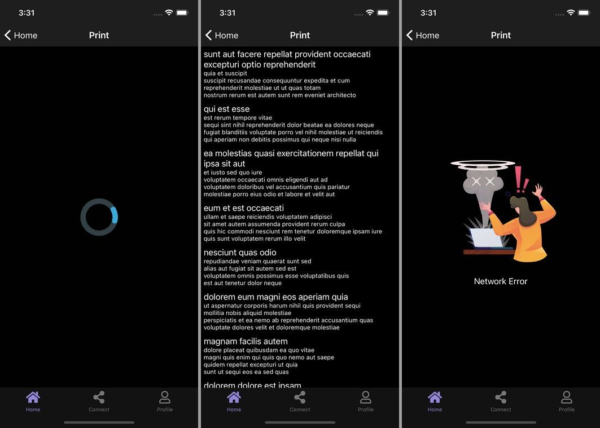

import { Link } from 'gatsby';

## ローディング画面とエラー画面の出し分けどうしてますか？

React(React Native)で「画面マウント時にデータをフェッチして、フェッチ中はローディング表示、フェッチ後にコンテンツもしくはエラーを表示する画面」を作るとき、どうやって実装しますか？



## 素直な実装

エラー画面が必要なく、ローディングorコンテンツ画面の2種類だけの出し分けの場合、`isLoading`フラグを用意して表示を切り替えるのが基本だと思います。

```javascript
import React, { useEffect, useContext, useState } from 'react'
import { View, Text, StyleSheet, ScrollView, Alert } from "react-native";
import ScreenTemplate from '../../components/ScreenTemplate'
import LoadingScreen from '../../components/LoadingScreen';
import axios from 'axios'
import RenderItem from './RenderItem';

export default function Print() {
  const [data, setData] = useState([])
  const [isLoading, setIsLoading] = useState(false) // ローディングフラグを用意

  useEffect(() => {
    fetchData() // マウント時にデータフェッチを開始
  }, [])

  const fetchData = async() => {
    try {
      setIsLoading(true) // フェッチ開始時にローディングフラグをオンに
      const { data } = await axios.get('https://jsonplaceholder.typicode.com/posts')
      setData(data)
    } catch(e) {
      console.log('error', e)
      Alert.alert('Network Error')
    } finally {
      setIsLoading(false) // フェッチ終了時にローディングフラグをオフに
    }
  }

  return (
    <ScreenTemplate>
      {!isLoading? // ローディングフラグを三項演算子で評価してコンテンツとローディング表示を出し分ける
        <ScrollView style={styles.main}>
          {data.map((item, i) => {
            return (
              <RenderItem item={item} key={i} index={i} />
            )
          })}
        </ScrollView>
        :
        <View style={styles.container}>
          <LoadingScreen />
        </View>
      }
    </ScreenTemplate>
  )
}

const styles = StyleSheet.create({
  container: {
    flex: 1,
    alignItems: 'center',
    justifyContent: 'center',
  },
  main: {
    flex: 1,
    width: '100%',
  },
})
```

**ScreenTemplate**コンポーネントはこんな感じです。`SafeAreaView`と`StatusBar`を色々な画面で使うために用意したコンポーネントです。

```javascript
import React, { useContext } from "react";
import { StyleSheet, SafeAreaView } from "react-native";
import { colors } from "../theme";
import { StatusBar } from 'expo-status-bar';
import { ColorSchemeContext } from "../context/ColorSchemeContext";

export default function ScreenTemplate(props) {
  const { scheme } = useContext(ColorSchemeContext)
  const isDark = scheme === 'dark'
  const container = isDark?styles.darkContainer: styles.container

  return (
    <SafeAreaView style={container}>
      <StatusBar style='light' />
        {props.children}
    </SafeAreaView>
  )
}

const styles = StyleSheet.create({
  container: {
    flex: 1,
  },
  darkContainer: {
    flex: 1,
    backgroundColor: colors.black
  }
})
```

## エラー画面も必要な場合

コンテンツ、ローディング、エラー画面の3種類を出し分ける場合を考えましょう。

ローディングフラグに加えてエラー評価用のフラグも用意します。その後`return`内で2つのフラグを評価して、3種類の画面を切り替えます。

```javascript
import React, { useEffect, useContext, useState } from 'react'
import { View, Text, StyleSheet, ScrollView, Alert } from "react-native";
import ScreenTemplate from '../../components/ScreenTemplate'
import LoadingScreen from '../../components/LoadingScreen';
import ErrorScreen from '../../components/ErrorScreen';
import axios from 'axios'
import RenderItem from './RenderItem';

export default function Print() {
  const [data, setData] = useState([])
  const [isLoading, setIsLoading] = useState(false)
  const [isError, setIsError] = useState(false) // エラー用のフラグを用意

  useEffect(() => {
    fetchData()
  }, [])

  const fetchData = async() => {
    try {
      setIsLoading(true)
      const { data } = await axios.get('https://jsonplaceholder.typicode.com/posts')
      setData(data)
    } catch(e) {
      console.log('error', e)
      setIsError(true) // エラー発生時はエラーフラグをオンに
    } finally {
      setIsLoading(false)
    }
  }

  return (
    <ScreenTemplate>
      {!isLoading? // まずローディングフラグを評価してローディング表示の出し分け
        !isError? // 次にエラーフラグを評価してエラー表示の出し分け
          <ScrollView style={styles.main}>
            {data.map((item, i) => {
              return (
                <RenderItem item={item} key={i} index={i} />
              )
            })}
          </ScrollView>
          :
          <View style={styles.container}>
            <ErrorScreen />
          </View>
        :
        <View style={styles.container}>
          <LoadingScreen />
        </View>
      }
    </ScreenTemplate>
  )
}

const styles = StyleSheet.create({
  container: {
    flex: 1,
    alignItems: 'center',
    justifyContent: 'center',
  },
  main: {
    flex: 1,
    width: '100%',
  },
})
```

上の例だと三項演算子のネストが発生してしまい分かりづらいので改善していきます。

## シンプルに実装する

ローディングやエラー表示を、上に貼った`ScreenTemplate`コンポーネントに移動させます。

このとき、親コンポーネントからローディング、エラーフラグを`ScreenTemplate`に渡します。`ScreenTemplate`側でローディング、エラー、コンテンツの3種類の画面を出し分ける処理をします。

**ScreenTemplate**

```javascript
import React, { useContext } from "react";
import { StyleSheet, SafeAreaView } from "react-native";
import { colors } from "../theme";
import { StatusBar } from 'expo-status-bar';
import { ColorSchemeContext } from "../context/ColorSchemeContext";
import LoadingScreen from "./LoadingScreen";
import ErrorScreen from "./ErrorScreen";

export default function ScreenTemplate(props) {
  const { isLoading, isError } = props // 親コンポーネントからローディング、エラーフラグを受け取る
  const { scheme } = useContext(ColorSchemeContext)
  const isDark = scheme === 'dark'
  const container = isDark?styles.darkContainer: styles.container

  if(isLoading) { // ローディングフラグがオンのときはローディングを表示する
    return <LoadingScreen />
  }

  if(isError) { // エラーフラグがオンのときはエラーを表示する
    return <ErrorScreen />
  }

  return ( // ローディング、エラーフラグがオフのときはコンテンツを表示する
    <SafeAreaView style={container}>
      <StatusBar style='light' />
        {props.children}
    </SafeAreaView>
  )
}

const styles = StyleSheet.create({
  container: {
    flex: 1,
  },
  darkContainer: {
    flex: 1,
    backgroundColor: colors.black
  }
})
```

親コンポーネント側はローディング、エラーフラグを渡すようにします。

```javascript
import React, { useEffect, useContext, useState } from 'react'
import { View, Text, StyleSheet, ScrollView } from "react-native";
import ScreenTemplate from '../../components/ScreenTemplate'
import axios from 'axios'
import RenderItem from './RenderItem';

export default function Print() {
  const [data, setData] = useState([])
  const [isLoading, setIsLoading] = useState(false) // ローディングフラグを用意
  const [isError, setIsError] = useState(false) // エラーフラグを用意

  useEffect(() => {
    fetchData()
  }, [])

  const fetchData = async() => {
    try {
      setIsLoading(true) // フェッチ開始したらローディングフラグをオンに
      const { data } = await axios.get('https://jsonplaceholder.typicode.com/posts')
      setData(data)
    } catch(e) {
      console.log('error', e)
      setIsError(true) // エラー発生時にエラーフラグをオンに
    } finally {
      setIsLoading(false) // フェッチ終了時にローディングフラグをオフに
    }
  }

  return (
    <ScreenTemplate isLoading={isLoading} isError={isError}> {/* ローディング、エラーフラグを渡す */}
      {/* 親コンポーネント側はコンテンツのコードだけになり見やすくなる */}
      <ScrollView style={styles.main}>
        {data.map((item, i) => {
          return (
            <RenderItem item={item} key={i} index={i} />
          )
        })}
      </ScrollView>
    </ScreenTemplate>
  )
}

const styles = StyleSheet.create({
  container: {
    flex: 1,
    alignItems: 'center',
    justifyContent: 'center',
  },
  main: {
    flex: 1,
    width: '100%',
  },
})
```

## レポジトリ

全コードは[ボイラープレート](https://github.com/kiyohken2000/ReactNative-Expo-Firebase-Boilerplate-v2)を参照してください。

---