import { Link } from 'gatsby';

## CPUクーラーを交換しました

いよいよRaphaelことRyzen7000シリーズの発売が来週にせまってきました。AMDファンボーイの僕はもちろん最上位の7950Xを購入予定です。Ryzen7000シリーズの最大のデメリットは最大170WとなったTDPです。

今使ってる虎徹Mark2の冷却性能では頼りない。というわけでCPUクーラーをDeepcoolの[AK620](https://jp.deepcool.com/products/Cooling/cpuaircoolers/AK620-High-Performance-CPU-Cooler/2021/13076.shtml)に交換しました。

## CPUクーラー交換の様子

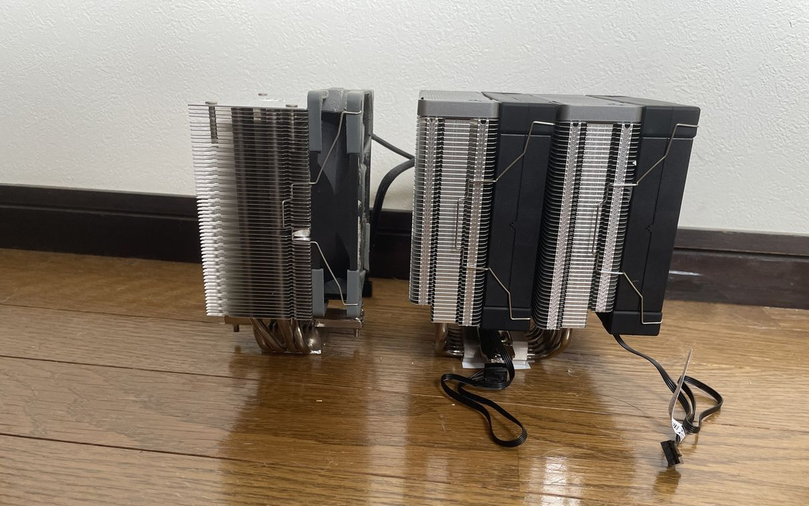

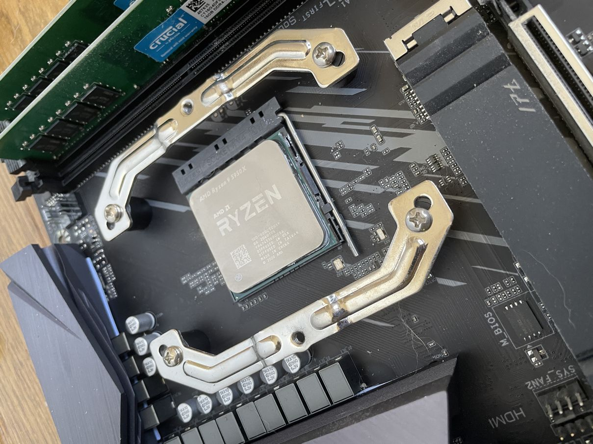

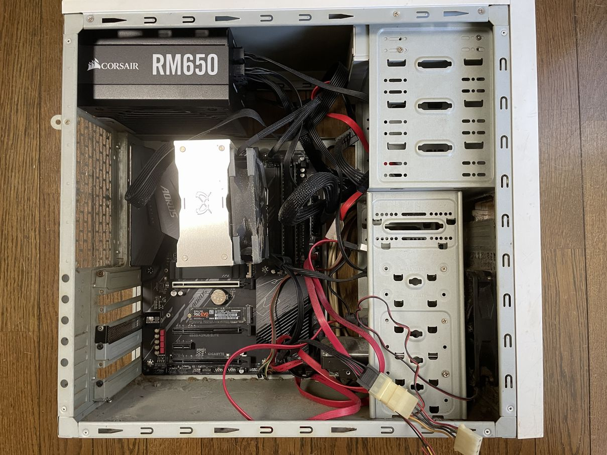

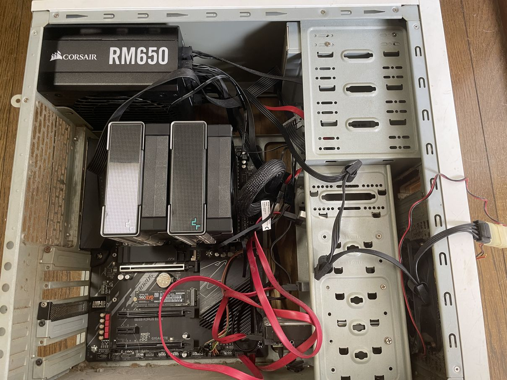

---

## スペック

|           | Ryzen9 5950X |
|-----------|------------|
| CPU      | Ryzen9 5950X |
| クーラー  | Scythe 虎徹Mark2 → **Deepcook AK620** |
| M/B | GIGABYTE B550 AORUS ELITE |
| MEM | Crucial W4U3200CM-16G |
| SSD | SamsungSSD980PRO 250GB |
| VGA | 玄人志向 RD-RX550-E2GB/OC |

---

## ベンチマーク

せっかくなので、虎徹Mark2使用時とAK620使用時でCinebenchR23、BlackMagic Raw Speed Test、x264/x265でのエンコードを行いスコアを計測しました。

冷却性能が向上したことにより、高クロック状態を維持できるようになっているはずです。それに伴い各種ベンチマークのスコアも向上するはず。

### CinebenchR23

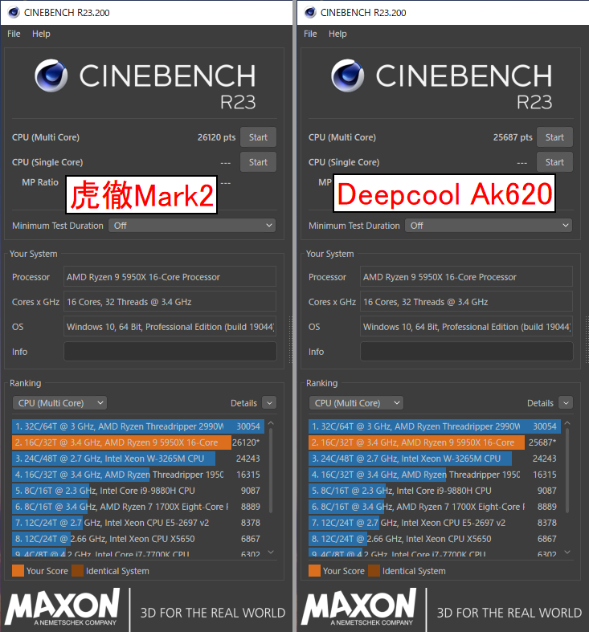

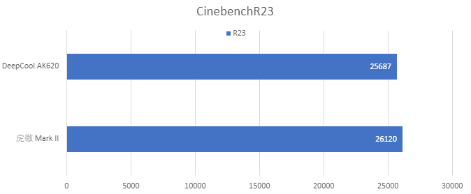

ちょっとスコア下がってる。

### BlackMagic Raw Speed Test

DaVinci Resolveのバージョンは18.0.3です。

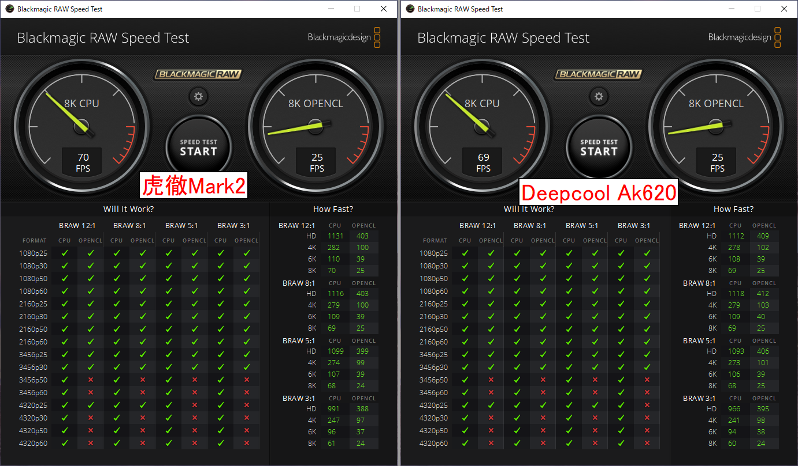

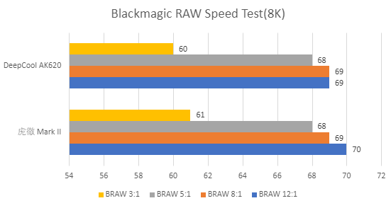

BlackMagic Raw Speed Testもちょっとスコア下がってる。

それにしてもBlackMagic Raw Speed Testはいい加減、Windows版も単体でインストールできるようにならないのだろうか。ベンチマークしたいだけなのに個人情報入れて3GBのファイルをダウンロードするのはハードルが高すぎる。

### x264/265エンコード

PT3で録画したアニメをx264とx265にエンコードしたときの時間を計りました。

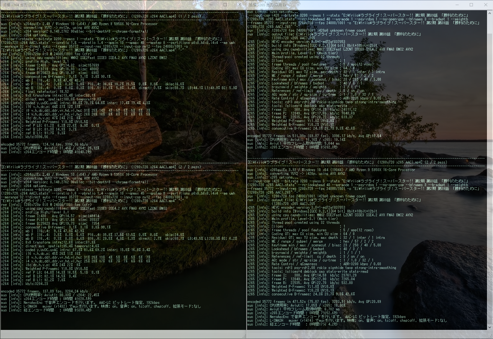

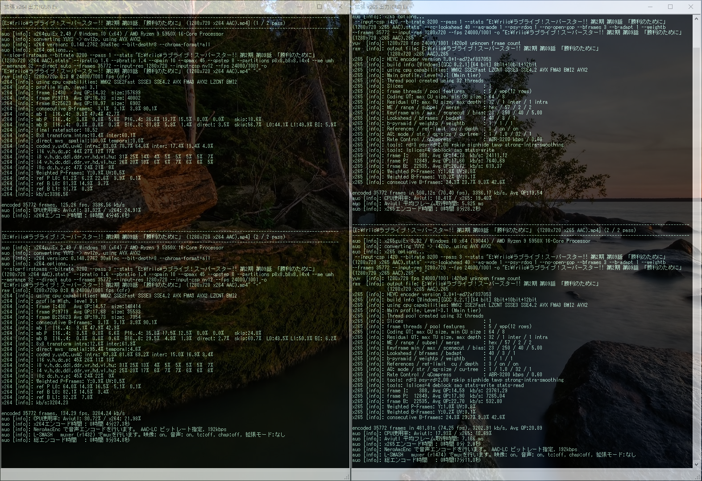

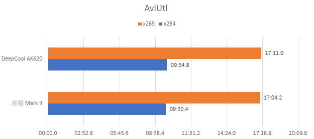

エンコードもちょっとスコア下がってる。

## まとめ

室温調整してないせいだと思いますが誤差程度で全体的にスコアが下がってしまいました。

それにしても<Link to="/blog/2020-12-12">前に書いたKP41病改善記事</Link>の貢献度を考えるとAMDから7950Xを優先的に買える権利くらいもらえてもいいと思う。いまだにちょいちょいアクセスあるところを見るとRyzenのKP41病はまだ直ってないみたいだし。

Ryzen 9 7950X買えるように祈っててください。

---