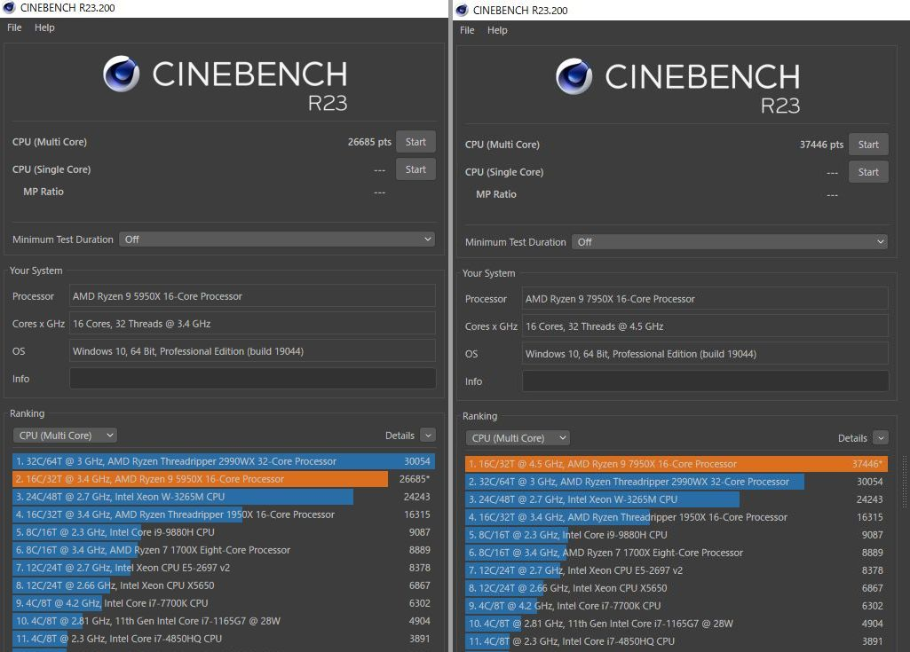

import { Link } from 'gatsby';

## Ryzen 9 7950Xを手に入れました

行ける範囲の実店舗がどこも7950X入荷しないとのことだったので、ウェブで注文したRyzen 9 7950Xが届きました。今回からソケットがAM5になり、メモリもDDR4からDDR5に変更されたためCPU、マザーボード、メモリの3点セットで以下を購入しました。

- Ryzen 9 7950X 117,800円
- MSI PRO X670-P WIFI 49,480円
- CFD W5U4800CM-16GS 18,970円

 

合計186,250円です。引くほど高い。特にマザーボードが異常に高い。しかもMSI PRO X670-P WIFIは5万円もするのにバックパネル一体型ではないという残念仕様でした。安いからという理由だけで選んだのですが、失敗しました。

---

## PT3のセットアップ

今回は、珍しくPT3のセットアップでハマったので覚書を残しておきます。

いつも通り**EpgDataCap_Bon**に**BonDriver**を入れてチャンネルスキャンを始めようと思ったのですが、BonDriverが開けないというエラーが出てスキャンできず。

アースソフトのExample.exeを実行すると`Devide::Open() (0x0000040a)`というエラーが出ていました。

調べてみるとBIOSで**Above 4G decoding**を無効にする必要があるとのこと。そこでBIOSで無効にしたところディスプレイが映らなくなりました。1時間ほど格闘の末**Resizable BAR**も無効にしたところディスプレイが復旧し、無事PT3のチャンネルスキャンもできるようになりました。

PT3もだいぶ古いデバイスになってしまったことを実感しました。

---

## スペック

|           | Ryzen9 5950X | Ryzen 9 7950X |
|-----------|------------|------------|
| CPU      | Ryzen9 5950X | **Ryzen 9 7950X** |
| クーラー  | Deepcook AK620 | Deepcook AK620 |
| M/B | GIGABYTE B550 AORUS ELITE | **MSI PRO X670-P WIFI** |
| MEM | Crucial W4U3200CM-16G | **CFD W5U4800CM-16GS** |
| SSD | SamsungSSD980PRO 250GB | SamsungSSD980PRO 250GB |
| VGA | 玄人志向 RD-RX550-E2GB/OC | 玄人志向 RD-RX550-E2GB/OC |

---

## ベンチマーク

前置きが長くなってしまいましたがベンチマークを実行して5950Xと比較しました。

実行したベンチマークは以下の4つです。

- CinebenchR23
- BlackMagic Raw Speed Test
- x264/x265での深夜アニメのエンコード
- このブログ(GatsbyJS)の依存関係のインストールとビルド

 

### CinebenchR23

### BlackMagic Raw Speed Test

DaVinci Resolveのバージョンは18.0.3です。

### x264/265エンコード

PT3で録画したアニメをx264とx265にエンコードしたときの時間を計りました。

### 開発コマンド

7950Xがエラー起こしてるけど、とりあえず動いてるのでヨシッ

## まとめ

5950Xから順当にスコアは伸びていますが、果たして18万円もかけて買い替える必要があったのかは激しく疑問です。

特にx264エンコードのスコアの伸びがイマイチでした。

---