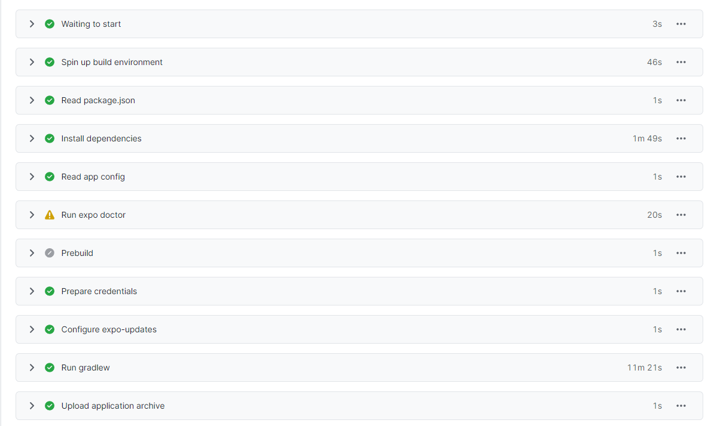

import { Link } from 'gatsby';

## React Native Native Voice

最近作ったアプリで音声認識(文字起こし、Speech to Text)機能を使いました。

React Nativeで音声認識を使う場合の定番ライブラリは[react-native-voice](https://github.com/react-native-voice/voice)です。ネイティブコードを含むためExpoのクラシックビルドでは使用できません、そのためEAS buildを使用しました。

音声認識はEAS buildが始まって利用可能になった代表的な機能のようで、[expo-dev-clientのGetting Started](https://docs.expo.dev/development/getting-started/)でも例としてあげられています。

公式ドキュメントの通りに進めることでiPhoneでは音声認識が利用可能になりますが、Androidでは動作しません。この記事ではAndroidで音声認識を動作させるための追加の設定を書きます。

## Androidの追加設定

react-native-voiceのレポジトリに[issueが投稿](https://github.com/react-native-voice/voice/issues/236)されている通り、Androidで音声認識を行うためにはマニフェストファイルに以下を追記する必要があります。

`android\app\src\main\AndroidManifest.xml`

```
<queries>
  <package android:name="com.google.android.googlequicksearchbox"/>
</queries>
```

Expoを使用されている方は気づくと思いますが、`npx create-expo-app my-app`や`expo init`で作ったプロジェクトには**ios**もしくは**android**フォルダはそもそも存在しません。なので素のexpoプロジェクトには**AndroidManifest.xml**が存在しないのです。

そこで、以下のコマンドを使用して**android**フォルダを作成します。

```
expo prebuild --platform android
```

上記コマンドを実行することでプロジェクト内に**android**ディレクトリが作成され依存関係がインストールされます。当然ディレクトリ内に**AndroidManifest.xml**も作成されます。

ちなみに、プロジェクト内に**ios**および**android**ディレクトリが存在する場合、EAS buildでは**Prebuild**ステップが省略されローカルの**ios**もしくは**android**ディレクトリが参照されるようです。



以上の手順で作成した**AndroidManifest.xml**に`com.google.android.googlequicksearchbox`を追記することでAndroidでも音声認識が利用可能になります。

最終的に私のマニフェストは以下のようになりました。

```
<manifest xmlns:android="http://schemas.android.com/apk/res/android" package="net.votepurchase.heyshinsan">
  <uses-permission android:name="android.permission.CAMERA"/>
  <uses-permission android:name="android.permission.INTERNET"/>
  <uses-permission android:name="android.permission.MODIFY_AUDIO_SETTINGS"/>
  <uses-permission android:name="android.permission.READ_EXTERNAL_STORAGE"/>
  <uses-permission android:name="android.permission.RECORD_AUDIO"/>
  <uses-permission android:name="android.permission.SYSTEM_ALERT_WINDOW"/>
  <uses-permission android:name="android.permission.VIBRATE"/>
  <uses-permission android:name="android.permission.WRITE_EXTERNAL_STORAGE"/>
  <uses-permission android:name="android.permission.ACCESS_MEDIA_LOCATION"/>
  <queries>
    <intent>
      <action android:name="android.intent.action.VIEW"/>
      <category android:name="android.intent.category.BROWSABLE"/>
      <data android:scheme="https"/>
    </intent>
    <intent>
      <action android:name="android.speech.RecognitionService"/>
    </intent>
    <package android:name="com.google.android.googlequicksearchbox"/>
  </queries>
  <application android:name=".MainApplication" android:label="@string/app_name" android:icon="@mipmap/ic_launcher" android:allowBackup="true" android:theme="@style/AppTheme" android:usesCleartextTraffic="true">
    <meta-data android:name="expo.modules.updates.ENABLED" android:value="true"/>
    <meta-data android:name="expo.modules.updates.EXPO_SDK_VERSION" android:value="46.0.0"/>
    <meta-data android:name="expo.modules.updates.EXPO_UPDATES_CHECK_ON_LAUNCH" android:value="ALWAYS"/>
    <meta-data android:name="expo.modules.updates.EXPO_RELEASE_CHANNEL" android:value="production"/>
    <meta-data android:name="expo.modules.updates.EXPO_UPDATES_LAUNCH_WAIT_MS" android:value="10000"/>
    <meta-data android:name="expo.modules.updates.EXPO_UPDATE_URL" android:value="https://exp.host/@votepurchase/hei-shin-san"/>
    <activity android:name=".MainActivity" android:label="@string/app_name" android:configChanges="keyboard|keyboardHidden|orientation|screenSize|uiMode" android:launchMode="singleTask" android:windowSoftInputMode="adjustResize" android:theme="@style/Theme.App.SplashScreen" android:exported="true" android:screenOrientation="portrait">
      <intent-filter>
        <action android:name="android.intent.action.MAIN"/>
        <category android:name="android.intent.category.LAUNCHER"/>
      </intent-filter>
      <intent-filter>
        <action android:name="android.intent.action.VIEW"/>
        <category android:name="android.intent.category.DEFAULT"/>
        <category android:name="android.intent.category.BROWSABLE"/>
        <data android:scheme="net.votepurchase.heyshinsan"/>
        <data android:scheme="exp+hei-shin-san"/>
      </intent-filter>
    </activity>
    <activity android:name="com.facebook.react.devsupport.DevSettingsActivity" android:exported="false"/>
  </application>
</manifest>
```

## app.json

記事の主題とは関係ないですが、上に貼ったexpoの公式ドキュメントでは`app.json`に**react-native-voice**だけをプラグインとして登録しています。

```
"expo": {
  "plugins": [
    [
      "@react-native-voice/voice",
      {
        "microphonePermission": "Allow $(PRODUCT_NAME) to access your microphone",
        "speechRecogntionPermission": "Allow $(PRODUCT_NAME) to securely recognize user speech"
      }
    ]
  ]
}
```

複数のプラグインを登録する場合は以下のようにします。ここでは**react-native-voice**と**expo-media-library**の二つのプラグインを登録しています。

```
"expo": {
  "plugins": [
    [
      "@react-native-voice/voice",
      {
        "microphonePermission": "このアプリは音声認識のためにマイクを使用します",
        "speechRecogntionPermission": "このアプリはAIからの応答を作成するために音声認識を使用します"
      }
    ],
    [
      "expo-media-library",
      {
        "photosPermission": "このアプリは画像を保存するためにフォトライブラリーを使用します",
        "savePhotosPermission": "このアプリは画像を保存するためにフォトライブラリーを使用します",
        "isAccessMediaLocationEnabled": true
      }
    ]
  ]
}
```

`plugins`の配列の中にそれぞれのプラグインの配列をネストして列挙する形にします。

---