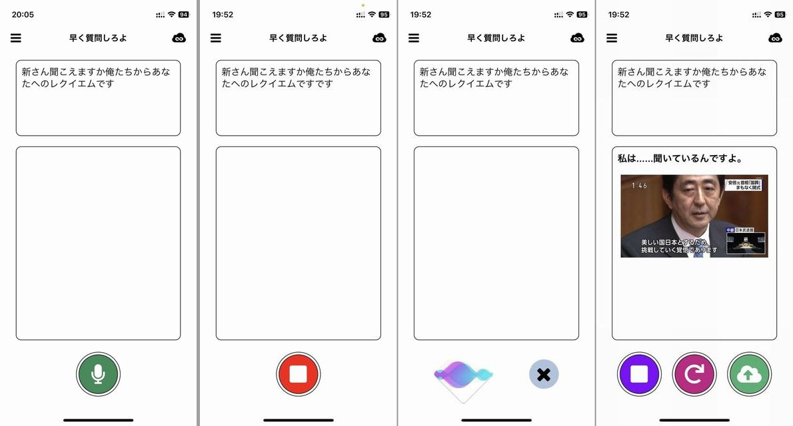
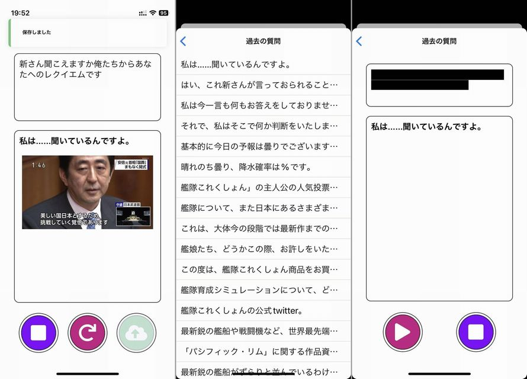
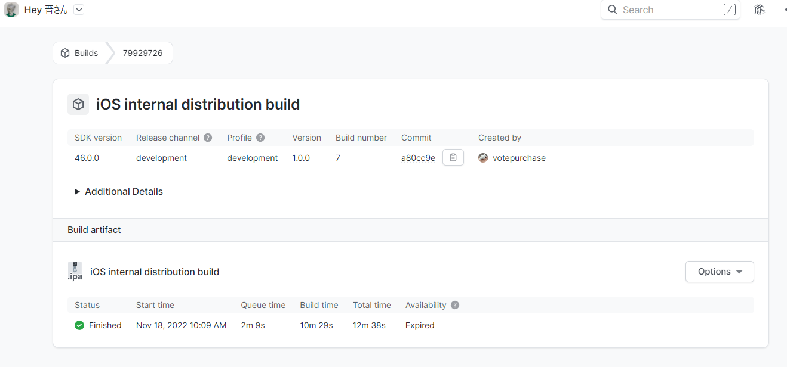
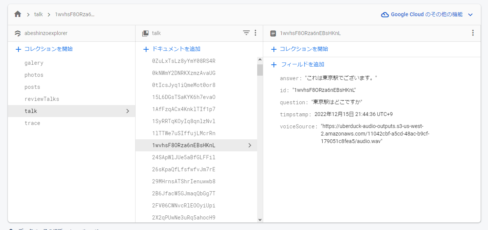
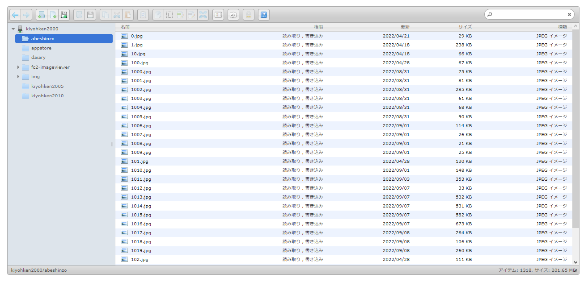
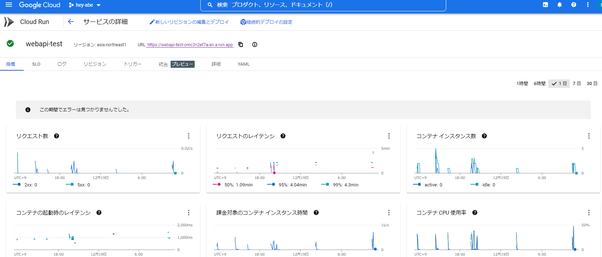
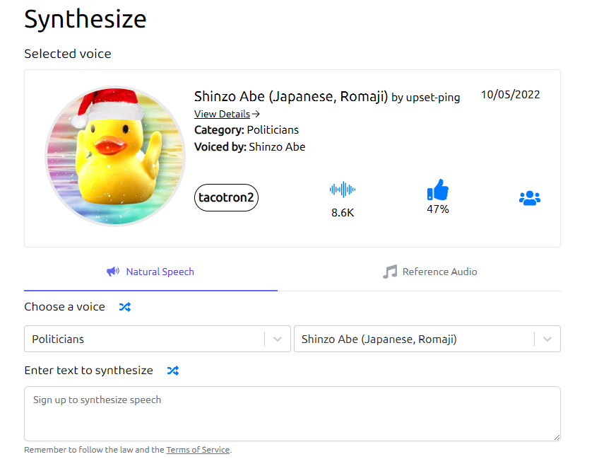

import { Link } from 'gatsby';

## 安倍晋三討伐の衝撃

2022年7月8日、その日の昼、日本全国の人々がテレビの前に釘付けになり、全世界で多くの人々が同じ体験をした。奈良県奈良市の近鉄大和西大寺駅北口付近にて、元内閣総理大臣の安倍晋三が選挙演説中に銃撃され死亡したのである。安倍晋三元首相銃撃事件は国内だけでなく海外でも大きく報じられ、海外メディアも速報で伝えた。米国のトランプ前大統領は8日、Truth Socialに「悲しいニュースだ」と投稿した。

かつて1963年11月22日にジョン・F・ケネディ大統領がテキサス州のダラスで暗殺された時、多くのアメリカ人は自分がどこで何をしていたかを鮮明に記憶しているという。それほどケネディ暗殺のニュースは衝撃的だったのである。2022年7月8日の事件の衝撃は、それに並ぶものであり、グローバリゼーションの深化したインターネット時代においては国内だけにとどまるものではなかった。この事件のことを知り、この事件について語ることによって、皮肉にも、人類は一つの時代と一つの地球を共有していることをまざまざと実感したのである。

## AI安倍晋三アプリをリリースしました

前置きが長くなりましたが日本全国のペットロスにお悩みの**日本の一般的な成人男性**(***Japanese general adult man***)のためのアプリを制作し、AppStoreおよびGooglePlayに公開しました。

- [AppStore - 意味のない質問だよ](https://apple.co/3AuRX6x)
- [GooglePlay - Hey 晋さん](https://bit.ly/3EIGWB4)

<br/>

## デモ動画

`youtube: BdToa3l6goA`

## アプリの説明

### 安倍晋三とのお話

安倍晋三に話しかけると安倍晋三が答えてくれる画面です。

緑のマイクボタンを押して質問を話しかけます。赤の停止ボタンを押して話すのをやめます。AI安倍晋三が回答と安倍晋三声を生成します。AI安倍晋三の回答が安倍晋三声で再生されます。緑のアップロードボタンを押すと問答が他のユーザーに共有されます。

回答の表示時に作者珠玉の安倍晋三画像コレクションから1枚ランダムに画像が表示されます。このコレクションは1318枚の安倍晋三画像を収蔵しており現在も増えています。



### 他のユーザーが共有した安倍晋三を楽しむ

他のユーザーが共有した安倍晋三との問答を一覧、再生する画面です。

右上のクラウドボタンを押すと過去の質問が一覧できます。だいたい2日前くらいまでの回答は再生できます。質問はのり弁になるのでプライバシー的にも安晋です。問答は全ユーザーで共有されます。



## 使用技術

### React Native(Expo)

アプリそのものはReact Native(Expo)で制作しました。speech-to-textをデバイスで行うために[@react-native-voice/voice](https://github.com/react-native-voice/voice)を使っています。そのためEAS buildを使用しました。



### Firebase

過去の問答の保存のためにFirestoreを使用しています。以下の画像のように

- 安倍晋三の生成した回答
- 回答のID
- 入力された質問
- タイムスタンプ
- 回答音声のURL

<br/>

を保存しています。問答の一覧画面では**最新の100件**を表示しているので、タイムスタンプはその並び替えに使用しています。



### FC2ホームページ

安倍晋三画像の保存場所です。作者が元々もっていたFC2ホームページのスペースを間借りしています。Firebase Cloud Storageを使用することも一瞬考えましたがCloud Storageは課金が発生する可能性が高いのでFC2を採用しました。



### GCP Cloud Run

安倍晋三風の回答を生成するウェブAPIをCloud Runにデプロイしています。

[安倍晋三風発言ジェネレーター](https://twitter.com/Abe_generator)の作者が開発している安倍晋三ディスコードBOTのソースコードと学習データを譲ってもらい、それをCloud Run用に書き換えてデプロイしました。

学習データとソースコードは許可を貰い、[abeshinzo-chat-bot](https://github.com/kiyohken2000/abeshinzo-chat-bot)としてGitHubで公開しています。



### Uberduck

安倍晋三声を生成するtext-to-speechには[Uberduck](https://uberduck.ai)を使用しています。Uberduckはユーザーが作成したボイスモデルが多数公開されており、その中に[安倍晋三モデル](https://app.uberduck.ai/speak#mode=tts-basic&voice=shinzo-ja)が存在しています。



## アプリの仕組み

### フロント側

アプリ側では大した事はしていません。

1. 入力された音声を文字起こし
1. 文字起こしした音声を回答生成APIにPOSTして回答を受け取る
1. 受け取った回答を今度はUberduckにPOSTして読み上げ音声を生成、音声ファイルのURLを受け取る
1. 受け取った音声ファイルのURLからwavファイルをダウンロードしてデバイスで再生

という手順です。

### 回答生成API

Uberduckは日本語のテキストで音声を生成できないのでTacotron変換をしたローマ字を渡す必要があります。そのため、APIでの回答生成時に日本語の回答と同時にTacotron変換を行ったローマ字もデバイス側に返しています。

例えば以下のようにします。

**リクエスト**

```
// curl
curl -X POST -H "Content-Type: application/json; charset=utf-8" -d '{"data":"あなたは安倍晋三ですか"}' https://webapi-test-omc3n2et7a-an.a.run.app

// axios
const res = await axios.post(
  'https://webapi-test-omc3n2et7a-an.a.run.app',
  {
    'data': 'あなたは安倍晋三ですか'
  },
  {
    headers: {
      "Content-Type" : "application/json; charset=utf-8"
    }
  }
)
const { origin, romaji, question } = res.data
```

**レスポンス**

```
{
  "origin": "これは、今まで申し上げているとおりでありまして、私は内閣総理大臣であると同時に自由民主党の総裁であります。",
  "question": "あなたは安倍晋三ですか",
  "romaji": "k o r e w a pau i m a m a d e m o o sh i a g e t e i r u t o o r i d e a r i m a sh I t e pau w a t a sh i w a n a i k a k U s o o r i d a i j i N d e a r u t o d o o j i n i j i y u u m i N sh U t o o n o s o o s a i d e a r i m a s U"
}
```

Tacotron変換には[pyopenjtalk](https://github.com/r9y9/pyopenjtalk)を使用しています。

### Uberduck

Uberduckでの音声生成は特別なことはしていません。ボイスモデルのUUIDと音声生成したい文字列を生成用のエンドポイントにポストします。音声生成とUberduck→S3への音声ファイルアップロードには数秒かかるため、URL取得用のエンドポイントを音声ファイルのURLが返ってくるまでポールします。

生成用のエンドポイントにテキストをPOSTする。

```javascript
const generateVoice = async({text}) => {
  try {
    const response = await axios.post(
      'https://api.uberduck.ai/speak',
      {
        'pace': 1,
        'voicemodel_uuid': voiceModelUUID,
        'speech': text
      },
      {
        headers: {
          'accept': 'application/json',
          'Authorization': 'Basic ' + btoa(`${key.uberduckKey}:${key.uberduckSecret}`),
          'content-type': 'application/json'
        }
      }
    );
    return response.data.uuid
  } catch (e) {
    console.log('error generateVoice', e)
    return null
  }
}
```

URL取得用のエンドポイントにGETリクエストをする。

```javascript
const getVoice = async({uuid}) => {
  try {
    const response = await axios.get(
      'https://api.uberduck.ai/speak-status',
      {
        params: {
          'uuid': uuid
        },
        auth: {
          username: key.uberduckKey,
          password: key.uberduckSecret
        }
      }
    );
    return response.data.path
  } catch(e) {
    console.log('error getVoice', e)
    return null
  }
}
```

まだ生成とアップロードが完了していない場合は`path`と`finished_at`が`null`になるので`path`にURLが入るまでポールします。

**レスポンスの例:**

```
{
  "started_at": "2021-07-09T17:07:58.679918",
  "failed_at": null,
  "finished_at": "2021-07-09T17:08:10.445369",
  "path": "https://uberduck-audio-outputs.s3-us-west-2.amazonaws.com/abcd1234-96e0-45b3-b036-6feac21764e7/audio.wav"
}
```

なお、Uberduckのディスコードで質問したところ、S3にアップロードされた音声ファイルは`about 24 hours`で削除されるとのことでした。

## 制作後感想

[安倍晋三エクスプローラー](https://kiyohken2000.github.io/flutter-practice/ja)に続く2作目の安倍晋三アプリとなりました。アプリの根幹となる安倍晋三BOTの開発者とUberduckの安倍晋三モデルの作者に感謝します。ありがとうございました。

GooglePlayでの公開は申請の翌日にはあっさり許可が出て無事配布されましたが、AppStoreでの公開は申請から配布まで一月以上かかりました。

安倍晋三討伐後の安倍晋三エクスプローラーのアップデート時にも時間がかかりましたが、どうやらAppleは安倍晋三についてかなりセンシティブになっているようです。アプリ名やAppStoreのメタデータに**安倍晋三**や**安倍総理**などが入っていると基本的にはリジェクトされるようです。

AppStoreでは**安倍晋三**に関連する場合エスカレート対象になるらしく、このアプリではステータスが**審査中**のまま2週間以上放置されました。最終的にはレビュアーと何度か電話で会話して許可されました。

```
Sing a Song!で出したんだけど「アプリ名がアプリの実際の機能を表していない」という理由で却下された。
レビュアーと電話で話したときに「Sing a Songとはなんですか？」「プロモーションテキストに書いてあるsing-a-song… do-sit…とはなんですか？」って聞かれたけど何も言い返せなかったは。
「俺には歌ってるように聞こえますけど？」っていうのがやっとだったは
```

---