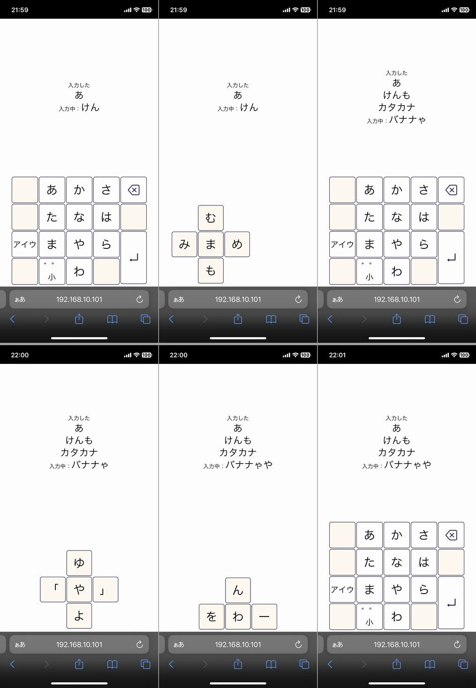

import { Link } from 'gatsby';

## ウェブ(React)用の仮想かなキーボードを作りました

予測変換は非対応です。ひらがな、カタカナ、濁点、半濁点、ゃゅょ、ャュョに対応しています。フリック入力対応です。




## デモ動画

`youtube: w-7aY4_mYgQ`

## Requirements

スワイプ検知に**react-swipeable**を使用しています。スタイリングには**React Native Web**を使用しています。エンターキーとバックスペースキーのアイコンに**react-icons**を使用しています。

- react-native
- react-native-web
- react-swipeable
- react-icons

<br/>

## レポジトリ

サンプルコードは以下レポジトリにあります。仮想キーボードコンポーネントは`src\components\KanaKeyboard`内にあります。

[react-virtual-kana-keyboard](https://github.com/kiyohken2000/react-virtual-kana-keyboard)

## 使い方

詳しい使い方は`src\screens\home\Home.js`を参照ください。

文字入力、エンターキー押下、バックスペースキー押下時の挙動は呼出側のコンポーネントで制御します。

### 文字入力時の制御

`val`に入力された文字が入っています。濁点、半濁点、小書き文字に変換した場合`isShiftInput`に`true`が入ります。

```javascript
const onInput = ({val, isShiftInput}) => {
  if(!val) return
  setText(prev => {
    if(isShiftInput) {
      const tempText = prev.slice(0, -1)
      return `${tempText}${val}`
    } else {
      return `${prev}${val}`
    }
  })
}
```

### エンターキー押下時の制御

```javascript
const onEnterPress = () => {
  if(!text) return
  setTextLines(prev => {
    return [...prev, text]
  })
  setText('')
}
```

### バックスペース押下時の制御

```javascript
const onBackspacePress = () => {
  if(!text) return
  setText(prev => prev.slice(0, -1))
}
```

### 仮想キーボードに各キー押下時の制御を渡す

```javascript
<KanaKeyboard
  onInput={onInput}
  onEnterPress={onEnterPress}
  onBackspacePress={onBackspacePress}
/>
```

## 仮想キーボードの設定

キーボードの設定は`src\components\KanaKeyboard\config.js`で行います。

```javascript
const keyboardStyles = {
  padding: 1, // キーの間隔 数値
  borderColor: colors.darkPurple, // キーの輪郭色 文字列
  borderWidth: 1, // キーの輪郭線幅
  borderRadius: 5, // キーの角丸 数値
  symbolLabelSize: fontSize.xxxxxLarge, // 文字キーのラベルフォントサイズ 数値
  symbolLabelColor: colors.black, // 文字キーのラベル色 文字列
  enterIconSize: fontSize.xxxxLarge, // エンターキーのアイコンサイズ 数値
  enterIconColor: colors.darkPurple, // エンターキーのアイコン色 文字列
  shiftSymbolSize: fontSize.xLarge, // 濁点半濁点キー、ひらがなカタカナ切替キーのラベルフォントサイズ 数値
  shiftSymbolColor: colors.black, //  濁点半濁点キー、ひらがなカタカナ切替キーのラベル色 文字列
  paletBackgroundColor: colors.floralwhite, // 文字キー展開時の背景色 文字列
  paletSymbolColor: colors.black, // 文字キー展開時のラベル色 文字列
  emptyKeyColor: colors.floralwhite, // 無効キーの色 文字列
  backspaceIconSize: fontSize.xxxxLarge, // バックスペースキーのアイコンサイズ 数値
  backspaceIconColor: colors.darkPurple, // バックスペースキーのアイコン色 文字列
}

const keyboardSettings = {
  shiftVisible: true, // ひらがなカタカナ切替キーの有効無効 真偽値 無効時は無効キーになります
  backspaceVisible: true, // バックスペースキーの有効無効 真偽値 無効時は無効キーになります
  trackMouse: true, //マウス操作でのスワイプを許可する場合はtrue
  keySize: width / 6, // 各キーのサイズ 数値
}
```

エンターキーとバックスペースキーのアイコンを変更する場合は以下のコンポーネントを編集します。

- `src\components\KanaKeyboard\EnterKey.js`
- `src\components\KanaKeyboard\BackspaceKey.js`

---