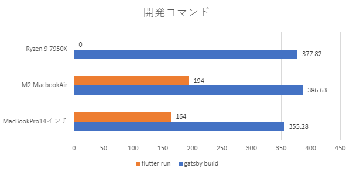

import { Link } from 'gatsby';

## M2 MacBookAirを買いました

最初に買った理由（言い訳）を書きます。

アプリ開発はRyzen7950Xの自作パソコンとM1Pro MacBookProの2台で行っています。

他にMacBookAir(2020 Intel)を持ち出し用に使っていました。しかしMacBookAirは日常使いですら非力でYouTubeすらまともに見られないほどでした。そこで、重量を我慢しながらMacBookProを持ち出すことも多くなっていました。

そんな中であることに気づきました。持ち出し中に虎の子のMacBookProに何かあったら開発がほとんどできなくなってしまうということです。特にアプリ開発ではiOSシミュレーターを使うのでMacBookProが故障すると致命的です。

そんなことを考えながら[整備済み品Mac](https://www.apple.com/jp/shop/refurbished/mac/macbook-air)のページを眺めていたら発注していました。

MacBookAirの仕様は以下の通りです。

- 8コアCPU
- 8コアGPU
- 24GBメモリ
- 512GB SSD

 

1/25の昼に注文して翌日の15時頃届きました。大雪の新潟に一日で届きました。Apple様とヤマト運輸の配送システムをなめていました。画像では1/27配送済みとなっていますが実際には1/26に届きました。

## 性能を検証

### 比較対象

というわけで開発に使っている他のPCと性能を比較しました。

比較対象は以下2つです。

- 自作パソコン(Ryzen 9 7950X/32GBメモリ/Radeon RX550)
- M1Pro MacBookPro14インチ(10コアCPU/14コアGPU/32GBメモリ/512GB SSD)

 

### 検証項目

検証項目は以下の4点です。なお、MacBookAirは環境をコピーせずに開発環境を作り直しました。

- Cinebench R23
- BlackMagic Raw Speed Test
- [このブログ(GatsbyJS)](https://github.com/kiyohken2000/retwpay-info)のビルド所要時間
- [安倍晋三エクスプローラー(Flutter)](https://github.com/kiyohken2000/flutter-practice)をデバッグモードで実行したときの起動時間

 

### Cinebench R23

順当な結果です。M2Pro/M2Maxの登場で虎の子のMacBookProもついに型落ちになってしまいましたがまだまだM2無印には負けていません。

### BlackMagic Raw Speed Test

こちらも順当な結果になりました。

### 開発コマンド

**GatsbyJSのビルド時間**

**Flutterの実行時間**

自作パソコンはiOSアプリのビルドができないのでNO Dataです。

**まとめグラフ**

GatsbyJSのビルドにおいてRyzen7950Xがまさかの逆転を許してしまいました。

MacBookProとMacBookAirの比較では、確かにMacBookProが高成績を残しているものの僅差にとどまっています。

## まとめ

アプリ開発においてはMacBookProとMacBookAirでは大きな差がないことがわかりました。M2世代になったことで最大メモリが16GBから24GBに増量されたため、M1 MacBookAirで最大の懸念だったメモリ容量の問題も解消されています。

もはや、アプリ開発では軽くてバッテリー持ちも良く値段も安いMacBookAirのほうがMacBookProよりも優先される選択肢といって過言ではないかもしれません。

MacBookAirは三方よしの攻守最強ノートパソコンといっても過言ではないと言えるでしょう。

---