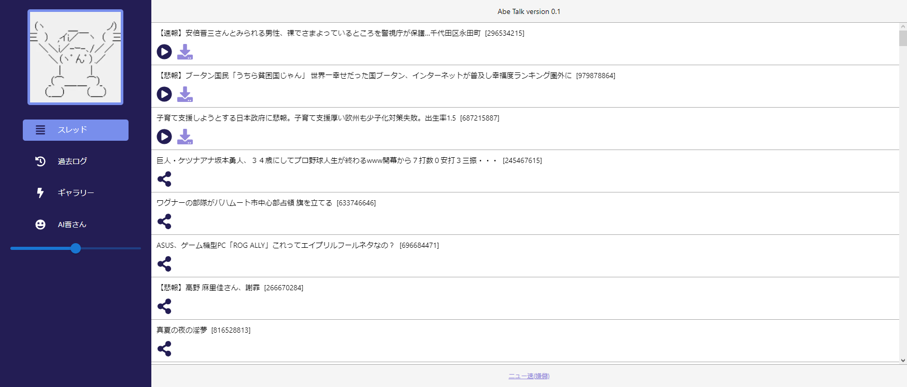
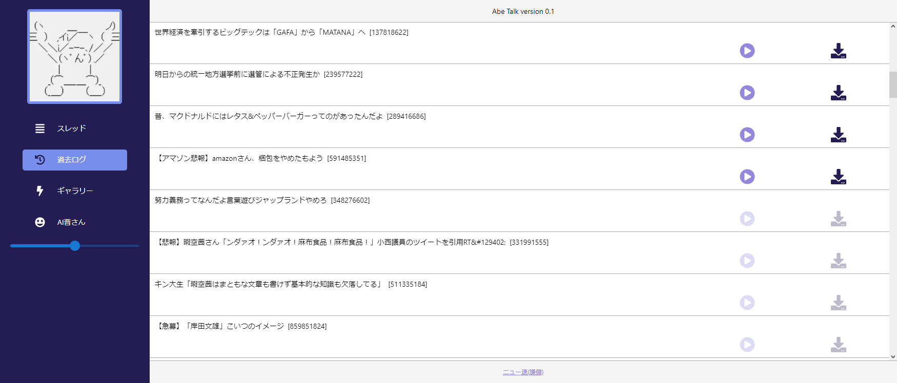
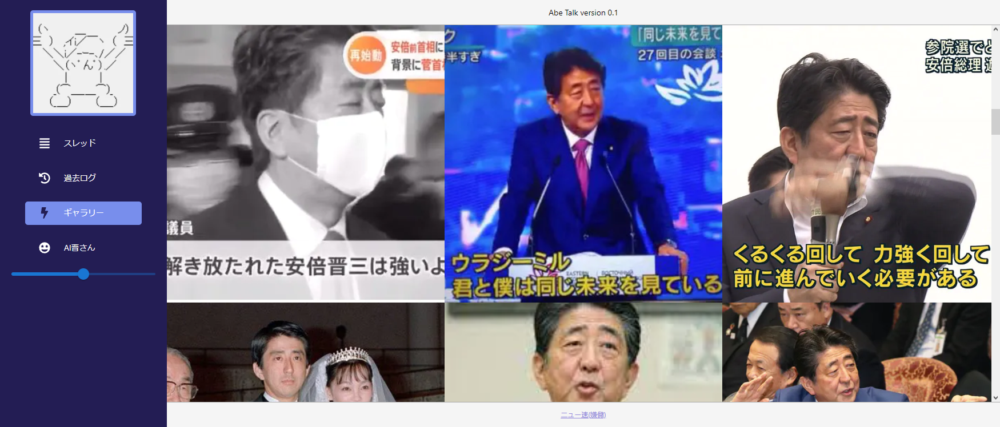
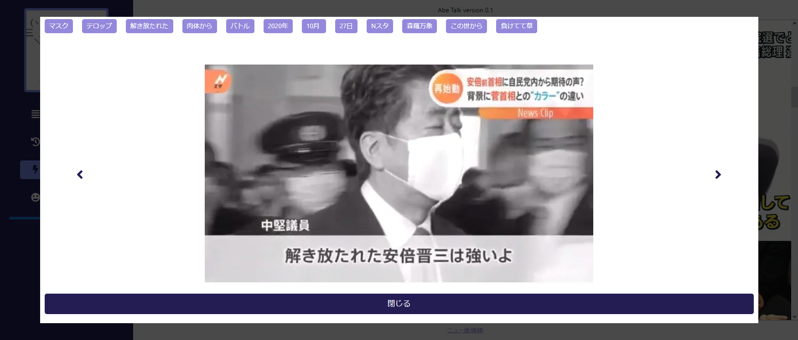
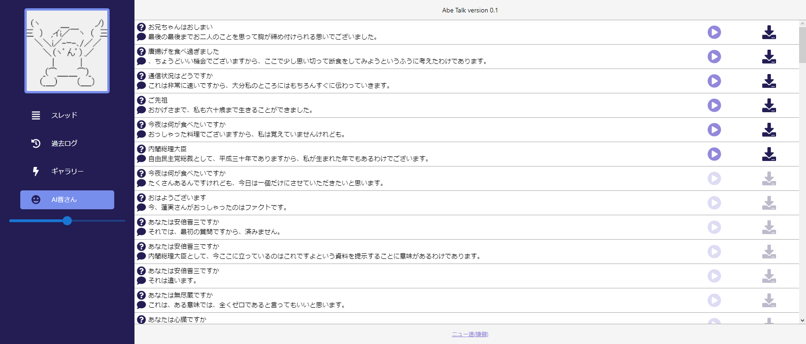
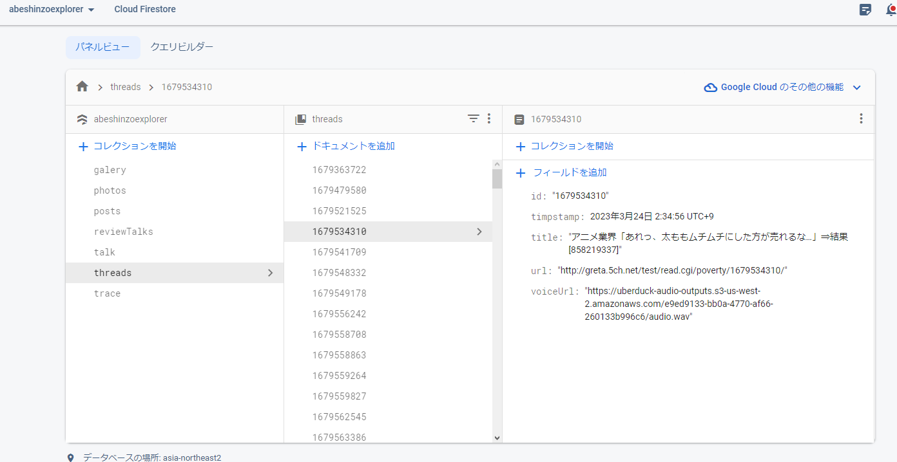
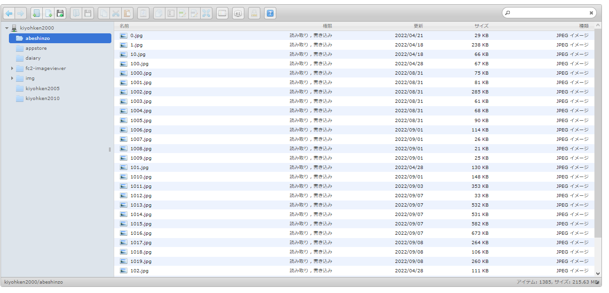

import { Link } from 'gatsby';

## 新作アプリ「Abe Talk」を公開しました

ウェブアプリ[Abe Talk](https://abe-talk.vercel.app)を作りました。嫌儲のスレタイを安倍晋三声で読み上げるウェブアプリです。

## アプリの説明

### スレッド画面



嫌儲のスレッド一覧画面です。

共有アイコンをクリックして安倍晋三声の読み上げ音声ファイルを生成します。再生アイコンをクリックすると生成した音声が再生されます。ダウンロードアイコンをクリックすることでwavファイルをローカルに保存することもできます。

### 過去ログ画面



音声データ生成済みのスレは過去ログ画面に表示されます。

wavファイルがまだ残っている場合は音声の再生とダウンロードが可能です。

### ギャラリー画面



安倍晋三エクスプローラーと同じ安倍晋三画像コレクションを閲覧することができます。



安倍晋三エクスプローラーでつけたタグはAbe Talkにも反映されます。

### AI晋さん画面



Hey晋さん/意味のない質問だよで保存されたAI安倍晋三との問答を閲覧することができます。wavファイルが残っている場合は再生/保存が可能です。

## 使用技術

### スタイリング

スタイリングにはReact Native Webを使用しました。

私はHTML/CSSを書けないためReact Nativeのコンポーネントが使えるReact Native Webは非常に便利でした。

### Firebase



バックエンドにはFirebaseを使用しました。

音声を生成したスレッドの情報はFirestoreに保存されます。保存されたスレッドの情報は過去ログ画面で利用しています。安倍晋三エクスプローラーや意味のない質問だよと同じFirebaseプロジェクトを使用しているので画像タグやAI安倍晋三との問答にもAbe Talkからアクセスすることができます。

### Cloud Run

日本語のTacotron変換を行うPythonスクリプトをCloud Runにデプロイしています。

こんな感じでPOSTリクエストを送信します。

```
// curl
curl -X POST -H "Content-Type: application/json; charset=utf-8" -d '{"data":"あなたは安倍晋三ですか"}' https://convert-tacotron-omc3n2et7a-an.a.run.app

// axios
const res = await axios.post(
	'https://convert-tacotron-omc3n2et7a-an.a.run.app',
	{data: 'あなたは安倍晋三ですか'},
	{
		headers: {
			"Content-Type" : "application/json; charset=utf-8"
		}
	}
)
const { converted, origin } = res.data
```

すると、Tacotron変換を行ってレスポンスを返します。

```
{
	"converted": "a n a t a w a a b e sh i N z o o d e s U k a",
	"origin": "あなたは安倍晋三ですか"
}
```

アプリではこのAPIにスレタイをPOSTしてTacotron変換を行い、変換した文字列をUberduckのText To Speech APIにPOSTして安倍晋三声を生成しています。

### Uberduck

Hey晋さん/意味のない質問だよと同じく、今回もUberduckの安倍晋三モデルを使用してText To Speechを行っています。

### FC2ホームページ



安倍晋三エクスプローラーと同じく、安倍晋三画像はFC2ホームページのスペースに置いています。

### Next.js

フロントエンドにはNext.jsを使用しました。

Next.jsでは**next.config.js**で**Rewrites**や**images.domains**を設定することでCORSエラーを回避できることが非常に便利でした。

ギャラリー画面で表示している安倍晋三画像はFC2ホームページに置いてあるため``や`<Image/>`でアクセスするとCORSエラーになります。`<iframe>`を使用してもFC2側の直リンク禁止エラーになります。

しかし、

```
const nextConfig = {
  images: {
    domains: [
      'kiyohken2000.web.fc2.com',
    ],
  },
}
module.exports = nextConfig
```

こんな感じで**images.domains**で外部ドメインを設定することで`<Image/>`コンポーネントから外部の画像データにアクセスすることができます。

また、このウェブアプリでは

- `https://api.uberduck.ai/speak` 音声データ生成用エンドポイント
- `https://api.uberduck.ai/speak-status` 音声データのステータス確認用エンドポイント
- `https://uberduck-audio-outputs.s3-us-west-2.amazonaws.com/{音声データのUUID}.wav` 音声データそのもの

<br/>

の3つの外部APIを使用しています。普通にウェブアプリからアクセスするとCORSエラーになりますが、

```
const nextConfig = {
  async rewrites() {
    return [
      {
        source: '/speak',
        destination: 'https://api.uberduck.ai/speak',
      },
      {
        source: '/speak-status',
        destination: 'https://api.uberduck.ai/speak-status',
      },
      {
        source: '/speak-play/:path*',
        destination: 'https://uberduck-audio-outputs.s3-us-west-2.amazonaws.com/:path*',
      },
    ];
  },
}
module.exports = nextConfig
```

こんな感じで**rewrites**を設定することでCORSエラーを回避することができます。

### 5chAPI

以前PINE proにBOTを実装したときにも使用しましたが、嫌儲のスレ一覧は`https://itest.5ch.net/subbacks/poverty.json`からjson形式で取得することができます。

ウェブアプリからこのURLに普通にアクセスするとCORSエラーになるため、Cloud Runに上記URLにアクセスして取得したjsonをクライアント側に返すPythonスクリプトをデプロイしています。

**next.config.js**でCORSエラー用の設定があることを知る前に作ってしまったAPIなので、実際は不要なAPIですが今更コードを変更するのも面倒なのでそのまま使っています。

なので、

ブラウザ → Cloud Run → 5ch API → Cloud Run → ブラウザ

という冗長な実装になっています。

なおCloud RunにデプロイしているPythonスクリプトはFlaskを使用しています。Flask-CORSを使用してブラウザからアクセスしてもCORSエラーが発生しないようにしています。

## レポジトリ

ウェブアプリとCloud RunにデプロイしているPythonスクリプトのコードは公開レポジトリにアップロードしています。

- [abe-talk](https://github.com/kiyohken2000/abe-talk)
- [convert-tacotron-cloud-run](https://github.com/kiyohken2000/convert-tacotron-cloud-run)
- [get-kenmou-thread](https://github.com/kiyohken2000/get-kenmou-thread)

---