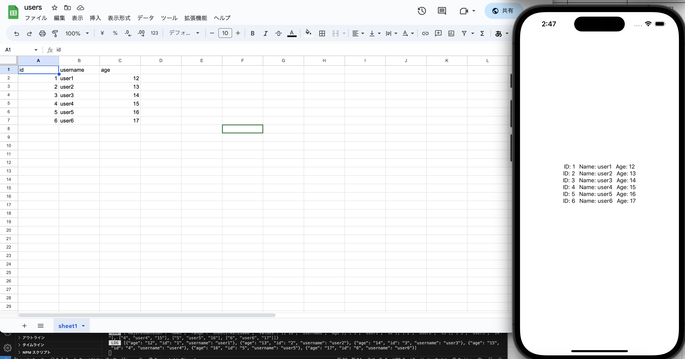
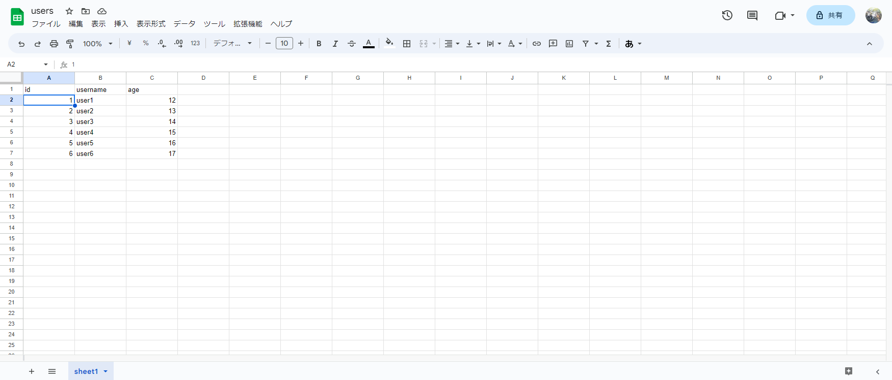
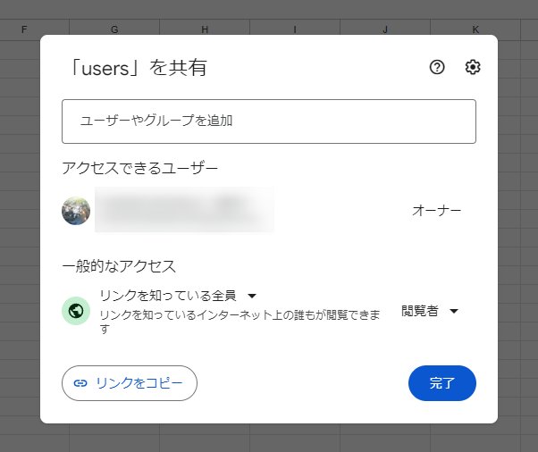
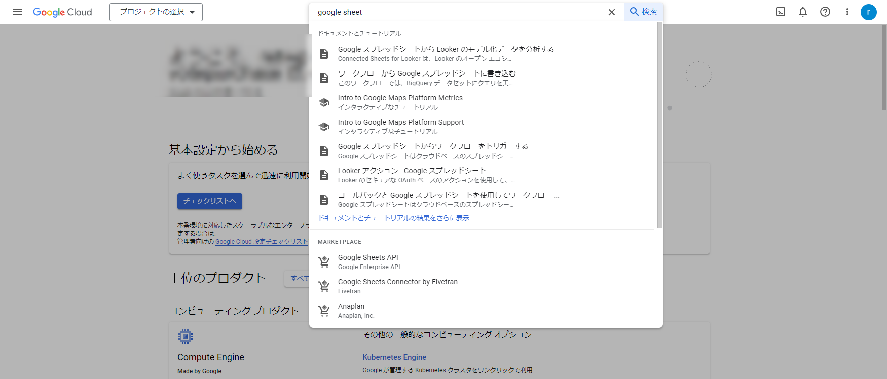
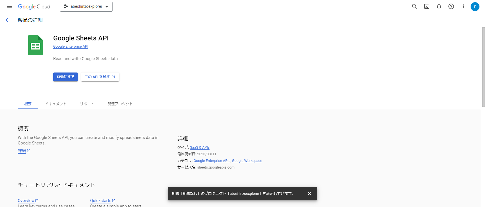
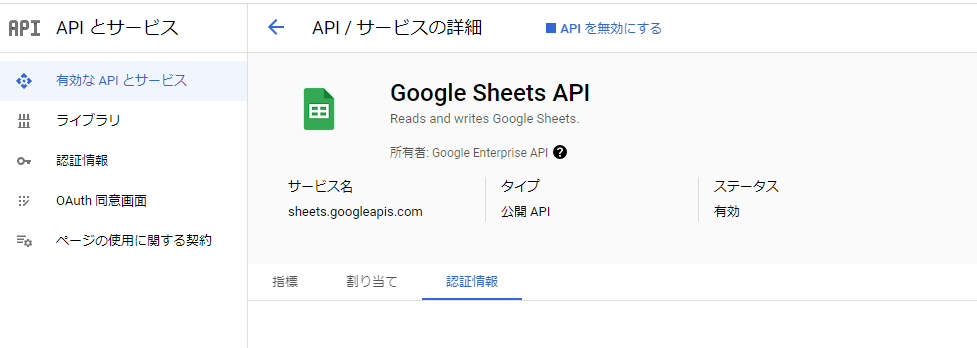
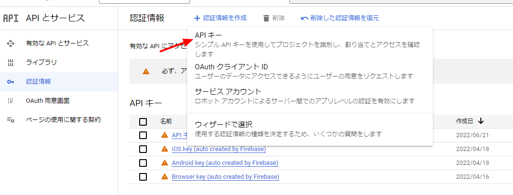
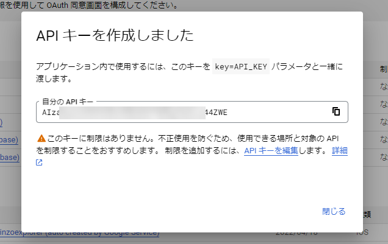
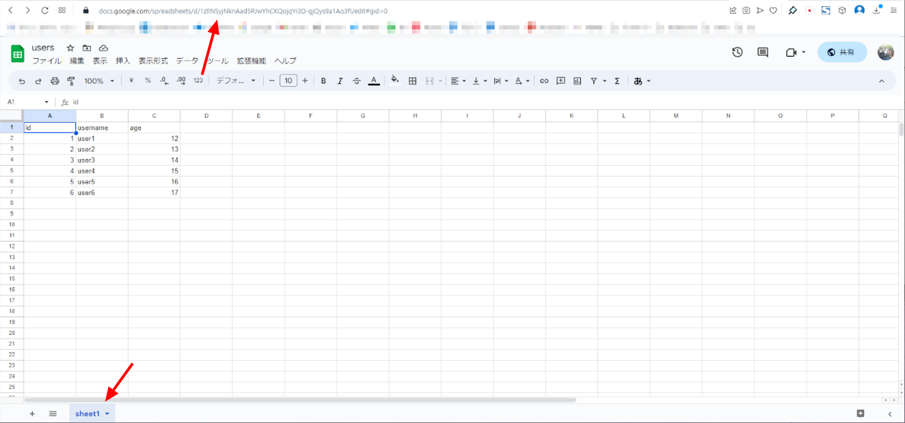

import { Link } from 'gatsby';

## Google Sheetsを読み取り専用データベースとして使用するReact Nativeアプリの作成

React NativeアプリのデータベースとしてGoogleスプレッドシートを使用することは推奨されません。なぜなら、クエリの実行を行えず、API呼び出しの割り当ても存在するからです。素直にFirestoreを使ったほうが良いです。

しかし非プログラマーがFirebaseコンソールでFirestoreにデータを追加/変更するのは技術的なハードルが高いです。もちろんFirestoreにデータを追加/変更するウェブUIを用意するのが正攻法ですが、その場合はアプリとウェブ管理画面の両方を作成する必要があります。そこで、Googleスプレッドシートを読み取り専用のデータベースとして使用するアイディアが役立つ場合があります。Googleスプレッドシートを使えばデータの管理画面を用意する必要がないからです。



[サンプルリポジトリ](https://github.com/kiyohken2000/google-sheets-test)

## データベース用のGoogleスプレッドシートを用意する

データベースとして使用するスプレッドシートを作成します。ひとまず以下のようなスプレッドシートを作成しました。



共有オプションを使用して閲覧権限を「リンクを知っている全員」にしておきます。このスプレッドシートにデータを追加/変更するとリアルタイムにアプリに反映されます。



## Google Sheets APIを用意

アプリからGoogleスプレッドシートにアクセスするためのAPIキーをGCPコンソールで作成します。

まずGCPコンソールを開いて**Google Sheets API**を開きます。



Google Sheets APIを有効にします。



Google Sheets APIを有効になりました。



次にAPIキーを発行します。**認証情報** → **認証情報を作成** → **APIキーを作成**を選択します。



APIキーが発行されました。これはアプリからスプレッドシートにアクセスするときにURLパラメーターとして使用するのでメモしておきます。



## API URL

アプリからアクセスするときのURLは以下のようになります。

**https://sheets.googleapis.com/v4/spreadsheets/{Sheet-ID}/values/{Sheet-Name}?valueRenderOption=FORMATTED_VALUE&key={API-Key}**


変数は以下の3つです。

- Sheet-ID
- Sheet-Name
- API-Key

<br/>

API-KeyはGCPコンソールで発行したものを使います。Sheet-IDはスプレッドシートURLに含まれています。Sheet-Nameはシート名です。

今回は**1zllNSyjNknAad5RJwYhCKQojqYi3D-gjQys9a1Ao3fI**がSheet-ID、**sheet1**がSheet-Nameです。



これでスプレッドシートにアクセスする準備ができました。

## アプリからアクセスする

実際にアプリからスプレッドシートのデータを読み取ります。

まずはスプレッドシートのURLを記述します。

**src\config.js**

```javascript
const apiKey = 'my_api_key'
const sheetId = '1zllNSyjNknAad5RJwYhCKQojqYi3D-gjQys9a1Ao3fI'
const sheetName = 'sheet1'

const dataUrl = `https://sheets.googleapis.com/v4/spreadsheets/${sheetId}/values/${sheetName}?valueRenderOption=FORMATTED_VALUE&key=${apiKey}`

export { dataUrl }
```

アプリからURLにアクセスします。下の例ではaxiosを使用していますがHTTPクライアントならなんでもいいです。

**App.js**

```javascript
useEffect(() => {
  const fetchData = async() => {
    try {
      const res = await axios.get(dataUrl)
      const { data } = res
      console.log(data)
    } catch(e) {
      console.log('fetch data error', e)
    }
  }
  fetchData()
}, [])
```

json形式で以下のようなデータを取得することができます。

```
Object {
  "majorDimension": "ROWS",
  "range": "sheet1!A1:Z1000",
  "values": Array [
    Array [
      "id",
      "username",
      "age",
    ],
    Array [
      "1",
      "user1",
      "12",
    ],
    Array [
      "2",
      "user2",
      "13",
    ],
    Array [
      "3",
      "user3",
      "14",
    ],
    Array [
      "4",
      "user4",
      "15",
    ],
    Array [
      "5",
      "user5",
      "16",
    ],
    Array [
      "6",
      "user6",
      "17",
    ],
  ],
}
```

このままだと扱いにくいのでフォーマット用の関数を作成します。

**src\functions.js**

```javascript
const formatData = ({data}) => {
  const keys = data.values[0];
  const _data = data.values.slice(1);
  const obj = _data.map(arr => Object.assign({}, ...keys.map((k, i) => ({ [k]: arr[i] }))));
  return obj
}
```

データ取得後に作成した関数を通すようにします。

```javascript
useEffect(() => {
  const fetchData = async() => {
    try {
      const res = await axios.get(dataUrl)
      const { data } = res
      const _data = formatData({data})
      console.log(_data)
    } catch(e) {
      console.log('fetch data error', e)
    }
  }
  fetchData()
}, [])
```

フォーマット後は以下のようなデータが得られます。

```
Array [
  Object {
    "age": "12",
    "id": "1",
    "username": "user1",
  },
  Object {
    "age": "13",
    "id": "2",
    "username": "user2",
  },
  Object {
    "age": "14",
    "id": "3",
    "username": "user3",
  },
  Object {
    "age": "15",
    "id": "4",
    "username": "user4",
  },
  Object {
    "age": "16",
    "id": "5",
    "username": "user5",
  },
  Object {
    "age": "17",
    "id": "6",
    "username": "user6",
  },
]
```

あとは取得したデータをセットして描画するようにアプリに記述します。

**App.js**

```javascript
import React, { useEffect, useState } from 'react';
import { StyleSheet, Text, View } from 'react-native';
import axios from 'axios';
import { dataUrl } from './src/config';
import { formatData } from './src/functions';

export default function App() {
  const [data, setData] = useState([])

  useEffect(() => {
    const fetchData = async() => {
      try {
        const res = await axios.get(dataUrl)
        const { data } = res
        const _data = formatData({data})
        setData(_data)
      } catch(e) {
        console.log('fetch data error', e)
      }
    }
    fetchData()
  }, [])

  return (
    <View style={styles.container}>
      {data.map((item) => {
        const { id, username, age } = item
        return (
          <View style={styles.row} key={id}>
            <Text>ID: {id}</Text>
            <View style={{paddingHorizontal: 5}}/>
            <Text>Name: {username}</Text>
            <View style={{paddingHorizontal: 5}}/>
            <Text>Age: {age}</Text>
          </View>
        )
      })}
    </View>
  );
}

const styles = StyleSheet.create({
  container: {
    flex: 1,
    backgroundColor: '#fff',
    alignItems: 'center',
    justifyContent: 'center',
  },
  row: {
    flexDirection: 'row'
  }
});

```

以上、React NativeアプリからGoogleスプレッドシートにアクセスする方法でした。

---