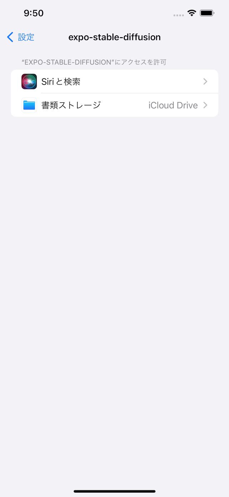

import { Link } from 'gatsby';

## expo-stable-diffusionの登場

Apple Neural Engineを使用してStable Diffusionによる画像生成を行うExpoモジュールが公開されました。

- [expo-stable-diffusion](https://github.com/andrei-zgirvaci/expo-stable-diffusion)

<br/>

この記事では[モジュールの作者による記事](https://andreizgirvaci.com/blog/how-to-create-ai-generated-images-on-ios-in-react-native-using-stable-diffusion)を参考にしてExpoの開発クライアントで画像生成を実行する方法を紹介します。iOSシミュレーターを使います。

## 完成形


プロンプトとステップ数を入力して**Generate Image**ボタンを押すと生成した画像をアプリ上に表示します。


生成した画像はiPhoneの**ファイルアプリ**内に保存されます。

- [レポジトリ](https://github.com/kiyohken2000/stable-diffusion-app)

<br/>

## 大まかな手順

1. ベースとなるプロジェクトの作成
1. 必要なパッケージのインストール
1. `app.json`の編集
1. Develop Clientのビルド
1. Stable Diffusion Modelをシミュレーターにコピー
1. UIやパッケージを使用するためのコードを書く

以上です。

なお、Develop Clientをビルドするので`eas-cli`とExpoアカウントは必須となります。

### 1. ベースとなるプロジェクトの作成

まずはベースとなるExpoプロジェクトを作成します。

```
expo init
```

で最初から始めてもいいのですが、今回は[自作ボイラープレート](https://github.com/kiyohken2000/ReactNativeExpoBoilerplate)を使用しました。

GitHubからボイラープレートをダウンロードしてきて依存関係をインストールします。

```
yarn install
```

アプリを起動してみます。

```
expo start
```


起動しない場合は、`app.json`の`updates.url`と`extra`を削除します。

### 2. 必要なパッケージのインストール

- expo-dev-client
- expo-build-properties
- expo-file-system
- expo-stable-diffusion

<br/>

インストールします。

```
npx expo install expo-dev-client expo-build-properties expo-file-system expo-stable-diffusion
```

#### expo-dev-client

expo-stable-diffusionはネイティブコードを含むのでExpo Goでは動きません。Develop Clientを使用するために使用します。

#### expo-build-properties

モジュール作者のブログ記事にある通り**iOS Deployment Target**を**16.2**に設定するために使用します。

#### expo-file-system

Stable Diffusion Modelの配置や、生成した画像の保存先としてアプリのドキュメントディレクトリを使用するので、パスを取得するために使用します。

#### expo-stable-diffusion

CoreMLを使用してStable Diffusionを実行するために使用します。

#### Optional

UIの作成のために以下のライブラリもインストールしました。メインテーマとはあまり関係ありません。

- react-native-auto-height-image
- react-native-material-menu

<br/>

### 3. app.jsonの編集

#### expo-build-properties

**deploymentTarget**を**16.2**に設定します。

```javascript
"plugins": [
  [
    "expo-build-properties",
    {
      "ios": {
        "deploymentTarget": "16.2"
      }
    }
  ]
],
```

#### info.plist

`ios.infoPlist`に**UIFileSharingEnabled**と**LSSupportsOpeningDocumentsInPlace**と**UISupportsDocumentBrowser**を追記します。

これはiPhoneの**ファイルアプリ**からもドキュメントディレクトリにアクセスできるようにするためです。

```javascript
"ios": {
  "supportsTablet": true,
  "bundleIdentifier": "net.votepurchase.stablediffusion",
  "buildNumber": "1.0.0",
  "infoPlist": {
    "NSPhotoLibraryUsageDescription": "Use the photo library to change your avatar.",
    "CFBundleDevelopmentRegion": "ja_JP",
    "UIFileSharingEnabled": true,
    "LSSupportsOpeningDocumentsInPlace": true,
    "UISupportsDocumentBrowser": true
  },
  "userInterfaceStyle": "automatic"
},
```

### 4. Develop Clientのビルド

準備ができたのでDevelop Clientをビルドします。

```
eas build:configure
```

を実行して。`eas.json`を作成します。

作成した`eas.json`を編集します。iOSシミュレーターを使用するので`simulator`を**true**にしておきます。

```javascript
{
  "cli": {
    "version": ">= 3.17.1"
  },
  "build": {
    "development": {
      "developmentClient": true,
      "distribution": "internal",
      "channel": "development",
      "ios": {
        "simulator": true
      }
    },
    "preview": {
      "distribution": "internal",
      "channel": "internal"
    },
    "production": {
      "channel": "production"
    }
  },
  "submit": {
    "production": {}
  }
}
```

iOS用のDevelop Clientをビルドします。

```
eas build --profile development --platform ios
```

ビルドが完了したらExpoのダッシュボードからダウンロードします。


ダウンロードしてきた`application-*******.tar.gz`ファイルを展開します。展開した`.app`ファイルをシミュレーターにドラッグアンドドロップでインストールします。


**ファイルアプリ**からドキュメントディレクトリにアクセスできるようにします。

設定アプリを開き今回インストールしたアプリの設定を開きます。


**書類ストレージ**を開きます。



**iCloud Drive**が選択されている場合は**このiPhone内**に変更しておきます。


### 5. Stable Diffusion Modelをシミュレーターにコピー

Stable Diffusion Modelを用意します。今回は[パッケージ作者が用意したモデル](https://huggingface.co/andrei-zgirvaci/coreml-stable-diffusion-2-1-split-einsum-v2-txt2img/blob/main/coreml-stable-diffusion-2-1-split-einsum-v2-cpu-and-ne-txt2img.zip)を使用します。


ダウンロードしたzipを展開して中身を確認します。決まりはないのですがフォルダ名を**compiled**に変更しました。


compiledフォルダをシミュレーター内のアプリのドキュメントディレクトリにコピーします。**ファイルアプリ**を開いてもこの時点ではまだ空です。


作者のブログ記事では`idb`コマンドを使ってコピーしていますが、今回はFinderを使用します。

シミュレーターのデータは`~/Library/Developer/CoreSimulator/Devices/`内にあります。

```
open ~/Library/Developer/CoreSimulator/Devices/
```

ディレクトリ名がシミュレーターIDとなっています。


更に`data`→`Containers`→`Data`→`Application`と進んで行くとアプリケーションIDが並んでいます。この中にモデルデータをコピーします。


が、この手順は使いません。アプリのドキュメントディレクトリをアプリから直接調べます。

アプリの適当なコンポーネントで`FileSystem.documentDirectory`を実行して直接パスを調べます。

**src/App.js**

```javascript
import React, { useState, useEffect } from 'react'
import { View } from 'react-native'
import { Provider } from 'react-redux'
import store from 'utils/store'
import 'utils/ignore'
import { UserContextProvider } from './contexts/UserContext'
import * as FileSystem from 'expo-file-system'; // expo-file-systemをインポート

// assets
import { imageAssets } from 'theme/images'
import { fontAssets } from 'theme/fonts'
import Router from './routes'

export default function App() {
  // state
  const [didLoad, setDidLoad] = useState(false)

  // handler
  const handleLoadAssets = async () => {
    // assets preloading
    await Promise.all([...imageAssets, ...fontAssets])
    setDidLoad(true)
  }

  // lifecycle
  useEffect(() => {
    handleLoadAssets()
    const path = FileSystem.documentDirectory // このアプリのドキュメントディレクトリのパスを取得する
    console.log('path:', path) // コンソールに取得したパスを表示する
  }, [])

  // rendering
  if (!didLoad) return <View />
  return (
    <Provider store={store}>
      <UserContextProvider>
        <Router />
      </UserContextProvider>
    </Provider>
  )
}
```

アプリを実行します。

```
yarn start
```

コンソールにドキュメントディレクトリのパスが表示されました。

```
path: file:///Users/admin/Library/Developer/CoreSimulator/Devices/3108E660-F4C8-4181-ACAF-AF9BBD33D6AD/data/Containers/Data/Application/01CEF53F-2EB4-4E46-BBE2-0EA39BF161B4/Documents/
```


取得したパスを開きます。

```
open ~/Library/Developer/CoreSimulator/Devices/3108E660-F4C8-4181-ACAF-AF9BBD33D6AD/data/Containers/Data/Application/01CEF53F-2EB4-4E46-BBE2-0EA39BF161B4/Documents/
```


このディレクトリにダウンロードしたモデルデータをコピーします。普通にドラッグアンドドロップやコピーペーストしてあげます。シミュレーターの**ファイルアプリ**からもコピーできたことが確認できます。


### 6. UIやパッケージを使用するためのコードを書く

expo-stable-diffusionの使い方は非常にシンプルです。

下のようにモデルデータと生成した画像のパスを記述します。

```javascript
const MODEL_PATH = FileSystem.documentDirectory + "compiled";
const SAVE_DIR = FileSystem.documentDirectory + "GeneratedImages/"
const IMAGE_NAME = 'image'
const SAVE_PATH = `${SAVE_DIR}${IMAGE_NAME}.jpeg`
```

その後、モデルをロードして、プロンプトとステップ数と保存先のパスを指定して生成用のメソッドを呼び出すだけです。

```javascript
await ExpoStableDiffusion.loadModel(MODEL_PATH)
await ExpoStableDiffusion.generateImage({
  prompt: text,
  stepCount: stepCount,
  savePath: SAVE_PATH,
})
```

以下は実際のコードです。ポイントだけ抜き出します。

**必要なライブラリをインポート**

```javascript
import * as FileSystem from 'expo-file-system';
import * as ExpoStableDiffusion from 'expo-stable-diffusion';
```

**パスを設定**

モデルと生成した画像のパスを記述します。

```javascript
const MODEL_PATH = FileSystem.documentDirectory + "compiled";
const SAVE_DIR = FileSystem.documentDirectory + "GeneratedImages/"
const IMAGE_NAME = 'image'
const SAVE_PATH = `${SAVE_DIR}${IMAGE_NAME}.jpeg`
```

コンソールでパスを確認すると以下のようになっています。

```javascript
useEffect(() => {
  console.log({MODEL_PATH, SAVE_PATH})
}, [])
```

```
{
  "MODEL_PATH": "file:///Users/admin/Library/Developer/CoreSimulator/Devices/3108E660-F4C8-4181-ACAF-AF9BBD33D6AD/data/Containers/Data/Application/01CEF53F-2EB4-4E46-BBE2-0EA39BF161B4/Documents/compiled",
  "SAVE_PATH": "file:///Users/admin/Library/Developer/CoreSimulator/Devices/3108E660-F4C8-4181-ACAF-AF9BBD33D6AD/data/Containers/Data/Application/01CEF53F-2EB4-4E46-BBE2-0EA39BF161B4/Documents/GeneratedImages/image.jpeg"
}
```

**ディレクトリ確認用の関数**

画像の保存先ディレクトリ`GeneratedImages/`が存在するか確認して、なければ作成する関数を作成します。

```javascript
const ensureDirExists = async() => {
  const dirInfo = await FileSystem.getInfoAsync(SAVE_DIR);
  if (!dirInfo.exists) {
    console.log("directory doesn't exist, creating...");
    await FileSystem.makeDirectoryAsync(SAVE_DIR, { intermediates: true });
  }
}
```

**画像生成用の関数**

モデルをロードして画像を生成する関数です。生成にかかった時間も取得したかったので開始時と終了時にUNIXタイムスタンプを取得して経過時間を計算しています。

`SAVE_PATH`は固定値ですが、生成前と生成後で画面の表示を分けたかったので`setResult`でstateとして処理しています。

画像の生成前に、上述した`ensureDirExists`を実行してディレクトリの存在確認を行っています。

```javascript
const generateImage = async() => {
  try {
    setIsLoading(true)
    setResult('')
    const startAt = moment().unix()
    console.log('generate image start')
    await ExpoStableDiffusion.loadModel(MODEL_PATH)
    console.log('Model Loaded, Generating Images!')
    await ensureDirExists()
    await ExpoStableDiffusion.generateImage({
      prompt: text,
      stepCount: stepCount,
      savePath: SAVE_PATH,
    })
    console.log('image generated')
    const finishAt = moment().unix()
    const elapsed = calculateElapsedSeconds({startAt, finishAt})
    console.log('elapsed', elapsed)
    setElapsedSeconds(elapsed)
    setResult(SAVE_PATH)
  } catch(e) {
    console.log('error', e)
  } finally {
    setIsLoading(false)
  }
}
```

**画像表示部**

画像の`source`はローカルのイメージなので`require()`としたいところですが、画像のパスはuriなので`source={{ uri: result }}`とします。

**uri = 画像のURL**という先入観があったので最初は`require()`と書いてしまいました。

```javascript
<View style={{flex: 1, alignItems: 'center', justifyContent: 'center'}}>
{result?
  <View style={{flex: 1, justifyContent: 'center'}}>
    <AutoHeightImage
      width={width * 0.9}
      source={{ uri: result }}
      defaultSource={require('../../../assets/images/logo-lg.png')}
    />
    <View style={{flex: 0.5, alignItems: 'flex-end'}}>
      <Text>生成にかかった時間: {elapsedSeconds}秒</Text>
    </View>
  </View>
  :
  <Text style={styles.text}>プロンプトを入力してボタンを押してください</Text>
  }
</View>
```

## まとめ

iPhoneだけですが、ついにReact NativeのExpoでStable Diffusionを使用できるようになりました。

モデルをiPhoneにコピーする手順が面倒だったり、生成速度が非常に遅いですが大きな一歩ではないでしょうか。

---