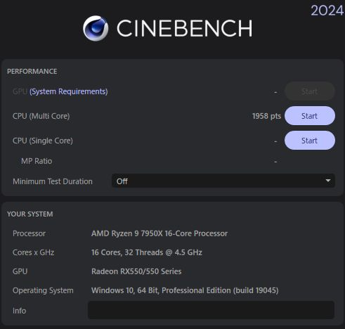
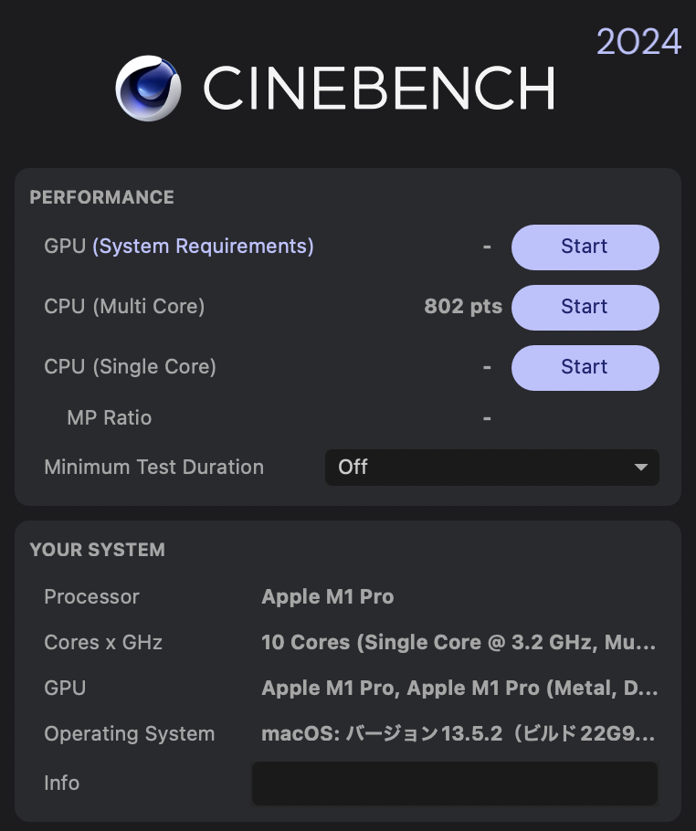
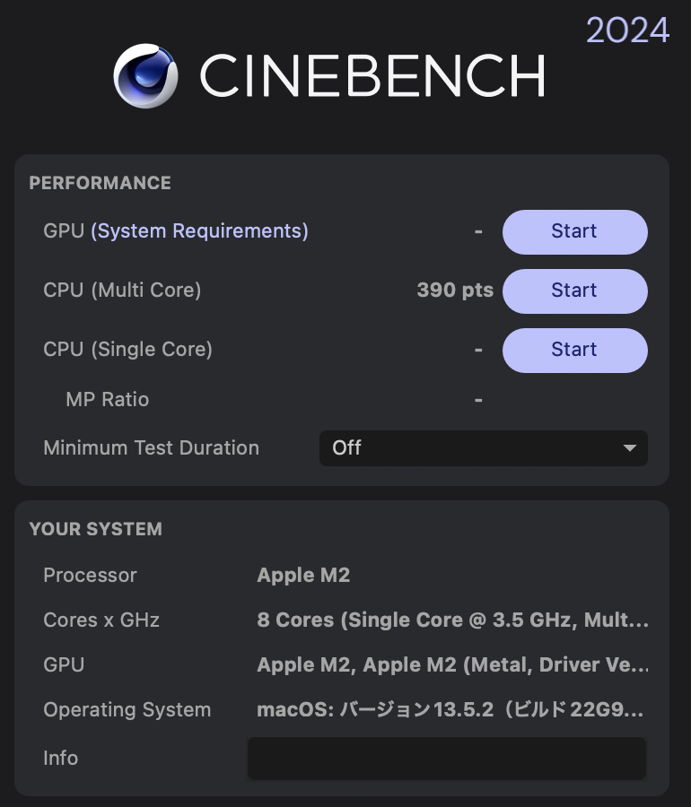
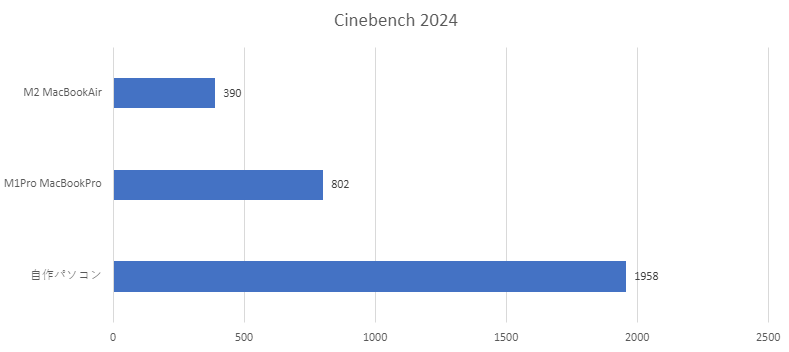

import { Link } from 'gatsby';

## Cinebench 2024が公開されました

定番ベンチマークCinebenchの最新版「Cinebench 2024」が公開されました。

- [GPUテスト搭載の「Cinebench 2024」が無償公開 ～Windows/Mac対応の定番ベンチマーク](https://forest.watch.impress.co.jp/docs/news/1529516.html)

 

そこで、今回はメインで使っている3つのPCでCPUのスコアを計測しました。

## 比較機材

- 自作パソコン(Ryzen 9 7950X/32GBメモリ/Radeon RX550/Deepcool AK620)
- M1Pro MacBookPro14インチ(10コアCPU/14コアGPU/32GBメモリ/512GB SSD)
- M2 MacBookAir13インチ(8コアCPU/8コアGPU/24GBメモリ/512GB SSD)

 

## 計測結果

**自作パソコン**

**M1Pro MacBookPro14インチ**

**M2 MacBookAir13インチ**

## まとめグラフ

## まとめ

前のバージョンより結果が出るまで時間がかかる。特にMacBookAirはファンレスにもかかわらず数分間フルロードになるためスコアは伸び悩みました。

---