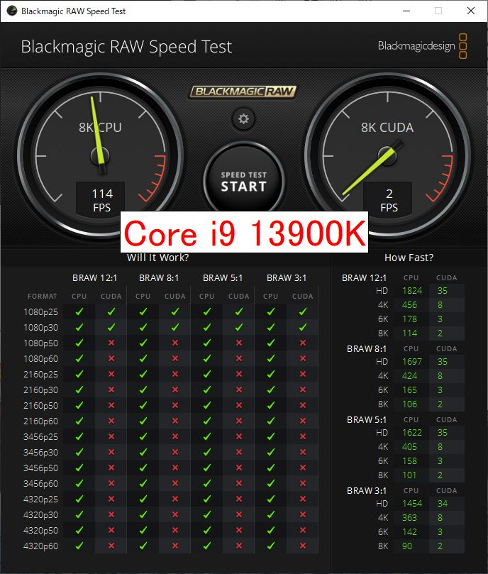

import { Link } from 'gatsby';

## Core i9 13900Kを手に入れました

Core i7 6700Kのサブ機をCore i9 13900Kに組み替えました。

購入したのは以下の7点です。

- Intel Core i9 13900K
- ASRock Z790 PG Lightning
- Crucial CT2K16G48C40U5(DDR5 4800MHz 16GB*2)
- KIOXIA EXCERIA PRO SSD-CK1.0N4P/J (M.2 2280 1TB)
- DEEPCOOL PQ650M R-PQ650M-FA0B-JP (650W)
- DeepCool AK620
- ZALMAN Z3 Iceberg Black (E-ATX ガラス)

 

下記のグラボとSSDは流用しました。

- 玄人志向 GF-GT710-E1GB/HS
- ADATA SU630 480GB
- PLEXTOR PX-512M9PeG 512GB

 

最近、深夜アニメの本数とBS放送での放送局数が増えたこともあり、曜日によってはPT3一台だけでは録画しきれないクールが発生していました。そのためRyzen 9 7950Xに加えてサブ機のCore i7 6700Kでも録画とエンコードを行うことがたびたびあります。古いCPUなだけあって1本のアニメをエンコードするのに30分以上フルロードになっていました。

また、以前からやりたかった企画**自作パソコン組み立てるところから始まるスマホアプリ開発のハウツーYouTube**を実際に行う良い機会かと考え、2ヶ月ほど悩んだ末にようやく購入に踏み切りました。

Intelの動向も後押しになりました。Meteor Lake-Sがキャンセルになり、今年の自作PC向けCPUはRaptor Lake Refreshでお茶を濁す形になったためです。クロックが微増するRefresh版を発売直後のご祝儀価格で買うよりは値段の落ち着いたRaptor Lakeを買ったほうがお得だろうという考えです。

YouTubeシリーズ[PC自作から始まるスマホアプリ開発](https://www.youtube.com/watch?v=bhzWqlPCxIg&list=PLCulJu7bwJxeoiTXDqgKyaijxsyoc_bva)、ご覧いただければ幸いです。

折角IntelとAMDのハイエンドCPUが揃ったのでいくつかのベンチマークを実行して性能を比較しました。

## 検証機材

|           | Ryzen 9 7950X | Core i9 13900K|
|-----------|------------|------------|
| CPU      | Ryzen9 7950X | Core i9 13900K |
| クーラー  | DeepCool AK620 | DeepCool AK620 |
| M/B | MSI PRO X670-P WIFI | ASRock Z790 PG Lightning |
| MEM | CFD W5U4800CM-16GS | Crucial CT2K16G48C40U5 |
| SSD(System) | SamsungSSD980PRO 250GB| KIOXIA EXCERIA PRO SSD-CK1.0N4P/J |
| VGA | 玄人志向 RD-RX550-E2GB/OC | 玄人志向 GF-GT710-E1GB/HS |

 

## ベンチマーク

実行したのは下記4つです

- Cinebench R23
- Cinebench 2024
- BMRawSpeedTest
- x264/x265エンコード

 

早速結果を見ていきましょう。

### Cinebench R23

**Ryzen 9 7950X**

**Core i9 13900K**

### Cinebench 2024

**Ryzen 9 7950X**

**Core i9 13900K**

### グラフ(Cinebench R23/2024)

### Blackmagic RAW Speed Test 8K

**Ryzen 9 7950X**

**Core i9 13900K**

### グラフ(Blackmagic RAW Speed Test 8K)

### x264/x265エンコード

**x264**

**x265**

### グラフ(x264/x265エンコード)

## まとめ

全体的にCore i9 13900KがRyzen 9 7950Xを上回る結果となりました。特にx264/x265エンコードではCore i9はCPU使用率がほぼ100%まで上がるため明らかにRyzen 9を上回ります。

AMDファンボーイ的には少し悲しい結果になりました。

---