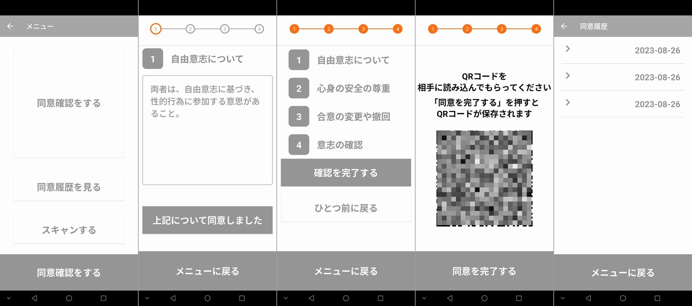
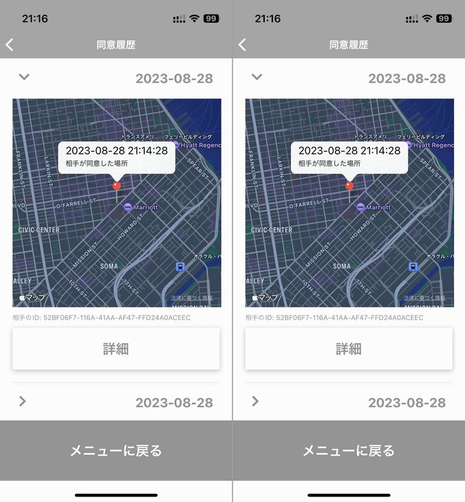

import { Link } from 'gatsby';

## 新作アプリを作りました

数か月前のことになりますが新作アプリを作ってリリースしました。

- [Kiroku - 性的同意アプリ](https://play.google.com/store/apps/details?id=net.votepurchase.kiroku)

 

少し前に話題になった「性的同意アプリ」のパチモンです。話題になってる本家のアプリがリリース延期になった隙に先にリリースしてしまえば人気アプリ開発者になれるかと思って作ったのですがダメでした。

- [性的同意アプリ「キロク」配信延期　セキュリティ強化、同意を強制される懸念に対応へ](https://www.itmedia.co.jp/news/articles/2308/23/news172.html)

 

Androidではリジェクトされることなく何の問題もなくリリースできましたがAppStoreの審査がどうやっても通らなくて諦めました。30回近くリジェクトされて何度かレビュアーと電話で話しましたが結局許可されませんでした。

リジェクトの理由は以下の2点です。

- 1.1.6 Safety: Objectionable Content
- 4.1.0 Design: Copycats

 

そもそものアプリのテーマである「目的が性的パートナー間の同意を文書化すること」自体がAppleとして許可できないということと、たとえリリースされてないアプリであってもパチモンアプリはダメということです。

ここで報告することで供養とします。残念。

---