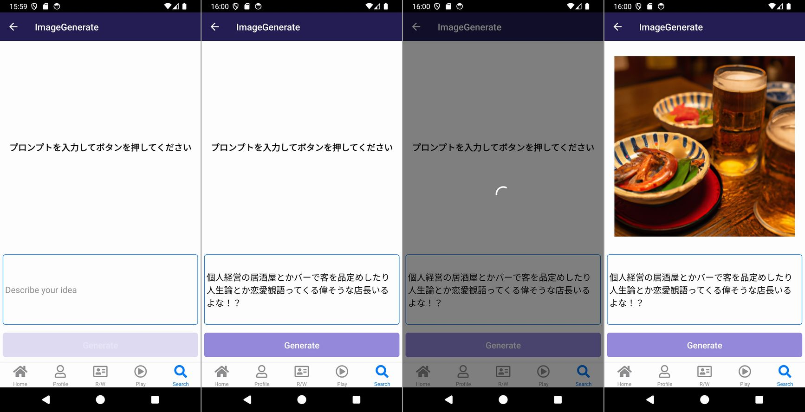

import { Link } from 'gatsby';

## Open AI APIで画像生成を行う

<Link to="/blog/2023-06-02">以前</Link>Open AI APIを使ってText to Imageを行う方法を書きました。

<br/>
<br/>

最近始めたYouTubeシリーズ[自作パソコン組み立てるところから始まるスマホアプリ開発解説](https://youtu.be/KTnybq94rg0)のネタにするために、記事を参考にコードを書いたところ[OpenAIのライブラリ](https://www.npmjs.com/package/openai)のバージョンアップに伴い使い方が変わっており、記事通りのコードでは動かなくなっていました。

どうやらライブラリのバージョンが3系から4系に上がったタイミングで使い方が変わったようです。そこで今回の記事ではバージョン4系で画像生成を行う方法を紹介します。

ソースコードは[こちら](https://github.com/kiyohken2000/youtuber-project)の**src/scenes/imageGenerate/ImageGenerate.js**です。

## 完成画面



1. 画面下半分のテキスト入力エリアにプロンプトを入力
2. 画面下の**Generate**ボタンを押して生成を開始
3. 画像生成中はローディングを表示する
4. 生成した画像を表示する

という以前と同じ動きになります。

## コードの変更点

変更箇所は**openaiオブジェクトの生成部分**と**APIへのリクエスト部分**です。

他は変わらず、相変わらず[react-native-url-polyfill](https://www.npmjs.com/package/react-native-url-polyfill)も必要です。

**API Keyの作成**や**ライブラリのインストール**は以前の記事と同じです。

### インポート部分

3系ではopenaiから`Configuration`と`OpenAIApi`をそれぞれインポートしていましたが、4系では`OpenAI`のみインポートします。

```javascript
// バージョン3系
import { Configuration, OpenAIApi } from "openai";
import "react-native-url-polyfill/auto";

// バージョン4系
import OpenAI from 'openai';
import "react-native-url-polyfill/auto";
```

### openaiオブジェクトの作成部分

認証オブジェクトの作成は不要となりました。

```javascript
// バージョン3系
const configuration = new Configuration({apiKey});
const openai = new OpenAIApi(configuration);

// バージョン4系
const openai = new OpenAI({apiKey: openaiKey});
```

### リクエスト部分

画像生成関数へのアクセス方法が`openai.createImage()`から`openai.images.generate()`に変わりました。

また、レスポンスも微妙に変わり画像URLの位置が変わりました。1枚だけ生成し、その画像のURLにアクセスする場合は`res.data.data[0].url`から`res.data[0].url`に変わっています。

```javascript
// バージョン3系
const res = await openai.createImage({
  prompt: text,
  n: 1,
  size: "512x512",
});
setResult(res.data.data[0].url);

// バージョン4系
const res = await openai.images.generate({
  prompt: text,
  model: 'dall-e-2',
  size: '512x512',
  n: 1
})
setResult(res.data[0].url)
```

### パラメーター

ライブラリの中身を確認したところ4系のパラメーターは以下の通りでした。3系のパラメーターは覚えてませんがほぼ変わってないと思います。

```javascript
export interface ImageGenerateParams {
  /**
   * A text description of the desired image(s). The maximum length is 1000
   * characters for `dall-e-2` and 4000 characters for `dall-e-3`.
   */
  prompt: string;

  /**
   * The model to use for image generation.
   */
  model?: (string & {}) | 'dall-e-2' | 'dall-e-3' | null;

  /**
   * The number of images to generate. Must be between 1 and 10. For `dall-e-3`, only
   * `n=1` is supported.
   */
  n?: number | null;

  /**
   * The quality of the image that will be generated. `hd` creates images with finer
   * details and greater consistency across the image. This param is only supported
   * for `dall-e-3`.
   */
  quality?: 'standard' | 'hd';

  /**
   * The format in which the generated images are returned. Must be one of `url` or
   * `b64_json`.
   */
  response_format?: 'url' | 'b64_json' | null;

  /**
   * The size of the generated images. Must be one of `256x256`, `512x512`, or
   * `1024x1024` for `dall-e-2`. Must be one of `1024x1024`, `1792x1024`, or
   * `1024x1792` for `dall-e-3` models.
   */
  size?: '256x256' | '512x512' | '1024x1024' | '1792x1024' | '1024x1792' | null;

  /**
   * The style of the generated images. Must be one of `vivid` or `natural`. Vivid
   * causes the model to lean towards generating hyper-real and dramatic images.
   * Natural causes the model to produce more natural, less hyper-real looking
   * images. This param is only supported for `dall-e-3`.
   */
  style?: 'vivid' | 'natural' | null;

  /**
   * A unique identifier representing your end-user, which can help OpenAI to monitor
   * and detect abuse.
   * [Learn more](https://platform.openai.com/docs/guides/safety-best-practices/end-user-ids).
   */
  user?: string;
}
```

## 画面全体のコード

変更点は上述の点だけですが、画面全体のコードも残しておきます。

```javascript
import React, { useState } from 'react'
import { StyleSheet, Text, View, TextInput, Dimensions, TouchableWithoutFeedback, Keyboard } from 'react-native'
import { fontSize, colors } from "../../theme";
import Button from '../../components/Button';
import ScreenTemplate from "../../components/ScreenTemplate";
import Spinner from 'react-native-loading-spinner-overlay'
import AutoHeightImage from 'react-native-auto-height-image';
import "react-native-url-polyfill/auto";
import OpenAI from 'openai';
import { openaiKey } from '../../openaiKeys';

const { width } = Dimensions.get('window')

export default function ImageGenerate() {
  const [text, setText] = useState('')
  const [loading, setLoading] = useState(false);
  const [result, setResult] = useState('');
  const openai = new OpenAI({
    apiKey: openaiKey
  });

  const generateImage = async () => {
    try {
      setLoading(true)
      const res = await openai.images.generate({
        prompt: text,
        model: 'dall-e-2',
        size: '512x512',
        n: 1
      })
      setResult(res.data[0].url)
    } catch(e) {
      console.log('generate image error', e)
    } finally {
      setLoading(false)
    }
  };
  
  return (
    <ScreenTemplate>
      <TouchableWithoutFeedback onPress={()=> Keyboard.dismiss()}>
        <View style={styles.container}>
          <View style={{flex: 3}}>
            <View style={{flex: 1, alignItems: 'center', justifyContent: 'center'}}>
            {result?
              <AutoHeightImage
                width={width * 0.9}
                source={{ uri: result }}
                defaultSource={require('../../../assets/images/logo-lg.png')}
              />
              :
              <Text style={styles.text}>プロンプトを入力してボタンを押してください</Text>
            }
            </View>
          </View>
          <View style={{flex: 1, padding: 5}}>
            <TextInput
              style={styles.textInput}
              onChangeText={(text) => setText(text)}
              placeholder="Describe your idea"
              placeholderTextColor={colors.graySecondary}
              multiline={true}
            />
          </View>
          <View style={styles.buttonContainer}>
            <Button
              label="Generate"
              color={colors.lightPurple}
              labelColor={colors.white}
              disable={!text || text.length < 10}
              onPress={generateImage}
            />
          </View>
          <Spinner
            visible={loading}
            textStyle={{ color: colors.white }}
            overlayColor="rgba(0,0,0,0.5)"
          />
        </View>
      </TouchableWithoutFeedback>
    </ScreenTemplate>
  )
}

const styles = StyleSheet.create({
  container: {
    flex: 1
  },
  textInput: {
    backgroundColor: 'transparent',
    color: colors.black,
    padding: 5,
    fontSize: fontSize.large,
    borderWidth: 1,
    borderColor: colors.bluePrimary,
    flex: 1,
    borderRadius: 5
  },
  buttonContainer: {
    flex: 0.5,
    paddingHorizontal: 5,
    justifyContent: 'center'
  },
  text: {
    color: colors.black,
    fontSize: fontSize.large,
    fontWeight: "bold",
  },
})
```

## まとめ

[YouTube](https://youtu.be/KTnybq94rg0?si=8-cQerxaiMvk4KSs)見てくれよな！

---