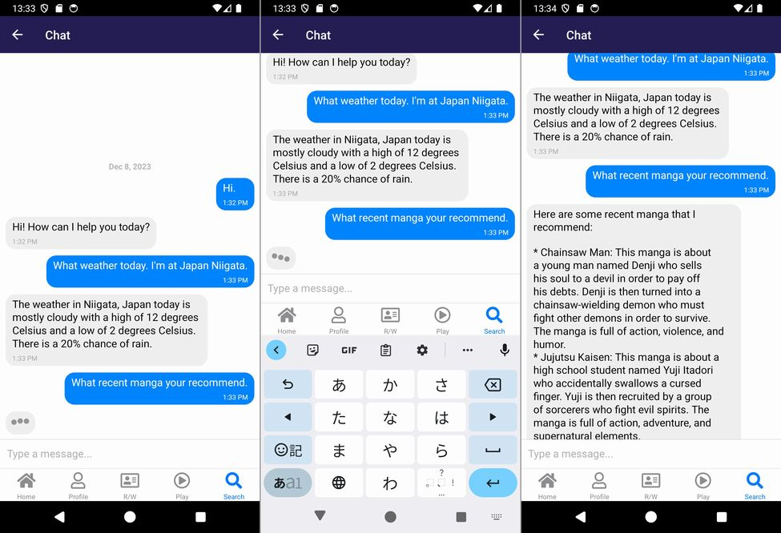
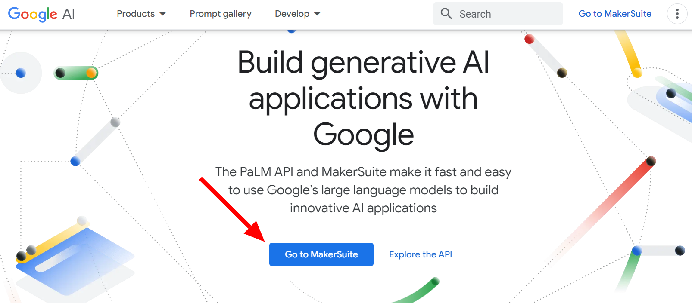
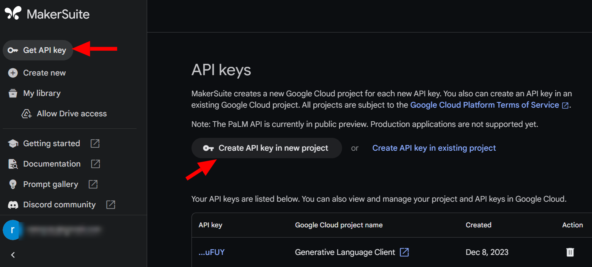
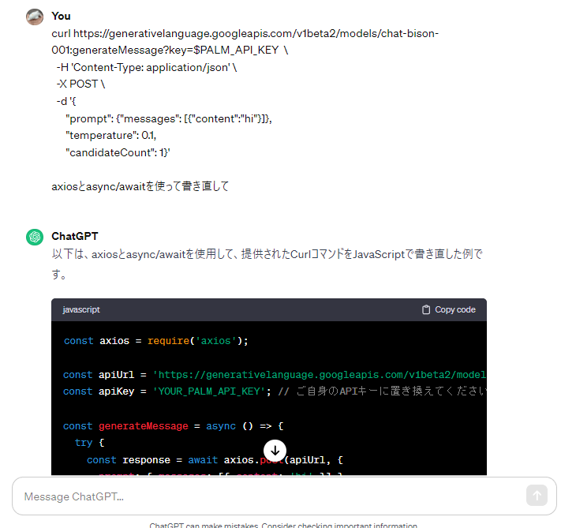

import { Link } from 'gatsby';

## PaLM APIを使ってボットとチャットする方法

相変わらず生成AI関連が激熱ですね。去年はWeb3!web3!言ってましたが、今年は生成AIに始まり生成AIに終わる一年になりました。生成AIといえばOpenAIが開発するChatGPTなわけですが、実はGoogleもChatGPTっぽい対話型AI **PaLM**を開発しています。

というわけで、今回の記事ではReact NativeからPaLM APIにアクセスしてPaLM APIとチャットするアプリの作り方を紹介します。

なお、この記事の内容は私のYouTubeシリーズ「自作パソコン組み立てるところから始まるスマホアプリ開発解説」でも紹介しています。

- [PC自作から始めるスマホアプリ開発 #35 React Native基礎編 GoogleのAIと対話する方法](https://youtu.be/5BEp7VpT4l8)
- [PC自作から始めるスマホアプリ開発 #36 React Native基礎編 GoogleのAIとチャットする](https://youtu.be/qPWJQVv_Z7g)

<br/>

ソースコードです。[youtuber-project](https://github.com/kiyohken2000/youtuber-project)

## 完成図

こちらが完成画面です。画面の構成はほぼ[react-native-gifted-chat](https://github.com/FaridSafi/react-native-gifted-chat)そのままです。

ユーザーがプロンプトを入力して送信するたびにPaLM APIで応答を生成してチャットに表示する、という動きになります。

**PaLM APIは日本語未対応のため英語でのチャットしかできません**。



## APIキーの作成

コードを書く前に[Google AIのウェブページ](https://developers.generativeai.google/)でAPIキーを作成してください。アプリからPaLM APIにアクセスする際に必要です。

**Go to MakerSuite**ボタンからMakerSuiteのページへ移動します。



左の**Get API key**を開き**Create API key in new project**を押してAPIキーを発行します。



APIキーは後ほど、アプリからPaLM APIにアクセスする際に使用します。

## 使用するライブラリ

- [axios](https://github.com/axios/axios) PaLM APIにはHTTPを使ってPOSTリクエストを送信します。そのためにaxiosを使用します。
- [react-native-gifted-chat](https://github.com/FaridSafi/react-native-gifted-chat) チャット画面作成のために使用します。

<br/>

## PaLM APIへのアクセス方法

[Googleのドキュメント](https://developers.generativeai.google/api/rest/generativelanguage/models/generateMessage)にRESTでアクセスする方法が記載されています。curlでアクセスする場合の例が以下のように記載されています。

```
curl https://generativelanguage.googleapis.com/v1beta2/models/chat-bison-001:generateMessage?key=$PALM_API_KEY  \
  -H 'Content-Type: application/json' \
  -X POST \
  -d '{
      "prompt": {"messages": [{"content":"hi"}]},
      "temperature": 0.1, 
      "candidateCount": 1}'
```

これをaxiosでアクセスする場合のコードに書き換えます。私はChatGPTにやってもらいました。以下はChatGPTが生成した関数です。



```javascript
const axios = require('axios');

const apiUrl = 'https://generativelanguage.googleapis.com/v1beta2/models/chat-bison-001:generateMessage';
const apiKey = 'YOUR_PALM_API_KEY'; // ご自身のAPIキーに置き換えてください

const generateMessage = async () => {
  try {
    const response = await axios.post(apiUrl, {
      prompt: { messages: [{ content: 'hi' }] },
      temperature: 0.1,
      candidateCount: 1,
    }, {
      headers: {
        'Content-Type': 'application/json',
      },
      params: {
        key: apiKey,
      },
    });

    console.log(response.data); // レスポンスのデータを出力するか、適切な処理を行ってください
  } catch (error) {
    console.error('Error:', error.message);
  }
};

// 関数を呼び出す
generateMessage();
```

レスポンスは以下のようになります。

**candidates**の中に配列形式でAIが生成した文章が格納されています。

```javascript
{
  "candidates": [
    {
      "author": "1",
      "content": "Hi there! How can I help you today?"
    }
  ],
  "messages": [
    {
      "author": "0",
      "content": "Hi"
    }
  ]
}
```

なお、プロンプトを日本語で入力した場合は以下のようになり文章が返ってきません。

```javascript
{
  "filters": [
    {
      "reason": "OTHER"
    }
  ],
  "messages": [
    {
      "author": "0",
      "content": "こんにちは"
    }
  ]
}
```

## 応答生成関数を作成

PaLM APIにPOSTリクエストを送信してAIからの応答を返す関数の例です。

```javascript
import axios from "axios";
import { palmKey } from "../openaiKeys";

const apiUrl = 'https://generativelanguage.googleapis.com/v1beta2/models/chat-bison-001:generateMessage';
const errorMessage = 'すみません。よくわかりませんでした'

const generateMessage = async({inputText}) => {
  try {
    const {data} = await axios.post(apiUrl, {
      prompt: { messages: [{ content: inputText }] },
      temperature: 0.1,
      candidateCount: 1,
    }, {
      headers: {
        'Content-Type': 'application/json',
      },
      params: {
        key: palmKey,
      },
    });
    if(data && data.candidates && data.candidates[0].content) {
      return data.candidates[0].content
    } else {
      return errorMessage
    }
  } catch (error) {
    console.log('generate message error:', error);
    return errorMessage
  }
}

export { generateMessage }
```

### インポート部分

まずはaxiosと先ほど作成したAPIキーをインポートします。

```javascript
import axios from "axios";
import { palmKey } from "../openaiKeys";
```

### PaLM APIのエンドポイントとエラーメッセージを定義

次にエンドポイントのURLとエラーなどで応答を生成できなかった場合に返すメッセージを定義します。

```javascript
const apiUrl = 'https://generativelanguage.googleapis.com/v1beta2/models/chat-bison-001:generateMessage';
const errorMessage = 'すみません。よくわかりませんでした';
```

### テキスト生成関数を作成

`generateMessage`としてPaLM APIにテキストを送信してAIによって生成されたテキストを返す関数を定義します。

引数`inputText`としてユーザーによって入力されたテキストを受け取ります。

ウェブAPIにアクセスするので非同期関数として定義します。

```javascript
const generateMessage = async ({ inputText }) => {
  // 関数の本体
}
```

### APIリクエストとエラーハンドリング

`axios.post`を使用してPaLM APIにリクエストを送信して結果を取得します。リクエストが失敗した場合は先ほど定義したエラーメッセージを関数の戻り値としています。

```javascript
try {
  const {data} = await axios.post(apiUrl, {
    prompt: { messages: [{ content: inputText }] },
    temperature: 0.1,
    candidateCount: 1,
  }, {
    headers: {
      'Content-Type': 'application/json',
    },
    params: {
      key: palmKey,
    },
  });
  /*
    正常な場合の処理
  */
} catch (error) {
  console.log('generate message error:', error);
  return errorMessage
}
```

### 正常なレスポンスの処理

APIからの正常なレスポンスがある場合、その結果を返します。それ以外の場合は先ほど定義したエラーメッセージを関数の戻り値とします。英語以外が入力されてAIが応答を生成できなかった場合はエラーメッセージを返します。

```javascript
if (data && data.candidates && data.candidates[0].content) {
  return data.candidates[0].content;
} else {
  return errorMessage;
}
```

## チャット画面の作成

まずはチャット画面全体のコードを書きます。**react-native-gifted-chat**のサンプルコードほぼそのままです。

```javascript
import React, { useState, useCallback, useEffect } from 'react'
import { View, Text, StyleSheet, TouchableWithoutFeedback, Keyboard } from "react-native";
import ScreenTemplate from "../../components/ScreenTemplate";
import { GiftedChat } from 'react-native-gifted-chat'
import { generateMessage } from '../../utils/textGenerate';
import moment from 'moment';

export default function Chat() {
  const [messages, setMessages] = useState([])
  const [isLoading, setIsLoading] = useState(false)

  useEffect(() => {
    const onRecieveNewMessage = async() => {
      if(messages[0]) {
        const { text, user } = messages[0]
        if(user._id === 1) {
          setIsLoading(true)
          const reply = await generateMessage({inputText: text})
          const botMessage = {
            _id: `${moment().unix()}`,
            createdAt: new Date(),
            text: reply,
            user: {
              _id: 2
            }
          }
          setMessages(previousMessages =>
            GiftedChat.append(previousMessages, botMessage),
          )
          setIsLoading(false)
        }
      }
    }
    onRecieveNewMessage()
  }, [messages])

  const onSend = useCallback((messages) => {
    setMessages(previousMessages =>
      GiftedChat.append(previousMessages, messages),
    )
  }, [])

  return (
    <ScreenTemplate>
      <TouchableWithoutFeedback onPress={() => Keyboard.dismiss()}>
        <View style={styles.container}>
          <GiftedChat
            messages={messages}
            onSend={messages => onSend(messages)}
            user={{
              _id: 1,
            }}
            renderAvatar={null}
            isTyping={isLoading}
          />
        </View>
      </TouchableWithoutFeedback>
    </ScreenTemplate>
  )
}

const styles = StyleSheet.create({
  container: {
    flex: 1
  }
})
```

サンプルコードと違う部分は`useEffect`フック内になります。

1. `useEffect`の依存配列にチャットログ用stateの`messages`を追加してチャットログに変更があるたびに`onRecieveNewMessage`関数を動かしています。
2. `messages`には新しい順でチャットが格納されています。
3. 先頭の要素`messages[0]`が存在しているかチェックします。これは最初に画面を開いたときはチャットログが存在しないので応答を生成する必要がないためです。
4. 先頭のメッセージからメッセージ本文`text`とユーザー情報`user`を取り出します。
5. ボットが自分のメッセージに反応しないようにユーザーIDを比較します。ユーザーが入力したメッセージ(_idが1)の場合に応答を生成する処理に進みます。
6. テキスト生成関数にメッセージ本文を与えてAIからの応答を受け取ります。タイピングインジケーター表示用にテキスト応答生成関数の前後でローディングフラグを切り替えます。
7. 取得した応答を使って、GiftedChatが扱える形式の`botMessage`オブジェクトを作成します。
8. `setMessages`を使って既存のチャットログにボットメッセージを追加します。

```javascript
useEffect(() => {
  const onRecieveNewMessage = async() => {
    if(messages[0]) { // 3. 先頭の要素があるかチェック
      const { text, user } = messages[0] // 4. 先頭のメッセージから本文とユーザー情報を取り出す
      if(user._id === 1) { // 5. ボットが自分のメッセージに反応しないようにユーザーIDを比較する
        setIsLoading(true)
        const reply = await generateMessage({inputText: text}) // 6. テキスト生成関数を使ってAIの応答を生成
        const botMessage = { // 7. 生成したメッセージをGiftedChatが扱える形式に整形
          _id: `${moment().unix()}`,
          createdAt: new Date(),
          text: reply,
          user: {
            _id: 2
          }
        }
        setMessages(previousMessages => // 8. チャットログにボットメッセージを追加
          GiftedChat.append(previousMessages, botMessage),
        )
        setIsLoading(false)
      }
    }
  }
  onRecieveNewMessage()
}, [messages]) // 1. messagesに変更があった場合に onRecieveNewMessage 関数を動かす。
```

## まとめ

今回はPaLM APIを使ってチャット画面を作成する方法を紹介しました。現在は日本語に対応していないので使いどころが難しいですね。早く日本語に対応してもらえないものでしょうか。

[YouTube](https://youtu.be/qPWJQVv_Z7g)見てくれよな！

---