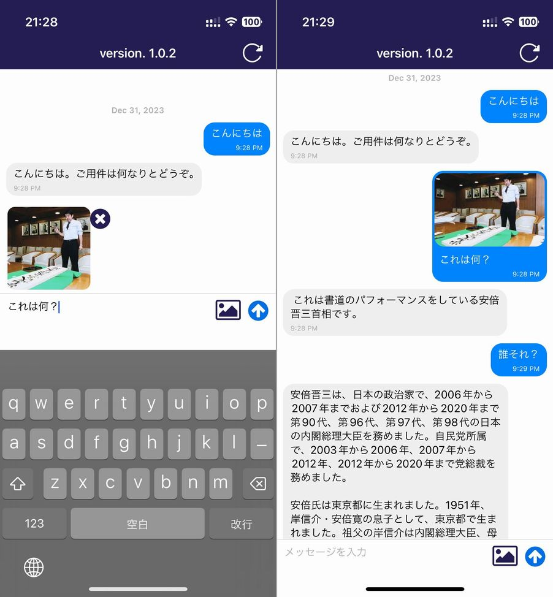

import { Link } from 'gatsby';

## ガチ有能AI助手

Googleの新AIモデル[Gemini](https://japan.googleblog.com/2023/12/gemini.html)を使ったAIチャットアプリ「ガチ有能AI助手」をリリースしました。

- [App Store](https://apps.apple.com/jp/app/id6474574029)
- [Google Play](https://play.google.com/store/apps/details?id=net.votepurchase.mygpt)

<br/>

## アプリの説明

ChatGPTアプリをイメージしてもらえればわかりやすいと思います。ChatGPTでは中のAIはGPT-3.5/GPT-4ですが、ガチ有能AI助手はGeminiを使用しています。

ChatGPTとの違いは画像認識も無料で使えるところです。ChatGPTは画像認識を利用するには課金が必要ですが、Geminiでは今のところ無料で画像認識も利用可能です。



[デモ動画](https://youtu.be/LoRu39rUhYY)

## 開発の経緯

10月から投稿しているYouTubeシリーズ[PC自作から始めるスマホアプリ開発](https://www.youtube.com/watch?v=0A1TV9viebY&list=PLCulJu7bwJxeoiTXDqgKyaijxsyoc_bva)では、React Native(Expo)を使用したアプリ開発の方法を解説しています。

このYouTubeシリーズでは自作パソコンを組み立てて、Windowsをインストールして、開発環境を構築して、アプリのコードを書いて、アプリをビルドして、AppStore/GooglePlayに提出してリリースするというアプリ開発の一連の過程を投稿しました。

このYouTubeシリーズの当初の目標は**開発したアプリを実際にリリースする**というものでした。

自作パソコンの組み立てと開発環境の構築が完了したあとしばらくは「React Native基礎編」と題して様々なライブラリの使い方や各種ウェブAPIの使い方を解説していました。

その中でGoogle PalM APIを使ったAIとのチャット画面の作り方を解説したのですが、その動画投稿の直後に[Googleの新AIモデルGeminiのプレビューが始まりました](https://www.watch.impress.co.jp/docs/news/1554512.html)。

そこで、ChatGPTアプリのGemini版を制作し、その過程をYouTubeシリーズのお題にすれば目標を達成できると考え開発することにしました。

1画面(チャット画面)しかないかなりシンプルなアプリなのでストアの審査に通るか半信半疑だったのですが、無事AppStore/GooglePlay共にリリースでき、審査に提出する過程もYouTubeに投稿できましたので当初の目標は無事に達成できました。

## Gemini Pro API

[Gemini API のスタートガイド](https://ai.google.dev/docs?hl=ja)ではPython、Go、Swiftなど様々な言語での使用方法が掲載されていますが、この中にはREST APIでの使用方法もあります。

ガチ有能AI助手ではREST APIでのアクセス方法を参考にして、axiosを使ってHTTPリクエストでGemini Pro APIを利用しています。

なお、Gemini Pro APIはプレビュー期間が終了するまでは1分間に60回のレートリミットの他に制限はなく無料で利用可能です。プレビュー期間終了後はインプット/アウトプットそれぞれ1000文字単位で課金が発生します。

## 技術的なこと

ソースコードは[こちら](https://github.com/kiyohken2000/my-gpt)です。

コードの詳細はYouTubeシリーズに投稿しています。[PC自作から始めるスマホアプリ開発](https://www.youtube.com/watch?v=0A1TV9viebY&list=PLCulJu7bwJxeoiTXDqgKyaijxsyoc_bva)の第35回～第43回がそれにあたります。

### Geminiにアクセスする方法(Text To Text Generation)

Gemini Pro APIは**Text-only input**と**Multi-turn conversations (chat)**の2種類のテキスト生成APIがありますが、**Text-only input**ではそれまでの文脈は考慮されないため、ガチ有能AI助手では**Multi-turn conversations (chat)**を使用してAIの応答を生成しています。

```javascript
const generateMessage = async () => {
  try {
    const { data } = await axios.post(
      'https://generativelanguage.googleapis.com/v1beta/models/gemini-pro:generateContent?key=' + API_KEY,
      {
        contents: [
          {
            role: 'user',
            parts: [
              {
                text: 'Write the first line of a story about a magic backpack.',
              },
            ],
          },
          {
            role: 'model',
            parts: [
              {
                text: 'In the bustling city of Meadow brook, lived a young girl named Sophie. She was a bright and curious soul with an imaginative mind.',
              },
            ],
          },
          {
            role: 'user',
            parts: [
              {
                text: 'Can you set it in a quiet village in 1600s France?',
              },
            ],
          },
        ],
      },
      {
        headers: {
          'Content-Type': 'application/json',
        },
      }
    );
    console.log(data)
  } catch (error) {
    console.error('Error:', error.message);
  }
};
```

こんな感じで`contents`にチャットログを丸ごと入力してあげることで、それまでの文脈を考慮した応答が生成されます。

### Geminiにアクセスする方法(Image To Text Generation)

**Text-and-image input API**ではテキストと一緒にBase64エンコードした画像も入力することで画像も考慮した応答を生成できます。

```javascript
const generateMessage = async() => {
  const API_KEY = 'YOUR_API_KEY'
  const apiUrl = 'https://generativelanguage.googleapis.com/v1beta/models/gemini-pro-vision:generateContent';
  try {
    const requestData = {
      contents: [
        {
          parts: [
            { text: 'What is this picture?' },
            {
              inline_data: {
                mime_type: 'image/jpeg',
                data: imageData, // Base64エンコードした画像
              },
            },
          ],
        },
      ],
    };
    const { data } = await axios.post(`${apiUrl}?key=${API_KEY}`, requestData, {
      headers: {
        'Content-Type': 'application/json',
      },
    });
    console.log(data)
  } catch (error) {
    console.error('Error:', error.message);
  }
}
```

こんな感じでアクセスします。なお、それぞれエンドポイントが違いますので、画像ありのときとテキストのみのときでリクエストするAPIを切り替える必要があります。

- **Multi-turn conversations (chat)**: `https://generativelanguage.googleapis.com/v1beta/models/gemini-pro:generateContent`
- **Text-and-image input**: `https://generativelanguage.googleapis.com/v1beta/models/gemini-pro-vision:generateContent`

<br/>

### 使用したライブラリ

アプリ自体はReact Native(Expo)で制作したのでライブラリもReact Nativeのものになります。

チャット機能に関連したものでは以下のライブラリを使用しました。

- axios: HTTPリクエストの送信に使用
- expo-clipboard: チャットをクリップボードにコピーするために使用
- expo-file-system: APIに画像を入力する際にBase64エンコードするために使用
- expo-image-manipulator: APIに画像を入力する際に画像のリサイズと拡張子を変更するために使用
- expo-image-picker: APIに画像を入力する画像を写真アプリから選択するために使用
- react-native-gifted-chat: チャットUIの作成のために使用

<br/>

## まとめ

YouTubeのネタにするために開発したアプリなのですがGeminiの性能が高いので意外と実用できる品質になったと思います。特に画像認識も無料で使えるのでChatGPT無課金勢には有用です。

ところで、このYouTubeシリーズはアプリ開発の一連の過程をパソコン組み立てるところからアプリストアに提出するところまで一気通貫で学べる良コンテンツだと自負しているのですが全然再生されてません。良かったらチャンネル登録してね。

## おまけ

このブログですが、ドメインが`retwpay.ml`から`capsaicin.site`に変わりました。freenomで取得していたドメインが急に使えなくなってしまったのでXserverで有料ドメインを新たに取得しました。

---