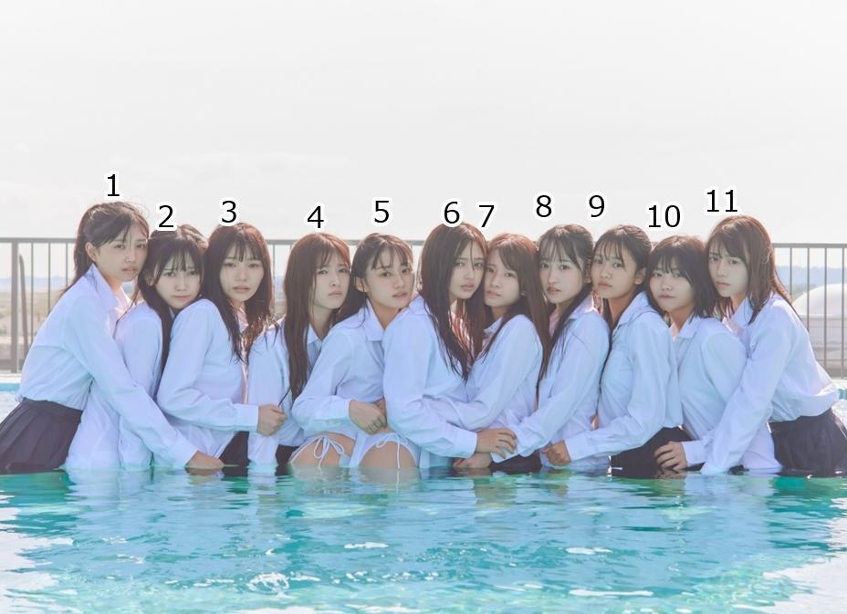
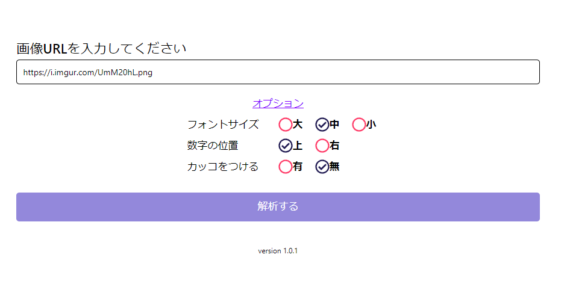
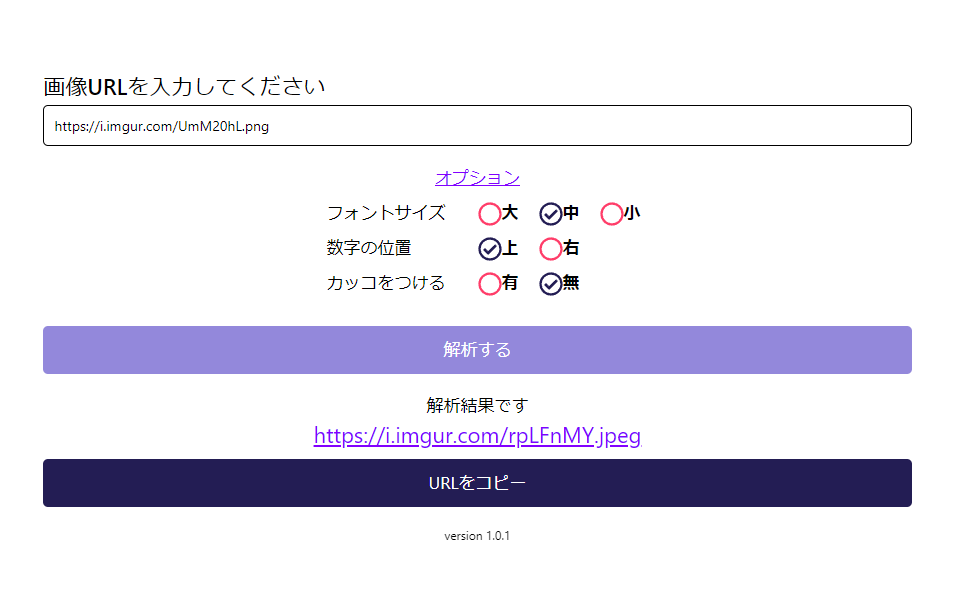

import { Link } from 'gatsby';

## 品評会画像メーカー

新しいウェブアプリをリリースしました。

- [品評会画像メーカー](https://hinpyoukai.com)
- [デモ動画](https://youtu.be/LVaNkMEKZw8)

 

## アプリの説明

集合写真のURLを入力すると、各人物の顔に番号を割り振った画像を出力するツールです。

### 入出力例

**入力画像**

**出力画像**

## 使い方

URL入力欄に画像のURLを入力します。オプションで**番号のフォントサイズ**、**番号の位置を顔の上にするか横にするか**、**番号に()をつけるかつけないか**を選択できます。

**解析する**ボタンを押すと人物に番号を割り振った画像のURLが表示されます。

## 使用技術とアプリの仕組み

### フロントエンド

フロントエンドはReactを使用しています。なお、作者はHTMLとCSSを書けないためスタイリングにはReact Native Webを使用しました。

フロントエンドでは、入力された画像URLとオプション(フォントサイズや数字位置など)をaxiosを使ってウェブAPIにPOSTリクエストを送信しています。

APIからは番号を振った後の画像のURLが返されます。出力結果としてAPIから返された画像URLを表示しています。

### ホスティング

アプリのホスティングにはFirebase Hostingを使用しています。

### バックエンド

バックエンドでは以下の処理を行うPythonスクリプトをCloud Runで実行しています。

1. フロントから送信されてきた、画像のURL、数字の位置、フォントサイズ、カッコのオンオフなどのパラメーターを受け取る
1. フロントから受け取った画像URLから画像をダウンロード
1. Face Recognitionパッケージを使用して顔の位置を特定
1. 顔の位置に数字を描画し、画像を保存
1. Imgurのパッケージを使用して処理後の画像をアップロード
1. アップロードされた画像のURLをフロントに返す

## ソースコード

ソースコードはGitHubに公開しています。

- [フロントエンド](https://github.com/kiyohken2000/hinpyoukai-front)
- [バックエンド](https://github.com/kiyohken2000/hinpyoukai-api)

 

## まとめ

精度はまぁまぁ高い。

---