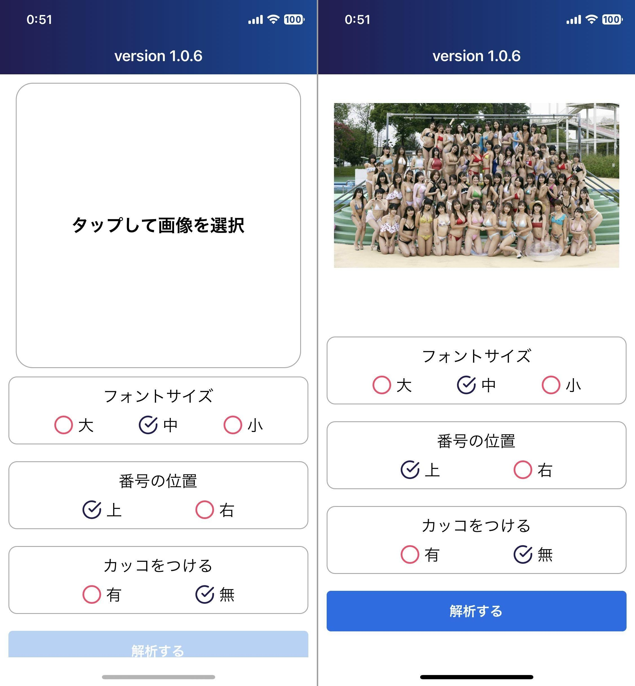
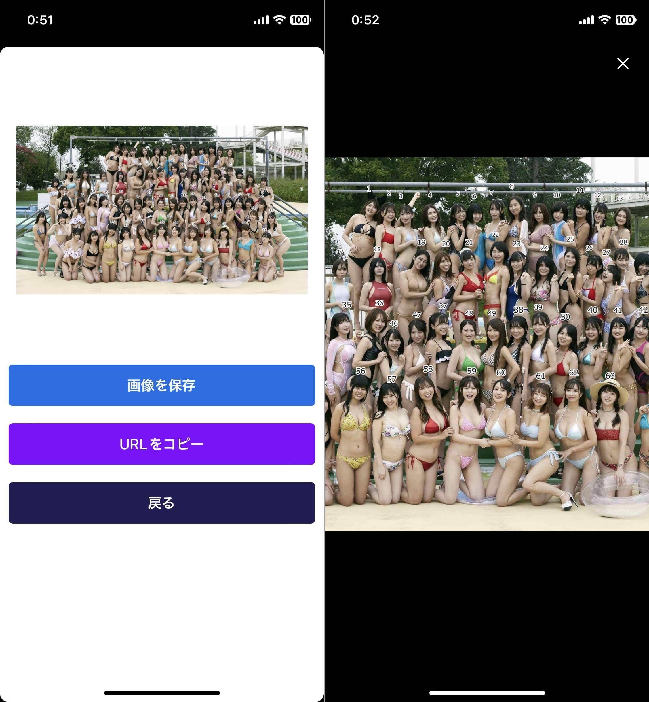

import { Link } from 'gatsby';

## 品評会画像メーカー

品評会画像メーカーのスマホアプリ版をリリースしました。

- [AppStore](https://apps.apple.com/jp/app/id6477918163)
- [GooglePlay](https://play.google.com/store/apps/details?id=net.votepurchase.hinpyoukai)

 

## アプリの説明

前回作成した[品評会画像メーカー](https://hinpyoukai.com)のスマホアプリ版です。集合写真を入力すると、各人物の顔に番号を割り振った画像を出力するツールです。

前回はウェブアプリとして作成しましたが、スマホアプリにしてほしいとの要望があったためスマホアプリ版を制作しました。

制作の過程を[YouTube](https://youtu.be/T-6PJak0NKU)で解説しています。

### 入出力例

**入力画像**

**出力画像**

## 使い方

**タップして画像を選択**を押して画像を選択します。**フォントサイズ**、**番号の位置**、**カッコの有無**をオプションとして選択可能です。画像を選択したら**解析する**をタップします。

解析が完了すると自動的に結果画面に遷移します。解析結果はimgurにアップロードされていますのでURLをコピーしたり、画像を保存することが可能です。また、結果画像をタップすることで画像を拡大プレビューすることもできます。

## 使用技術とアプリの仕組み

### フロントエンド

アプリ自体はReact Native(Expo)を使用しました。

### バックエンド

ウェブアプリ版と同じAPIを使用しています。

バックエンドでは以下の処理を行うPythonスクリプトをCloud Runで実行しています。

1. フロントから送信されてきた、画像のURL、数字の位置、フォントサイズ、カッコのオンオフなどのパラメーターを受け取る
1. フロントから受け取った画像URLから画像をダウンロード
1. Face Recognitionパッケージを使用して顔の位置を特定
1. 顔の位置に数字を描画し、画像を保存
1. Imgurのパッケージを使用して処理後の画像をアップロード
1. アップロードされた画像のURLをフロントに返す

### ウェブアプリ版との差分

画像解析を行うAPIは画像のURLを入力として受け取りますので、画像解析APIに画像データを直接入力することはできません。そこで、スマホアプリ版では選択した画像を一旦imgurにアップロードして、そのURLを画像解析APIに入力しています。

ウェブアプリ版では

1. 画像URLとオプションパラメーターをバックエンドに送信
1. 結果画像のURLを受け取って表示

の2ステップの処理を行っていますが、

スマホアプリ版では

1. 選択した画像をimgurにアップロードしてURLを得る
1. 画像URLとオプションパラメーターをバックエンドに送信
1. 結果画像のURLを受け取って表示

の3ステップになっています。

## ソースコード

ソースコードはGitHubに公開しています。

- [スマホアプリ](https://github.com/kiyohken2000/hinpyoukai-mobile)
- [バックエンド](https://github.com/kiyohken2000/hinpyoukai-api)

 

## まとめ

そもそも品評会自体があまり開催されなくなったので全然使われていない。

---