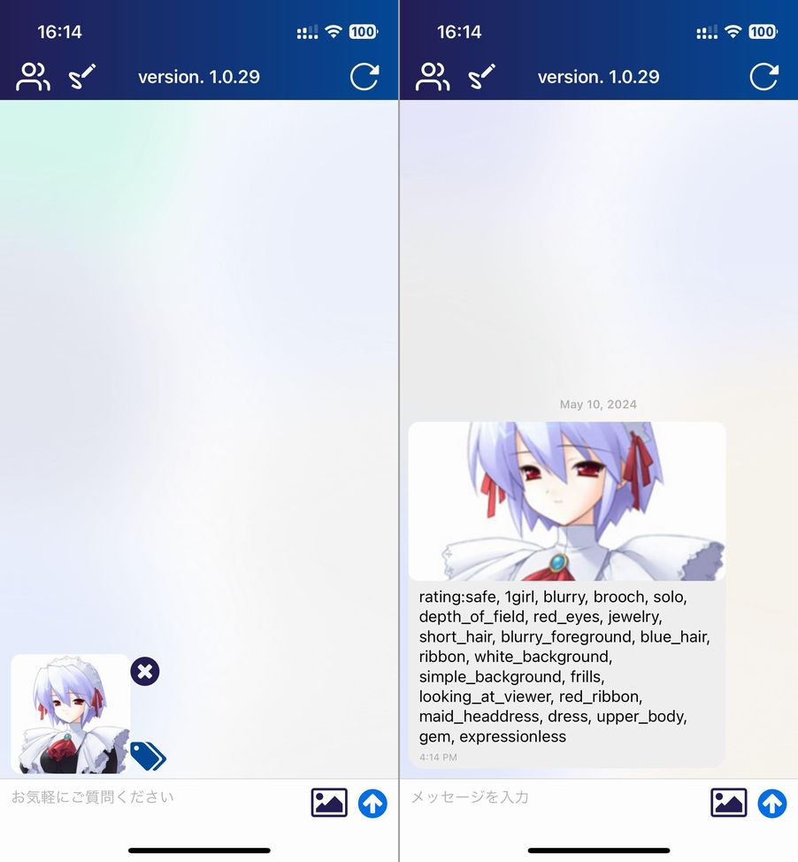
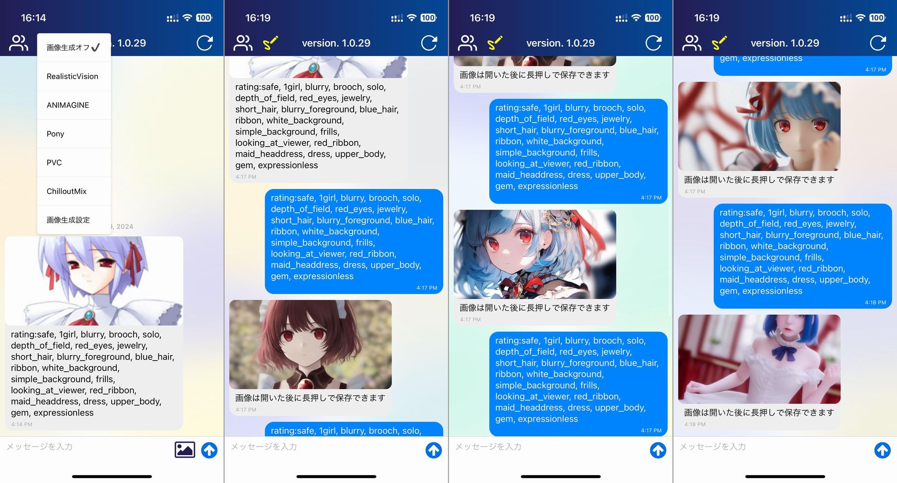
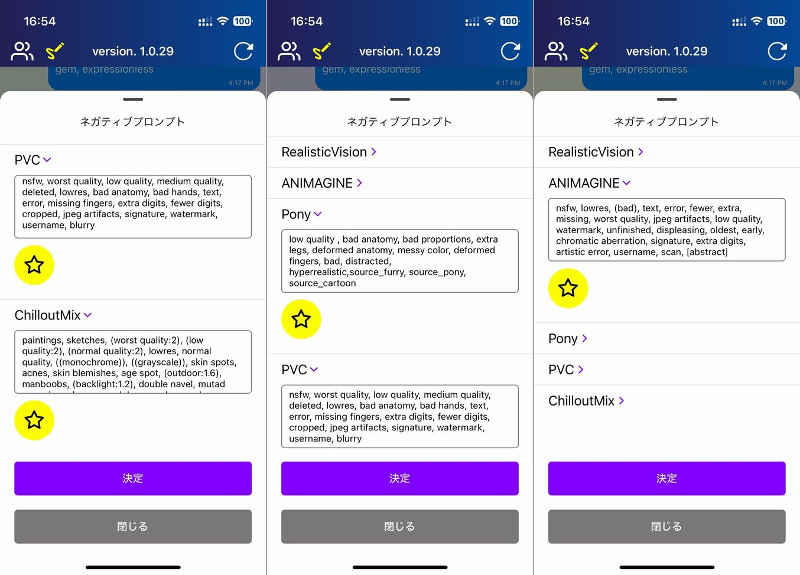
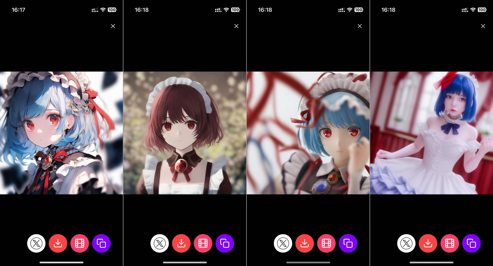
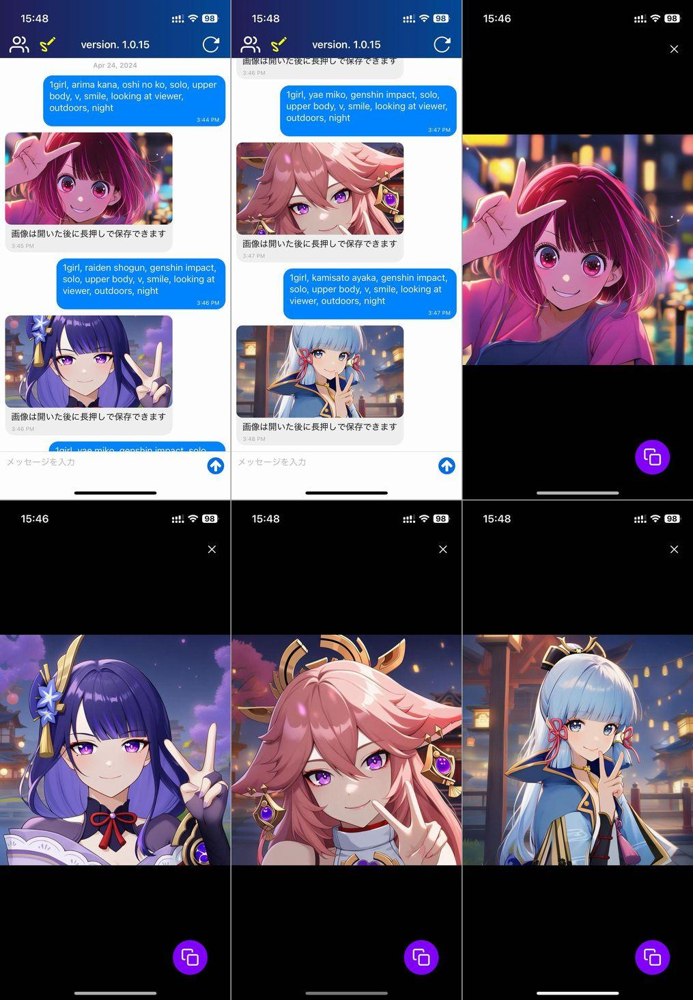
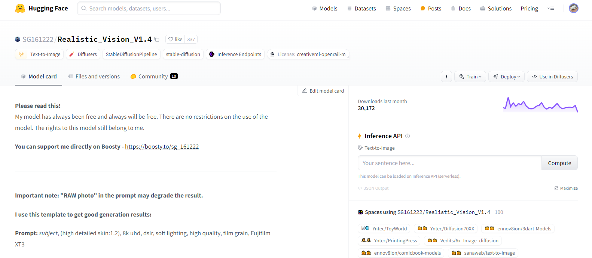
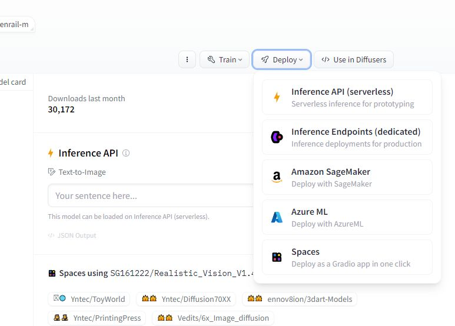
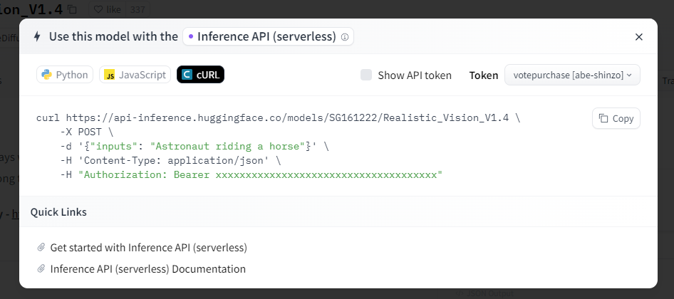

import { Link } from 'gatsby';

## ガチ有能AI助手に画像生成機能を追加しました

<Link to="/blog/2019-12-03">ガチ有能AI助手</Link>に画像生成機能を追加しました。

これまではGoogle Geminiとの単純なチャットアプリでしたが

- 画像生成
- 画像からプロンプト生成
- 生成した画像から動画生成

<br/>

といった機能を追加しました。今回の記事では画像生成に使用している**Huggingface Inference API serverless**をReact Native Expoから利用する方法を紹介します。

**ダウンロードはこちらからどうぞ**

- [AppStore](https://apps.apple.com/jp/app/id6474574029)
- [GooglePlay](https://play.google.com/store/apps/details?id=net.votepurchase.mygpt)

<br/>

## 機能の説明

まずは画像生成機能の使い方を紹介します。動画で見たい方は[YouTube](https://youtu.be/I4YRV8o10hw)に使い方動画をアップロードしていますのでご覧ください。

### プロンプト作成機能

もちろん自分で画像生成用のプロンプトを入力することもできますが、作者としてはプロンプト生成機能の使用を推奨しています。

プロンプト生成手順は

1. 送信ボタンの左の画像アイコンからプロンプト生成に使用する画像を選択
2. 選択した画像の右側のタグアイコンをタップ
3. 生成されたプロンプトが入力画像と共にチャットに表示される

という方法で使用できます。生成したプロンプトはメッセージバブルをタップすることでクリップボードにコピーできます。なおプロンプト生成はCloud RunにデプロイしたDeepDanbooruで行っています。



### 画像を生成する

次は実際に画像を生成します。

1. 左上の鉛筆アイコンをタップし使用するモデルを選択
2. メッセージ入力欄にコピーしたプロンプトを貼り付けて送信
3. 選択したモデルにより画像が生成されチャットに表示される

といった流れで画像が生成されます。



プロンプト中の**rating**を**safe**としていますが、**explicit**に変更することでRealistic Vision以外のモデルではR18画像が生成されます。ご興味がありましたらご自身でお試しください。Realistic Visionではセンシティブな画像は黒塗りになります。あと版権キャラも出ます。

また、鉛筆アイコンの中の**画像生成設定**を選択すると各モデルごとのネガティブプロンプトを設定できます。手入力もできますが、黄色い星アイコンをタップして推奨ネガティブプロンプトを入力することもできます。



### 生成した画像を閲覧する

チャットに表示された画像をタップすると閲覧画面になります。

閲覧画面では右側から

- [imgbb](https://imgbb.com)にアップロードしURLをクリップボードにコピー
- [novita.ai](https://novita.ai)を使用して画像を動画化する
- 画像をデバイスに保存
- Xに投稿（imgbbにアップロードして、URLが入った状態でXの投稿画面に遷移）

<br/>

の機能を使うことができます。



ここまでが画像生成機能の使い方の紹介となります。

あと、プロンプトに入力すると版権キャラも出ます。



## Huggingface Inference API serverless

画像生成にはHuggingface Inference API serverlessを使用しています。

各モデルページを開くと右側にInference APIということでプロンプト入力欄がありますがこれと同じものをウェブAPIとして使用できます。



右側の**Deploy**ボタンの中から**Inference API (serverless)**を選択することでPythonやJavaScript、curlでのアクセス方法が表示されます。





### 実際のコード

ガチ有能AI助手はReact Native(Expo)ですので、JavaScriptのサンプルコードを参考にして実装しました。

**apiUrl**はモデルのURL、**inputs**はプロンプト、**negative_prompt**はネガティブプロンプトとなります。

Huggingfaceのサンプルコードではfetchを使用していますが、ガチ有能AI助手ではaxiosを使用しました。

```javascript
const generateImage = async() => {
  try {
    const { data } = await axios.post(
      apiUrl,
      {
        inputs: text,
        negative_prompt: negativePrompt,
      },
      {
        headers: {
          Authorization: `Bearer ${huggingFaceKey}`,
          'Content-Type': 'application/json'
        },
        responseType: 'blob'
      }
    );
    console.log('受信したdata', data)
    const imageUrl = await convertBlobToImage({data})
    return { imageUrl: imageUrl, message: '画像は開いた後に長押しで保存できます'}
  } catch(e) {
    console.log('generate image error', e)
    return { imageUrl: null, message: errorMessage}
  }
}
```

上のコードを実行して、レスポンスをコンソールに表示すると以下のように表示されます。

```
受信したデータ {"_data": {"__collector": {}, "blobId": "FFB3D3CF-0B91-41B8-95C1-7BCD2B05C90D", "name": "animagine-xl-3.1", "offset": 0, "size": 124246, "type": "image/jpeg"}}
```

画像データそのものや画像のURLではなく**blob**が受信されていることがわかります。画像のURLであればそのまま`Image`コンポーネントに渡して描画できますがblobだとそうもいきません。

そこで、扱いやすいように下のようなuriに変換する仕掛けが必要となります。

```
file:///Users/admin/Library/Developer/CoreSimulator/Devices/3FD454CE-44DF-4B49-B093-F9EA7172056D/data/Containers/Data/Application/CE70546E-33BF-4984-8BEE-6CCEA1BE1235/Library/Caches/ExponentExperienceData/@votepurchase/my-gpt/ImageManipulator/40259C37-AC2C-401F-BE8E-F36DB61FDD1E.jpg
```

つまり

1. 受信したblobからデータをダウンロード
2. 一旦base64文字列を取得
3. [expo-image-manipulator](https://docs.expo.dev/versions/latest/sdk/imagemanipulator/)を使用してjpgに変換
4. 変換したjpgは`file:///...`の形でローカルにキャッシュされる

といった処理を記述します。

その処理を行う関数が上に貼ったコードの`convertBlobToImage`となります。Huggingfaceのレスポンスを渡すと`file:///...`形式のuriが返ってきます。

関数の中身はこんな感じ

```javascript
import { Platform } from 'react-native';
import { manipulateAsync, SaveFormat } from 'expo-image-manipulator';

// メインの関数
const convertBlobToImage = async({data}) => {
  try {
    const base64String = await convertBase64String({data}) // BlobデータをBase64文字列に変換
    const base64Code = removeDataURIPrefix(base64String) // Base64文字列を整形1
    const base64image = `data:image/jpeg;base64,${base64Code}` // Base64文字列を整形2
    const { uri } = await manipulateAsync(  // Base64文字列をjpgに変換してローカルにキャッシュ
      base64image,
      [],
      { compress: 1, format: SaveFormat.JPEG }
    );
    return uri // ローカルuriを返す
  } catch(e) {
    console.log('convert blob to image error', e)
  }
}

// プラットフォームに応じて適切な方法でBase64文字列に変換する
const convertBase64String = async({data}) => {
  if(Platform.OS === 'ios') {
    const url = URL.createObjectURL(new Blob([data]));
    const res = await request(url)
    const base64String = await toDataURI(res)
    return base64String
  } else if(Platform.OS === 'android') {
    const base64String = await convertBlobToBase64({data})
    return base64String
  } else {
    throw new Error('convert base64 string error');
  }
}

// Androidでは、FileReaderを使用してBlobをBase64文字列に変換
const convertBlobToBase64 = async({data}) => {
  return new Promise((resolve, reject) => {
    const fileReaderInstance = new FileReader();
    fileReaderInstance.readAsDataURL(data);
    fileReaderInstance.onload = () => {
      const base64data = fileReaderInstance.result;
      resolve(base64data);
    };
    fileReaderInstance.onerror = (error) => {
      reject(error);
    };
  });
}

// iOSではXMLHttpRequestを使用してBlobデータをPOSTリクエストとして送信し、レスポンスをBlobとして受け取る
const request = (url, data) =>
  new Promise((resolve) => {
    const req = new XMLHttpRequest();
    req.open('POST', url, true);
    req.responseType = 'blob';
    req.onload = () => {
      // At this point, req.response is a Blob.
      resolve(req.response);
    };
    req.send(data);
  });

// iOS用処理その2 BlobをData URIに変換する
const toDataURI = (blob) =>
  new Promise((resolve) => {
    const reader = new FileReader();
    reader.readAsDataURL(blob);
    reader.onloadend = () => {
      const uri = reader.result?.toString();
      resolve(uri);
    };
  });

const removeDataURIPrefix = (dataURI) => {
  return dataURI.replace(/^data:.*?;base64,/, '');
};

export { convertBlobToImage }
```

Androidでは`URL.createObjectURL`を使用できないため`Platform.OS`を使ってOSごとに処理を分けているところがポイントとなります。

ExpoGoで開発することにこだわらなければblobを扱うためのライブラリもあるかと思いますが、ExpoGoを使いたかったので上記の方法を採用しました。

## まとめ

Inference API serverless自体は結構不安定でよくエラーが返ってきます。

しばらくアクセスされていないとインスタンスが閉じてしまうようで、その場合は503や500エラーが返ります。数分経つとインスタンスが起動して正常なレスポンスを返すようです。また重いプロンプトでもエラーになる傾向があります。

また、インスタンスごとにSeed値は固定されているため短時間で同じプロンプトを入力すると同じ画像が生成されます。

無料で使わせてもらっているので致し方ないとは思いますが、できれば改善してほしいですね。

---