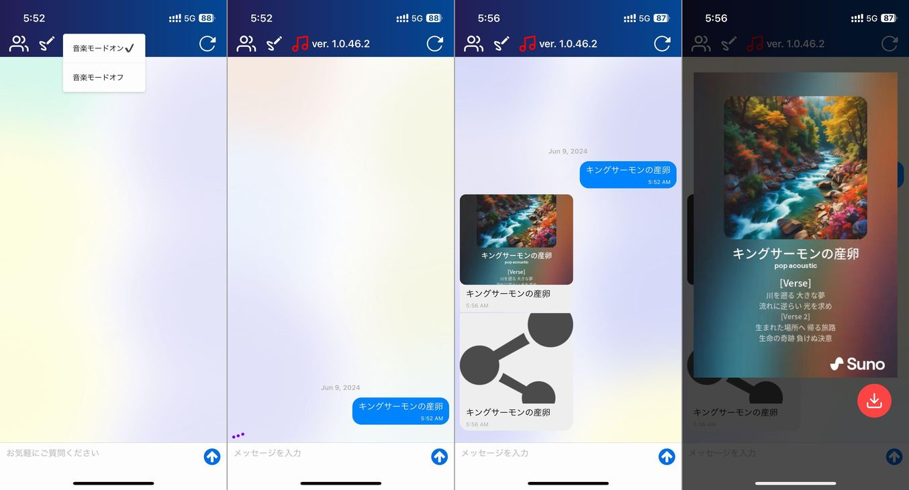

import { Link } from 'gatsby';

## ガチ有能AI助手に音楽生成機能を追加しました

このところ頻繁に更新しているガチ有能AI助手ですが、ついに音楽も生成できるようになりました。

インストゥルメンタルではなくボーカル付きの楽曲です。

生成したすべての曲は公開していますのでお楽しみください。

[ガチ有能AI助手で生成した楽曲プレイリスト](https://suno.com/playlist/d0f34448-fb71-486c-bf63-f5062b5aa3b4)

生成にはSunoを使用しています。Sunoは公式にAPIを提供していませんが、[リバースエンジニアリングしてAPIとして使うプロジェクト](https://github.com/gcui-art/suno-api)を発見してこれを使用しています。

非公式プロジェクトなのでいつ使えなくなるかはわかりません。

## 使い方

使い方は簡単です。

左上の音符アイコンから**音楽生成モードをオン**にしてプロンプトを入力、送信するだけです。

なお生成には3分から5分くらいかかりますのでひたすら待ちます。

## 便利な使い方

チャットAIと組み合わせると便利です。

この画像では、Geminiに画像とプロンプトを入力して楽曲のタイトルと内容を作ってもらい、それを楽曲生成AIに渡して音楽を生成しています。

## まとめ

Sunoには$8/月の課金をしていますのでアプリ全体で一月に250曲作れます。

---