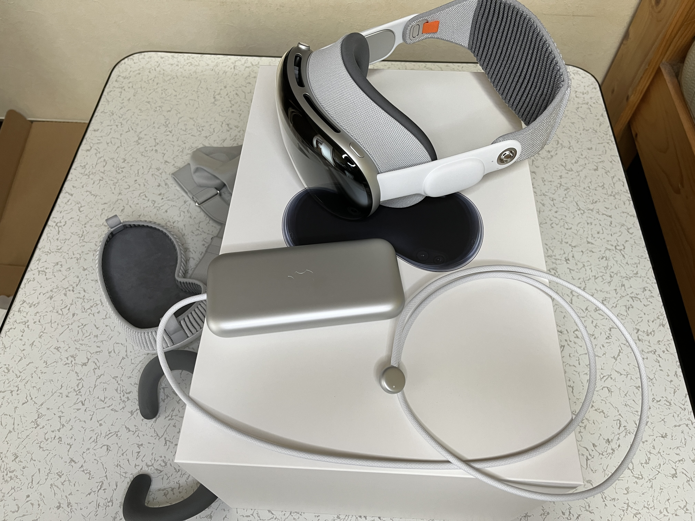
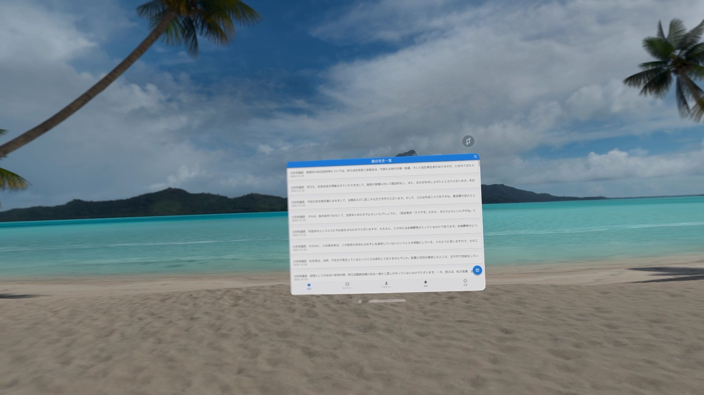
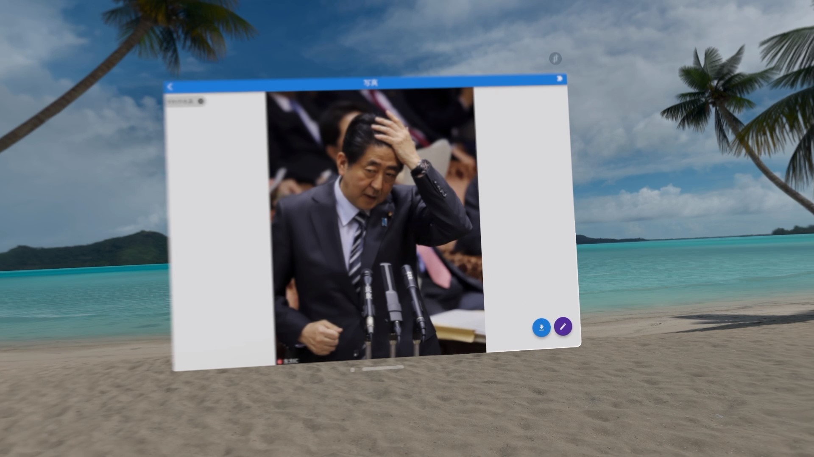
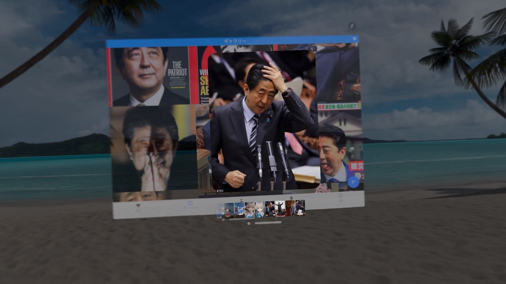
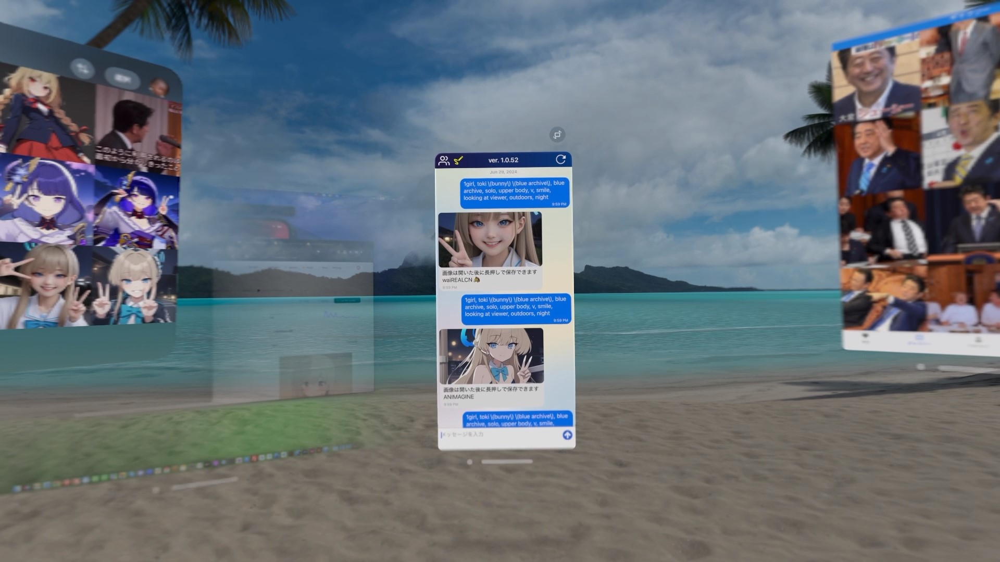
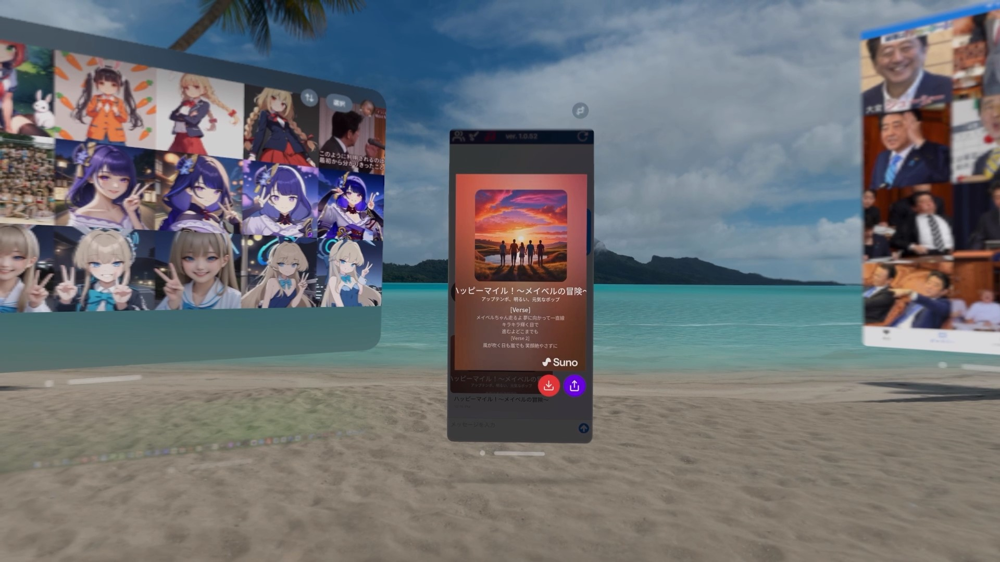
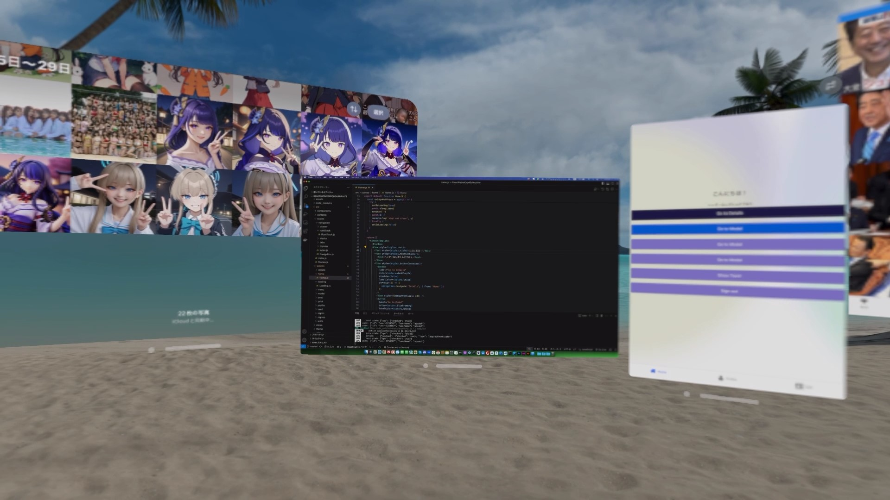
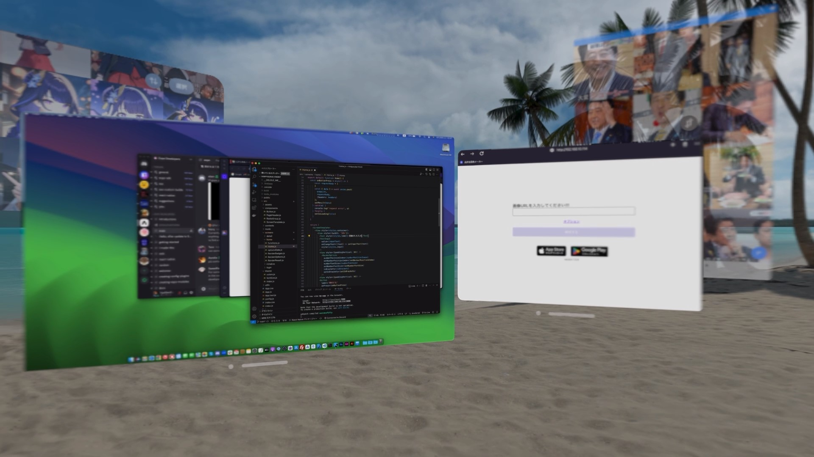

import { Link } from 'gatsby';

レビュー動画は[こちら](https://youtu.be/BrX9uVu_ohc)。この記事と同じこと言ってるし動画で見たほうがいいかも。

## Apple Vision Proを手に入れました

去る2024年6月28日、米国から遅れること半年、ついに日本でもApple Vision Proが発売されました。

私はAMDファンボーイですが、よく訓練されたApple信者でもありますのでもちろん発売日に購入しました。3Dコンテンツにはあんまり興味がないのですが、Macの画面をVision Pro内に映し出して超巨大ディスプレイとして使える機能に一目惚れしてしまったのです。

MacのVSCodeでアプリを編集しつつ、Vision Proでアプリをプレビュー、さらにVision Pro内のブラウザでドキュメントやChatGPTなどを表示して、アプリ開発をより効率的に行えると思ったからです。

この記事では、私の開発したいくつかのアプリをVision Proで動かした様子と、実際にVision Proをアプリ開発に使ってみた感想をお伝えします。

## 自作アプリを動かしている様子

### 安倍晋三エクスプローラー

まずは私の代表作、安倍晋三エクスプローラーを起動してみました。

安倍晋三の発言集画面です。スクリーンショットや画面収録だとかなり小さく見えていますが実際には普通に文字が読めるサイズで表示されています。両隣の木がだいたい3メートルから4メートルくらいの高さに見えているのでそのくらいの巨大さだと思ってください。

安倍晋三の画像集画面です。超巨大なiPadという感じ。

画像1枚を表示するとこんな感じ。2メートルくらいの安倍晋三。

画像をVision Proに保存して写真アプリで見ている様子。

今のところ超巨大iPadという感じです。

### ガチ有能AI助手

ガチ有能AI助手も普通に動きますが、文字入力や送信ボタンなど細かいボタンの操作はかなり厳しい。

音楽生成機能も問題なく動作します。アプリ内での再生や写真アプリへの保存も問題ありません。

## アプリ開発に使う

### React Nativeアプリを動かす

Vision Pro内に表示したMacでVSCodeを開きつつ、Vision ProのExpo GoでReact Nativeアプリをプレビューしている様子です。

画像だとVSCodeがかなり小さく見えますが、実際には巨大ディスプレイに見えているのでコードも問題なく読めます。もちろんVSCodeでコードを編集するとプレビューしているExpo Goに変更が反映されます。

ただし、Expo Goの画面をこれ以上小さくできないので首を動かさないとVSCodeとExpo Goの間で視線移動ができません。

Vision ProのブラウザでドキュメントやChatGPTを開くのも同じで、最低ウィンドウサイズがかなり大きいので複数ウィンドウを頻繁に視線移動する場合は首を動かさないといけません。

最初に書いた

**MacのVSCodeでアプリを編集しつつ、Vision Proでアプリをプレビュー、さらにVision Pro内のブラウザでドキュメントやChatGPTなどを表示して、アプリ開発をより効率的に**

というはちょっと現実的ではない感じです。

開発関連はMac画面内で完結させ、Vision ProではSlackやDiscord、流し見用動画など頻繁に見る必要のない画面を開いておくほうが現実的でしょう。

### Reactのウェブアプリを動かす

品評会画像メーカーのウェブ版も起動してみました。

Macのローカルホストで起動したウェブ版品評会画像メーカーをVision ProのモバイルOperaで開いている様子です。

これもReact Nativeアプリと同様、首を動かさないとそれぞれの画面が見れないほど巨大です。VSCodeとプレビューで頻繁に視線移動が必要なので現実的な使い方ではない。

## まとめ

まず、ミラーリングしたMacの画面ですが、快適と言えるほど解像感が高くありません。結構文字がボヤけて見えます。ボヤけないくらいまで文字を拡大してしまうと巨大ディスプレイにする意味が薄れてくるのが悩ましいところ。

今後のアップデートで4Kディスプレイ2枚分のミラーリングができるということですが、ボヤけるディスプレイ領域が広がるだけになりそうであんまり期待できません。

恐竜のアプリやApple TV+で配信されている3Dコンテンツを表示すると確かに感動ものの体験ができます。特に恐竜アプリは本当に自分の部屋に恐竜が入り込んできたかのような体験ができます。コンテンツ消費デバイスとしてはよくできていると思いますがプログラミング用途に使うのは結構厳しいというのが正直な感想です。

## おまけ

Comic GlassがVision Proに対応していたので漫画を表示してみました。どデカ画面で巨大な漫画を読めます。

---