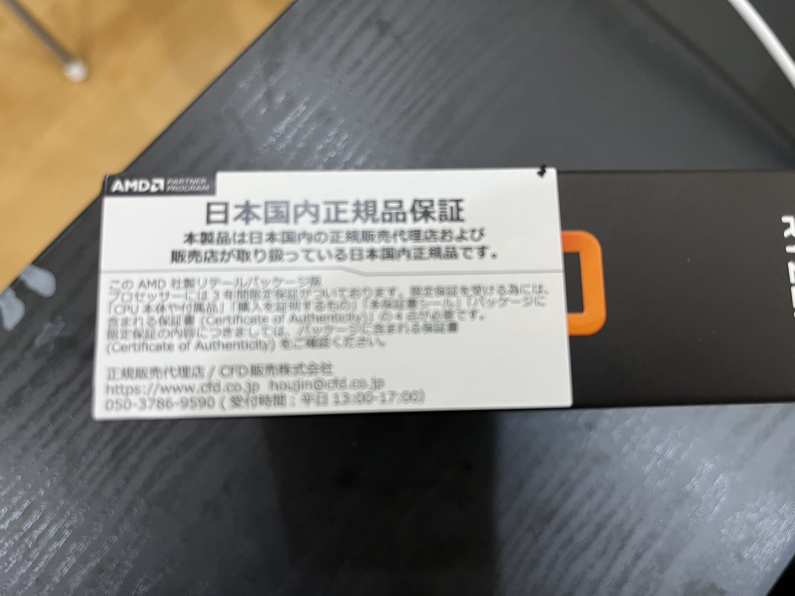

import { Link } from 'gatsby';

## Ryzen 9 9950Xを手に入れました

本日、2024年8月23日、Ryzen 9 9950X/9900Xが国内で販売開始されました。私はAMDファンボーイですので当然最上位の9950Xを入手しました。

いったんドスパラ通販で注文したのですが、しばらくして**カード不正利用を検知したため注文プロセスを中断した**とのメールが届いてしまいました。前日にドスパラ新潟店に電話して入荷するか確認したのですが残念ながら入荷しないとのこと。中断メールが届いてからパソコン工房新潟に電話したところ入荷してるとのことだったので気温30度超えの中自転車で実店舗まで買いに行ってきました。

そして、無事にRyzen 9 9950Xを入手できました。通販より早く手に入ったのでむしろ災い転じて福となりました。前回、Ryzen7000シリーズのときもドスパラ新潟は最上位7950Xだけ入荷しないとのことだったので、今回の注文プロセス中断の件と合わせて私の中のドスパラの評価は下がってしまいました。

気になるお値段はなんと119,800円。俺のカネ返してから辞めろ岸田。

## CPU乗せ換え

今回はソケットの変更もないためBIOSの更新だけで9950Xが使えます。早速乗せ換えました。

BIOSは事前に更新していたためCPU乗せ換えだけで何の問題もなく起動しました。しかし、BIOSの設定がリセットされたため再設定が必要でした。

Ryzen9000シリーズのコード名は**Granite Ridge**となります。Ryzenのコード名は初期は〇〇Ridge、その後3世代は画家名だったので、久々に〇〇Ridgeに戻った形になります。

- Ryzen1000: Summit Ridge
- Ryzen2000: Pinnacle Ridge
- Ryzen3000: Matisse
- Ryzen5000: Vermeer
- Ryzen7000: Raphael

 

Intelの次期Xeonのコード名が**Granite Rapids**なので、**Granite**が被ってる上にその後が**R**で始まるので非常にややこしい。どっちかゆずりなさいよと思いますが商売敵なのでしょうがない。

## 性能比較

というわけで、これまで使っていた**Ryzen 9 7950X**とサブ機の**Core i9 13900K**と性能比較をしてみました。

比較を行う種目は以下の通り。

- CinebenchR23
- BlackMagic Raw Speed Test
- 動画エンコード(x264/265)
- Stable Diffusionで画像生成

 

### スペック

|           | Ryzen9 9950X | Ryzen 9 7950X | Core i9 13900K |
|-----------|------------|------------|------------|
| CPU      | **Ryzen9 9950X** | Ryzen 9 7950X | Core i9 13900K |
| クーラー  | Deepcool AK620 | Deepcool AK620 | Deepcool AK620 |
| M/B | MSI PRO X670-P WIFI | MSI PRO X670-P WIFI | ASRock Z790 PG Lightning |
| MEM | CFD W5U4800CM-16GS | CFD W5U4800CM-16GS | Crucial CT2K16G48C40U5 |
| SSD | KIOXIA EXCERIA PRO SSD-CK1.0N4P/J | KIOXIA EXCERIA PRO SSD-CK1.0N4P/J | KIOXIA EXCERIA PRO SSD-CK1.0N4P/J |
| VGA | 玄人志向 RD-RX550-E2GB/OC | 玄人志向 RD-RX550-E2GB/OC | 玄人志向 GF-GT710-E1GB/HS |

 

### CinebenchR23

結構スコアが上がっていてうれしい。

### BlackMagic Raw Speed Test

Core i9さすがに強い。そして7950Xと比べてもスコア上昇はほぼ誤差の範囲。

### 動画エンコード(X264/265)

Core i9はCPU使用率が90%超えるので最速となりました。RyzenのCPU使用率はせいぜい50%ほど。普段使ってるx264で7950Xと比べて結構早くなってるのでうれしい。

### Stable Diffusion

実際にはCPUでStable Diffusionを動かすシチュエーションはないと思いますが、性能比較のためにCPUで画像生成を試してみました。

Civitaiでダウンロードした`.safetensors`を`diffusers`に変換後、diffusersを使って生成したときの実測値です。

変換や生成のコードは[Githubにある私のレポジトリ](https://github.com/kiyohken2000/convert-safetensors-to-diffusers)で確認できます。そして、生成に使用したモデルは[こちら](https://civitai.com/models/490947/peganaormerge)。

## まとめ

Ryzenを買い替えるたびに毎回言ってますが、毎世代買い替える必要は本来ない。でもAMDファンボーイ的には万が一**俺のRyzenドヤバトル**が始まった場合に負けることを想像すると恐怖に打ち震えてしまうので毎世代買い替えちゃう。

---