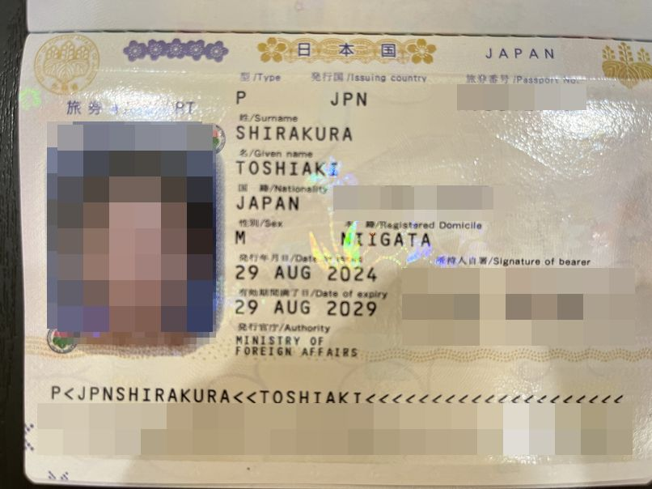

import { Link } from 'gatsby';

## 自己紹介

皆様は個人開発をやっておられますでしょうか。私も億万長者を目指して日々スマホアプリ開発をしております。

代表作は[安倍晋三エクスプローラー](https://apps.apple.com/jp/app/id1619512045)/[聖帝エクスプローラー](https://play.google.com/store/apps/details?id=net.votepurchase.seiteiexplorer)、最近力を入れているアプリは[ガチ有能AI助手](https://gachiai.xyz)です。他にもいくつかのアプリを個人で開発し、AppStore/GooglePlayで公開しています。

私はこれらのアプリを実家の自室で開発していました。10年以上実家暮らしをしていた筋金入りの子供部屋おじさんです。

なお、**ガチ有能AI助手**ではバックエンドで使用しているCloudRun、Firebase、Algolia、Suno、Huggingfaceでそれなりに運営費用が発生しています。そのためIn App Purchaseを使用してアプリ内から寄付ができるようにしています。

この記事のタイトル通りなのですが、これが原因で子供部屋を追い出される自体になりました。

## GooglePlayデベロッパーアカウントの確認手続き

半年以上前から予告されていましたがGoogle Playでのアプリの公開には本人確認の手続きが必要になりました。時期をずらして順次各開発者の本人確認を行っていくとのことでずいぶん前から予告されていました。

[Google Play Console デベロッパー アカウントの確認（2023 年 9 月より前に作成されたアカウントが対象）](https://support.google.com/googleplay/android-developer/answer/14177239?hl=ja)

## GooglePlayデベロッパーアカウントの確認手続きの開始

忘れもしません。夏季休暇初日8/10のことでした。前日は金曜ですので深夜アニメを10本見て朝方眠りにつき、昼過ぎに起きてメールチェックをしたときのことでした。

Googleから本人確認手続きが可能になったとのお知らせメールが届いていることに気づきました。

**期限までに確認を完了されなかった場合、お客様のデベロッパープロフィールとアプリはGooglePlayから削除されます**という警告にビビりながらGooglePlayコンソールを開きました。なお、この時点では名前と住所を入力して**免許証の写真をアップロードして完了だろうな**くらいに思っていました。

そして寝ぼけながら確認手続きを進めている最中、衝撃の展開が発生しました。

どうやら、**収益化をオンにしているアカウント**に関しては**住所までGooglePlayで公開される**模様。予告されていたときに内容をちゃんと把握してなかった私の落ち度ではあるのですが、住所まで公開されるとは夢にも思ってませんでした。せいぜい名前と電話番号くらいだろうと思っていました。

名前はAppStoreですでに公開済みですし、電話番号は面倒ですが公開用の番号を新たに取得すればいいかなー、くらいに思っていたのです。

ところが、手続きを進めたところ**この情報はGooglePlayストアの掲載情報に表示されます**というメッセージと共にご丁寧に表示されたプレビューを確認して戦慄。**実家の住所**がばっちりプレビューされています。

**まさかの住所公開**です。住所情報は本人確認のためにGoogleに提出するものであり**まさか公開するために提出するものだ**とは露ほども考えていませんでした。

## Googleへの証拠書類の提出

本人確認のためにGoogleに提出する情報は二つ、**本人確認の身分証**と**住所の証明**です。

本人確認の身分証については想定通り免許証ですが、問題は住所の証明です。

選択肢としては

1. 実家の住所を提出する
2. 公開用の住所を新たに用意する
3. バーチャルオフィスや貸しオフィスを契約してその住所を公開する
4. GooglePlayでのアプリ公開をあきらめる

 

このくらいでしょうか。

**実家の住所を提出する**、これに関してはどこかのバカが本当に突撃してきた場合容易に引っ越しできないため却下です。両親と同居しているのでセキュリティ的にも非常によろしくない。

**GooglePlayでのアプリ公開をあきらめる**、これも却下です。アプリ開発者のアイデンティティとしてAppStore/GooglePlay両方でアプリを公開していないと堂々と**自分はスマホアプリ開発者**であると名乗れなくなる気がします。

となると、残りの選択肢は**公開用の住所を新たに用意する**か**バーチャルオフィスを借りる**の二点となります。

まず検討したのは**バーチャルオフィス**です。ただし問題になるのが証拠書類の提出。

- 政府機関発行の書類または写真付き身分証明書
- 公共料金または電話料金の請求書
- 銀行の明細書
- 住宅ローンの契約書

 

証明のために上記のいずれかをアップロードしないといけません。はたしてバーチャルオフィスでこれらを用意できるのか激しく疑問でした。

それに私の場合は10月9日までに本人確認を完了しないといけないのであまり時間もない。

となると、自動的に**公開用の住所を新たに用意する**という手段しか残りません。

そして、提出する証拠書類は**公共料金の請求書**が最も手軽です。ということは**9月分の請求書を待っていては期限までに間に合いません**。

ここまでを連休初日の昼過ぎ、日課のジョギングをしながら考えていました。

## わい子供部屋おじさん、子供部屋退去を決意する

ジョギング終了後のこどおじの行動は大変早いものでした。

私の尊敬するAMD CEO Dr.Lisa Suはインタビューでよく*Change on a dime*という表現を使います。この日以降のこどおじの行動はまさに*Change on a dime*でした。

真夏の昼過ぎにジョギングから帰宅し、汗も洗い流さずSumoを検索、手ごろな物件を調べて問い合わせを送信します。すでに連休に突入していましたが、その数十分後に不動産会社から連絡が入りした。

**とにかくすぐに入居したい**旨を伝えたところ、連休中も営業しているので**明日にでも物件見学に来て欲しい**とのこと。二つ返事で了解しました。

翌日、不動産会社が提案したいくつかの物件を見学しその場で**入居する部屋を決定**。大家さんが直接管理している物件のため**連休中でも契約できる**とのことでした。

なお、その日の帰り。景気づけと子供部屋卒業を祝して**大人向けのお風呂屋さんで90分コースの自由恋愛**を楽しみました。このとき**お風呂屋さんのお姉さん**から**ベッドや布団は後回しでいいのでニトリの膨らむマットレスを買ってしばらくそれで寝なさい**というアドバイスをいただきました。意外な場所で以外な情報を得てしまいました。

そして、その翌日。契約書に押印し不動産会社に提出。正式に賃貸契約が結ばれました。

そしてその翌日の朝。部屋の鍵を受け取り正式に入居と相成りました。

こどおじ卒業を決意して4日目の入居でした。

## 入居後の引っ越し作業

とりあえず公開用の新しい住所は手に入れましたので、必ずしも生活拠点まで移す必要はありませんが、せっかく駅チカの便利な立地ですし家賃も払っているので住んでみることにしました。

どうせ全世界に向けて公開される予定の住所ですので、SNSで引っ越し作業の手伝いを募ったところ、手伝ってくれる心優しいおじさんが登場。

彼と一緒にニトリで家具を選び、ワンルームに運び入れました。

なお、心優しいおじさんとはその後高級焼肉と洒落込みました。

## 証拠書類の入手

入居して数週間後、ついに目的の証拠書類、公共料金の請求書を手に入れました。ばっちり新しい住所が記載されています。

それと、GooglePlayでは氏名も公開されます。そして氏名は身分証のものがそのまま公開されるとのこと。AppStoreではローマ字の氏名がすでに公開されています。

というわけで、ローマ字氏名の身分証を手に入れるためにパスポートも取得しました。

## 改めてGooglePlayの本人確認

**ローマ字の氏名の身分証（パスポート）**、**公開用の住所**を手に入れた本日。改めてGooglePlayにて本人確認手続きを行いました。

## ついに住所が公開される

午前中に確認手続きを行って確認中にしたので、数日かかるかなと思っていたのですが夕方には本人確認が完了しました。

ついにGooglePlayに住所が掲載されてしまったのです。

これからは、自分の住所を確認するときにいちいちiPhoneの電話アプリで自分の連絡先画面を開いたりする必要もありません。他の人に住所を伝えるときに住所をコピペする必要もありません。

私のGooglePlayのページのURLを伝えて**アプリのサポートセクションにあるよ**と言えばオッケーです。

**非常に便利**で良いですね！！！

## まとめ

この件に関してはマジでグーグルは頭がおかしい。狂ってるとしかいいようがない。アプリ利用者のセキュリティを守るために開発者のセキュリティはどうなってもいいという考えなんでしょうか。

頭のおかしいどこかのバカが公開されてる住所に突撃してきたらグーグルはどうやって責任とるんでしょうか。

そのうえアプリ内課金で手数料3割とってるわけですよグーグルは。マジで頭がおかしい。

去年話題になった[新規登録開発者のテスター20人問題](https://gamemakers.jp/article/2023_11_13_54780/)も併せて考えると、グーグルは個人開発者を排除したがってるとしか思えません。

---