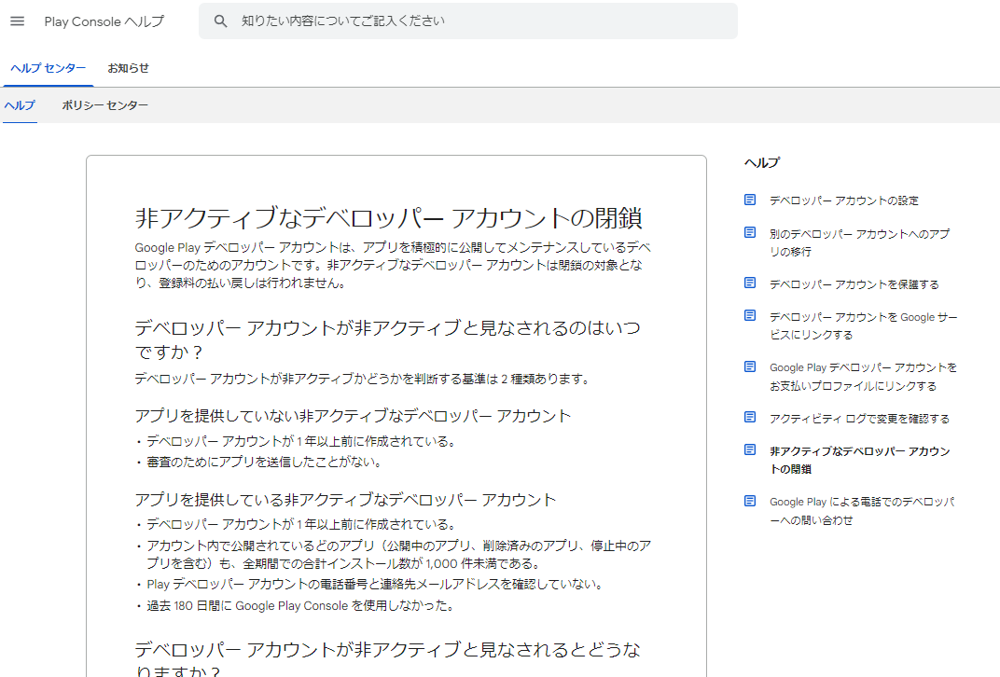

import { Link } from 'gatsby';

## インストール数1000未満のアプリしか作ってない開発者アカウントは削除される

こんな規約いつからあったのかわからないですが、表題の通りです。



```
デベロッパー アカウントが非アクティブと見なされるのはいつですか？
デベロッパー アカウントが非アクティブかどうかを判断する基準は 2 種類あります。

アプリを提供していない非アクティブなデベロッパー アカウント
- デベロッパー アカウントが 1 年以上前に作成されている。
- 審査のためにアプリを送信したことがない。

アプリを提供している非アクティブなデベロッパー アカウント
- デベロッパー アカウントが 1 年以上前に作成されている。
- アカウント内で公開されているどのアプリ（公開中のアプリ、削除済みのアプリ、停止中のアプリを含む）も、全期間での合計インストール数が 1,000 件未満である。
- Play デベロッパー アカウントの電話番号と連絡先メールアドレスを確認していない。
- 過去 180 日間に Google Play Console を使用しなかった。

```

[非アクティブなデベロッパー アカウントの閉鎖](https://support.google.com/googleplay/android-developer/answer/11605267)

非アクティブかつ、インストール数少ないアプリしか提供してないアカウントは自動的にBANされるようです。

## 高すぎるアプリ公開のハードル

他にもGoogle Playでアプリを公開するハードルはあります。

ひとつは先月書いた件、収益化をオンにしてる開発者アカウントは住所公開が必須になったこと。もうひとつは、去年から話題になってましたが、[テスターを20人集めて2週間ベータテストを継続しなければいけない件](https://gamemakers.jp/article/2023_11_13_54780/)。

## まとめ

やっぱりグーグルは個人開発者を排除したがってるとしか思えない。

---