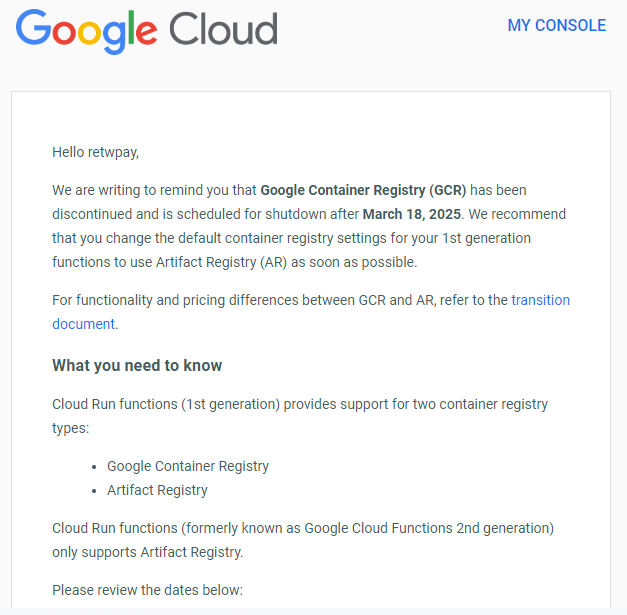
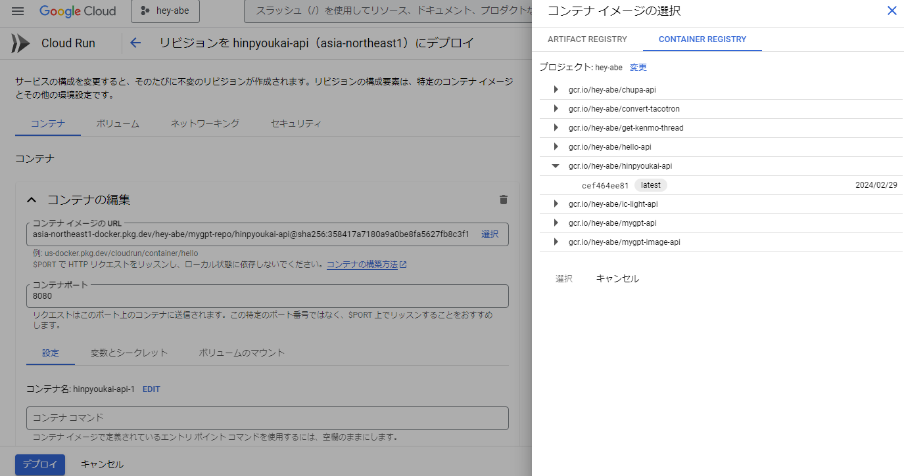
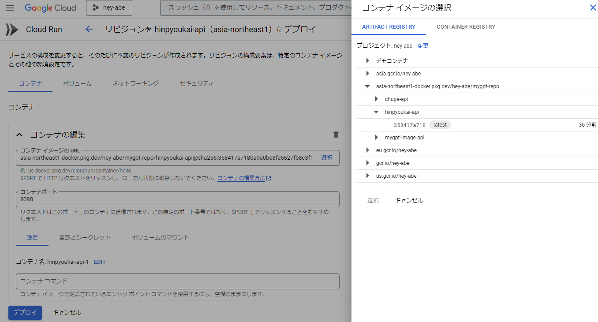

import { Link } from 'gatsby';

## GCP Container Registryの終了

一年以上前から予告されていましたがGCP Container Registryが2025年3月18日で廃止されます。そして、廃止後はContainer Registryの代わりにArtifact Registryを使用するように案内されていました。

GCPからお知らせのメールが届いていました。



私もいくつかのアプリでContainer Registryを使用していました。

すぐに思いつくものだと以下の3つ。

- [ガチ有能AI助手の画像生成API](https://github.com/kiyohken2000/my-gpt-image-api)
- [ガチ有能AI助手のチュパ音声生成API](https://github.com/kiyohken2000/chupa-sound-api)
- [品評会画像メーカーの顔認識API](https://github.com/kiyohken2000/hinpyoukai-api)

<br/>

それぞれPythonで記述しているFlaskアプリですので、DockerイメージをContainer Registryにアップロード、その後Cloud Runにデプロイして使用しています。

Container Registryの終了とともに動かなくなるのも寂しいので、GCPの案内通りContainer RegistryからArtifact Registryへ移行することにしました。

## これまでのデプロイ方法

これまでの私は以下のコマンドでContainer Registryにアップロードしていました。

```
gcloud builds submit --tag gcr.io/hey-abe/hinpyoukai-api --project hey-abe
```

アップロード後はブラウザでGCPコンソールを開き、アップロードしたDockerイメージをデプロイしていました。



## Artifact Registryへの移行手順

アップロード先がContainer RegistryからArtifact Registryに変わるだけですので、アップロード時のコマンドが変わるだけです。

### 1. まずはアップロード先のレポジトリを作成

```
gcloud artifacts repositories create mygpt-repo --repository-format=docker --location=asia-northeast1 --description="Docker repository"
```

**mygpt-repo**はレポジトリ名です。今回は上で紹介した3つのAPIをこのレポジトリの中にアップロードすることにしました。そのため、作成するレポジトリはこれ一つだけです。なのでレポジトリの作成コマンドは1回だけ実行します。

### 2. Dockerイメージをアップロード

なのでそれぞれのアップロードコマンドは以下のようになります。

```
ガチ有能AI助手の画像生成API
gcloud builds submit --tag asia-northeast1-docker.pkg.dev/hey-abe/mygpt-repo/mygpt-image-api --project hey-abe

ガチ有能AI助手のチュパ音声生成API
gcloud builds submit --tag asia-northeast1-docker.pkg.dev/hey-abe/mygpt-repo/chupa-api --project hey-abe

品評会画像メーカーの顔認識API
gcloud builds submit --tag asia-northeast1-docker.pkg.dev/hey-abe/mygpt-repo/hinpyoukai-api --project hey-abe
```

```mygpt-repo/```の後がイメージ名になります。

### 3. アップロードしたイメージをデプロイ

アップロードが完了するとCloud Runのデプロイ時にArtifact Registryからイメージを選択できるようになります。あとはデプロイしたいイメージを選択して通常通りデプロイするだけです。



## まとめ

今回はContainer Registryの代わりにArtifact RegistryへDockerイメージをアップロードする方法を説明しました。

こういうのはデッドラインに近づかないと重い腰が上がらないですね。近づきすぎると諦めが勝って結局やらないんですが、今回は無事に移行できました。

---