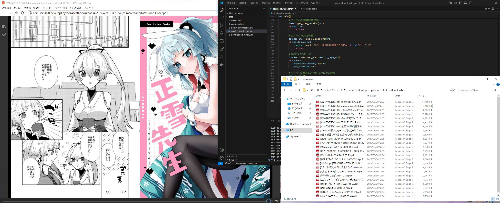
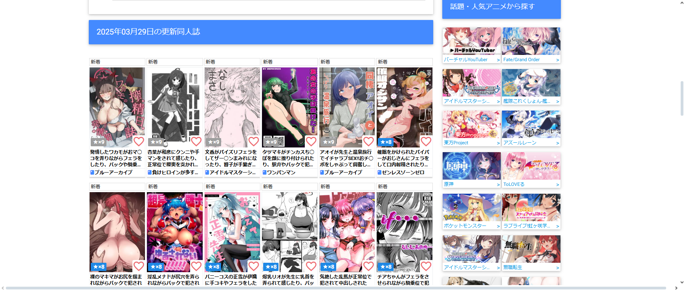
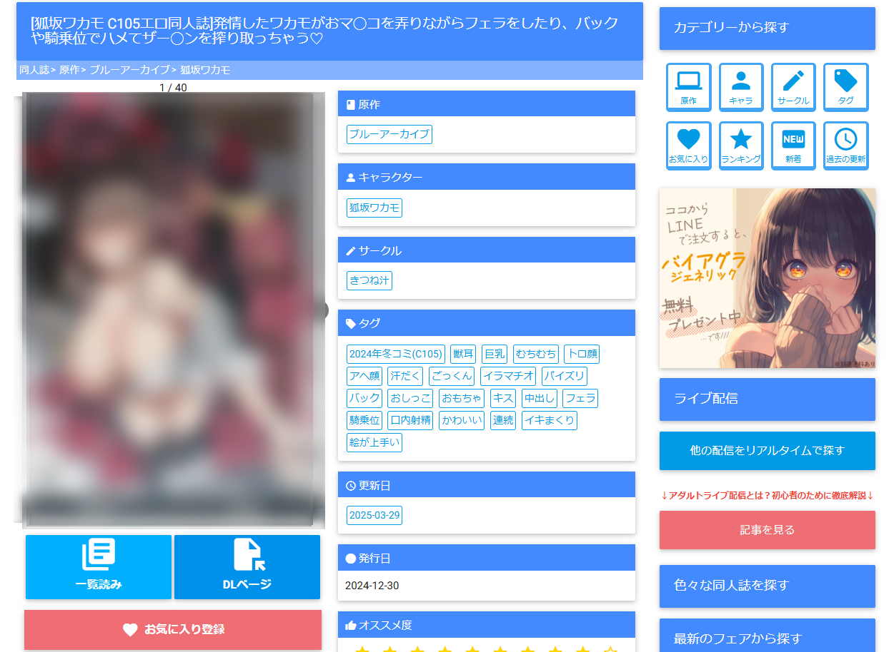
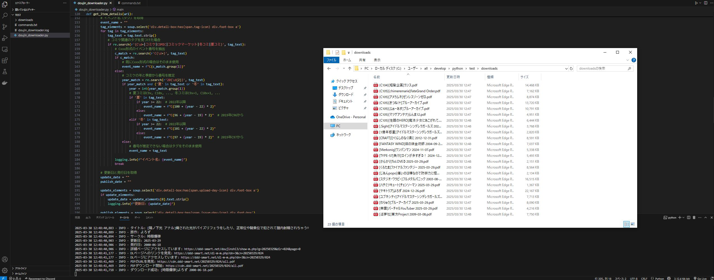

import { Link } from 'gatsby';


*整理されたファイル名の例*

本稿では、同人誌サイト「[同人すまーと](https://ddd-smart.net/)」専用の自動ダウンロードツールである「Doujin Archiver」についてご紹介します。当サイトでは毎日約20冊前後の同人誌が追加されるため、これらを効率的に保存・管理することを目的として本ツールを開発しました。


*同人すまーとの更新ページ例 - 日々多くの同人誌が追加されています*

## Doujin Archiverの概要

「Doujin Archiver」は、「同人すまーと」サイトから作品情報を取得し、PDFをダウンロードして統一された命名規則でファイルを整理するPythonスクリプトです。以下の機能を実装しています：

- 「同人すまーと」サイトの新着作品ページからの情報取得
- 新着作品のPDFファイルを自動ダウンロード
- イベント名、サークル名、原作名を使用した統一的なファイル命名規則の適用
- コミックマーケット（コミケ）のイベント名を「Cxxx」形式に統一
- ダウンロード履歴の管理による重複ダウンロードの防止
- 詳細なログ記録による動作状況の確認

<br/>

## 開発の背景

本ツールの開発背景には、以下のような課題がありました：

1. **命名規則の不統一**: ダウンロードしたファイルの命名規則が統一されておらず、整理が困難であること
2. **ファイル名の形式統一**: コミケの同人誌を「Cxxx」形式で統一して管理したいという要望
3. **手動ダウンロードの非効率性**: 1日に20冊前後追加される作品を手動でダウンロードするのは時間的コストが高いこと
4. **ダウンロード履歴管理の必要性**: 既存コレクションとの重複を避けるためにダウンロード履歴の管理が必要であること

これらの課題を解決するために、自動化スクリプトの開発に着手しました。特に重点を置いたのは、ファイル命名の一貫性の確保です。コミケ関連の同人誌は「(イベント名)[サークル名]作品名.pdf」という形式で統一することにより、コレクション管理の効率性と視認性が大幅に向上します。

## 主要機能の詳細

### 1. コミケイベント名の自動標準化

タグやタイトルに含まれるコミケ関連の情報を自動的に「Cxxx」形式に標準化します：

- 「2024年冬コミ(C105)」→「C105」
- 「2024年夏コミ(C104)」→「C104」

この変換処理により、ファイル名が統一され、コレクションの整理性が向上します。

### 2. 体系的なファイル命名システム

ファイル名は以下の優先順位に基づいて生成されます：

1. イベント情報がある場合：`(イベント名)[サークル名]原作名.pdf`
2. イベント情報がなく発行日がある場合：`[サークル名]原作名 発行日.pdf`
3. 上記のいずれもない場合：`[サークル名]原作名 更新日.pdf`

### 3. ファイル名の文字正規化

ファイル名として使用できない文字（`\ / * ? : " < > |`）は自動的に半角スペースに置換されます。例えば：

- `[chimere/marie]Fate/Grand Order.pdf` → `[chimere marie]Fate Grand Order.pdf`

これにより、OSの種類に依存せず適切にファイルを保存することが可能となります。


*同人誌の詳細ページからメタデータを抽出*

### 4. ダウンロード履歴の管理システム

一度ダウンロードした作品は履歴として記録され、次回実行時に重複ダウンロードを防止します。これにより、定期的にスクリプトを実行した場合でも新規作品のみが追加されます。

## 技術仕様

本スクリプトは以下の技術要素を使用しています：

- Python 3.6以上
- requests：HTTPリクエスト処理
- BeautifulSoup4：HTML解析
- pickle：ダウンロード履歴の永続化

コード構造は機能別にモジュール化されており、Python初学者の方にも理解しやすい設計としています。また、正規表現を用いたパターンマッチングにより、様々な形式のタグやイベント名に対応しています。


*Visual Studio Codeでの開発画面と実際のダウンロード結果*

## 利用方法

利用方法は以下の通りです：

1. Python実行環境にて必要ライブラリをインストール
   ```bash
   pip install requests beautifulsoup4
   ```

2. スクリプトをダウンロードし、必要に応じて設定を調整
   - ダウンロードディレクトリの指定
   - その他の設定パラメータの調整

3. スクリプトを実行
   ```bash
   python doujin_downloader.py
   ```

4. 自動的に「同人すまーと」の最新作品がダウンロードされ、整理されます


*PDFファイルが自動的にダウンロードされる様子*

## カスタマイズの可能性

本スクリプトは以下のようなカスタマイズが可能です：

- **ファイル命名規則の変更**: 個人の管理方針に合わせて命名ルールを変更
- **定期実行の設定**: cronやWindows TaskSchedulerを利用した定期実行の設定
- **フィルタリング機能の追加**: 特定のサークルや原作のみをダウンロードする条件の追加
- **メタデータの拡張**: さらに詳細な情報を取得・記録する機能の追加

<br/>

## 注意事項とライセンス

本スクリプトは教育・研究目的で公開しています。利用に際しては以下の点にご留意ください：

- 「同人すまーと」サイトの利用規約を必ずご確認の上、遵守してください
- サーバー負荷を考慮し、適切なアクセス間隔（現在は3秒）を設定しています
- 個人利用の範囲内でご使用ください
- MITライセンスの下で提供しています

<br/>

## GitHub リポジトリ

詳細な情報や最新のアップデートについては、以下のGitHubリポジトリをご参照ください。

[GitHub: doujin-archiver](https://github.com/kiyohken2000/doujin-archiver)


*「同人すまーと」の毎日の更新情報*

## 結論

「Doujin Archiver」は、「同人すまーと」サイトからの同人誌コレクションの管理を自動化することで、日々更新される多数の作品の効率的な保存と整理を可能にします。特に、1日に20冊前後追加される作品を手動で管理する手間を大幅に削減することができます。

また、ファイル命名の標準化によりコレクションの視認性と管理効率が向上します。Pythonプログラミングの学習者にとっても、実用的なプロジェクト例として参考になると考えています。

本ツールが皆様の同人誌コレクション管理の一助となれば幸いです。

---