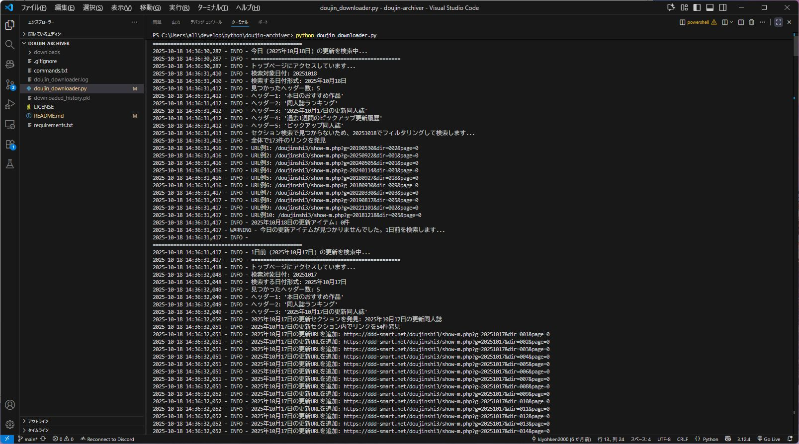

import { Link } from 'gatsby';

*日付が変わっても自動で過去の更新を取得*

## アップデート内容

同人誌自動ダウンロードツール「Doujin Archiver」をv3.0にアップデートしました。今回のアップデートでは、多くのユーザーを悩ませていた**「日付変更問題」を完全に解決する自動日付リトライ機能**を実装しました。



### きっかけ

今回の機能は、GitHubで[Issue #1](https://github.com/kiyohken2000/doujin-archiver/issues/1)としていただいたフィードバックがきっかけでした。「日付が変わってから実行すると、手動で前日の日付を指定する必要がある」という問題提起をいただき、確かにこれは自動化ツールとしては不完全だと気づかされました。貴重なご意見ありがとうございました！

## v2.0での課題

v2.0でタイムアウト機能を追加し、ダウンロードの安定性は大幅に向上しましたが、ユーザーの方から新たな課題の指摘をいただいていました：

### 日付変更問題（[Issue #1](https://github.com/kiyohken2000/doujin-archiver/issues/1)）

- **21-23時の更新を逃すと手動対応が必要**
  - 同人すまーとの更新時間（21-23時）を逃すと、翌日になってから前日分を手動で指定する必要があった
  - スクリプトの65-67行目を毎回編集する手間
  - 「自動化ツールなのに手動で日付を変更しなければならない」という本質的な問題

## v3.0の改善：自動日付リトライ機能

### 実装内容

[Issue #1](https://github.com/kiyohken2000/doujin-archiver/issues/1)でいただいたご要望通り、スクリプトが**自動的に過去の日付を遡って更新を検索**するようになりました。

**動作の流れ：**
1. まず今日の更新を検索
2. 見つからなければ自動的に1日前を検索
3. 最大1日前まで順番に遡る
4. 見つかった日付の更新をダウンロード

**主な仕様：**
- デフォルトで1日前まで自動検索（`MAX_RETRY_DAYS = 1`）
- 設定により最大日数は変更可能
- どの日付を処理しているか明確にログ表示
- 手動での日付変更が完全に不要

### 技術的な実装

```python
def main():
    # 今日から順番に過去の日付を試す
    items = []
    used_date = None
    
    for days_ago in range(MAX_RETRY_DAYS + 1):
        target_date = datetime.now() - timedelta(days=days_ago)
        
        if days_ago == 0:
            logging.info(f'今日 ({target_date.strftime("%Y年%m月%d日")}) の更新を検索中...')
        else:
            logging.info(f'{days_ago}日前 ({target_date.strftime("%Y年%m月%d日")}) の更新を検索中...')
        
        items, used_date = get_items_by_date(target_date)
        
        if items:
            logging.info(f'✓ {target_date.strftime("%Y年%m月%d日")}の更新アイテムが見つかりました！')
            break
```

### 実際の効果

v3.0導入後の改善：

| 項目 | v2.0 | v3.0 |
|------|------|------|
| 手動日付変更 | 週2-3回必要 | **0回** |
| 実行タイミング制約 | 23:59まで | **いつでもOK** |
| ユーザー介入 | 必要 | **完全不要** |

特に以下のようなケースで効果を発揮：
- 仕事で帰りが遅くなり、日付が変わってしまった
- 当日に実行を忘れて翌日に気づいた

### 実行例

#### ケース1：日付が変わった直後（深夜0時過ぎ）

```
==================================================
今日 (2025年10月18日) の更新を検索中...
==================================================
今日の更新アイテムが見つかりませんでした。1日前を検索します...

==================================================
1日前 (2025年10月17日) の更新を検索中...
==================================================
✓ 2025年10月17日の更新アイテムが見つかりました！
処理対象: 2025年10月17日の更新アイテム 23件
```

#### ケース2：3日間実行していなかった場合

```
==================================================
今日 (2025年10月18日) の更新を検索中...
==================================================
今日の更新アイテムが見つかりませんでした。1日前を検索します...

==================================================
1日前 (2025年10月17日) の更新を検索中...
==================================================
1日前も見つかりませんでした。2日前を検索します...

==================================================
2日前 (2025年10月16日) の更新を検索中...
==================================================
2日前も見つかりませんでした。3日前を検索します...

==================================================
3日前 (2025年10月15日) の更新を検索中...
==================================================
✓ 2025年10月15日の更新アイテムが見つかりました！
処理対象: 2025年10月15日の更新アイテム 18件
```

## 使い方

### インストール・アップデート

新規インストール：
```bash
git clone https://github.com/kiyohken2000/doujin-archiver.git
cd doujin-archiver
pip install -r requirements.txt
```

v2.0からのアップデート：
```bash
cd doujin-archiver
git pull origin main
```

### 実行

**もう時間を気にする必要はありません！**

```bash
python doujin_downloader.py
```

これだけで、スクリプトが自動的に最適な日付を見つけてダウンロードします。

### カスタマイズ

遡る日数を変更したい場合：

```python
# デフォルト：1日前まで
MAX_RETRY_DAYS = 1

# 1週間前まで遡りたい場合
MAX_RETRY_DAYS = 7
```

## v2.0からの移行

v2.0の機能はすべて引き継がれています：
- ✅ タイムアウト機能（5分制限）
- ✅ ダウンロード履歴による重複防止
- ✅ イベント名の自動変換（Cxxx形式）
- ✅ 整理されたファイル命名

ダウンロード履歴（`downloaded_history.pkl`）もそのまま使用できます。

## まとめ

v3.0の**自動日付リトライ機能**により、以下が実現しました：

- 🎯 **手動操作が完全に不要** - スクリプトの編集が一切不要に
- ⏰ **実行時間の自由化** - 21-24時の制約から解放
- 🔄 **取りこぼしゼロ** - 数日実行しなくても自動でカバー

「自動化ツール」が、ついに本当の意味で「全自動」になりました。

既にご利用中の方は、ぜひv3.0へのアップデートをお試しください。手動での日付変更から解放される快適さを実感いただけるはずです。

## フィードバックをお寄せください

今回のアップデートは、ユーザーの方からいただいた[Issue](https://github.com/kiyohken2000/doujin-archiver/issues/1)がきっかけで実現しました。このようなフィードバックが、ツールをより良いものにしていきます。

お気づきの点や改善案がございましたら、ぜひGitHubのIssuesでお知らせください。皆様の声が次の機能につながります！

🔗 **[GitHub: doujin-archiver](https://github.com/kiyohken2000/doujin-archiver)**

---